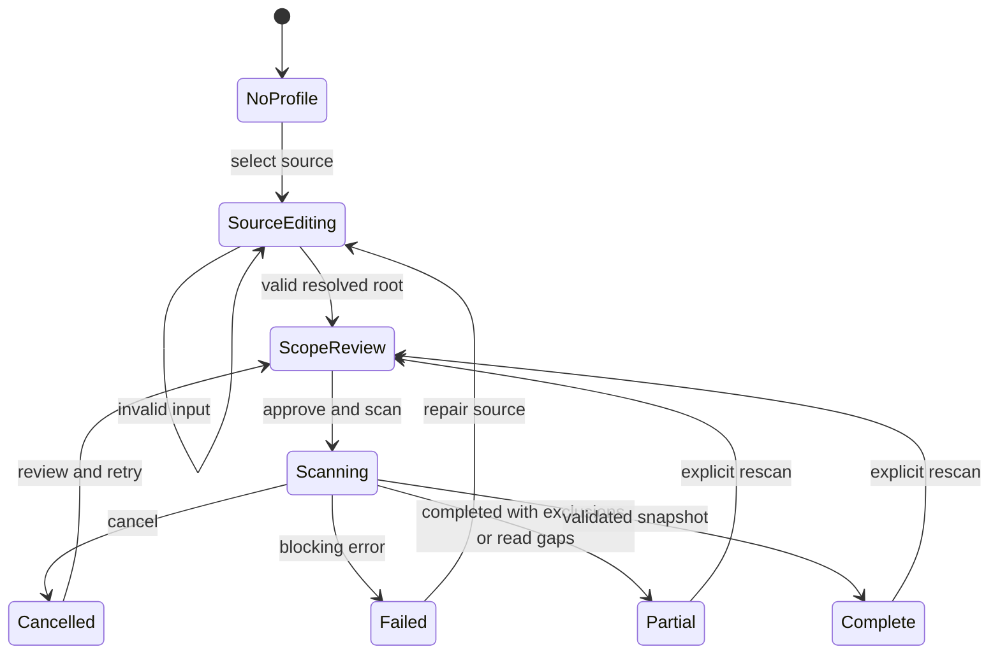
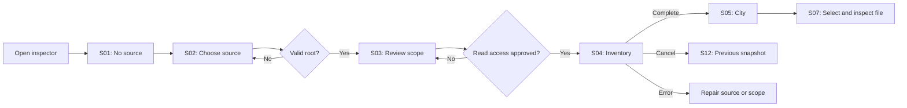
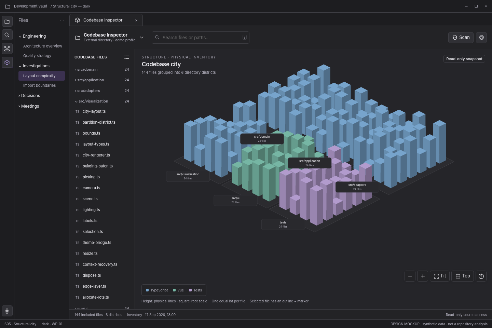
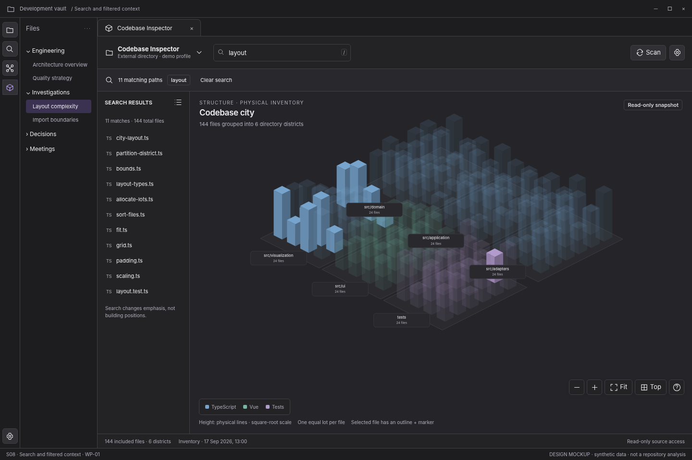
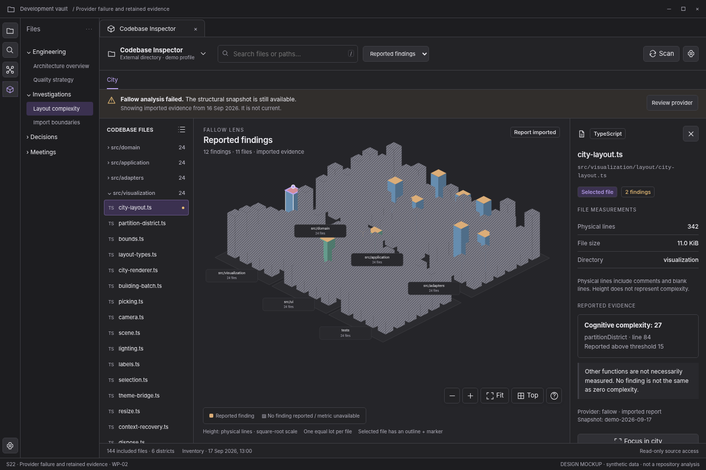
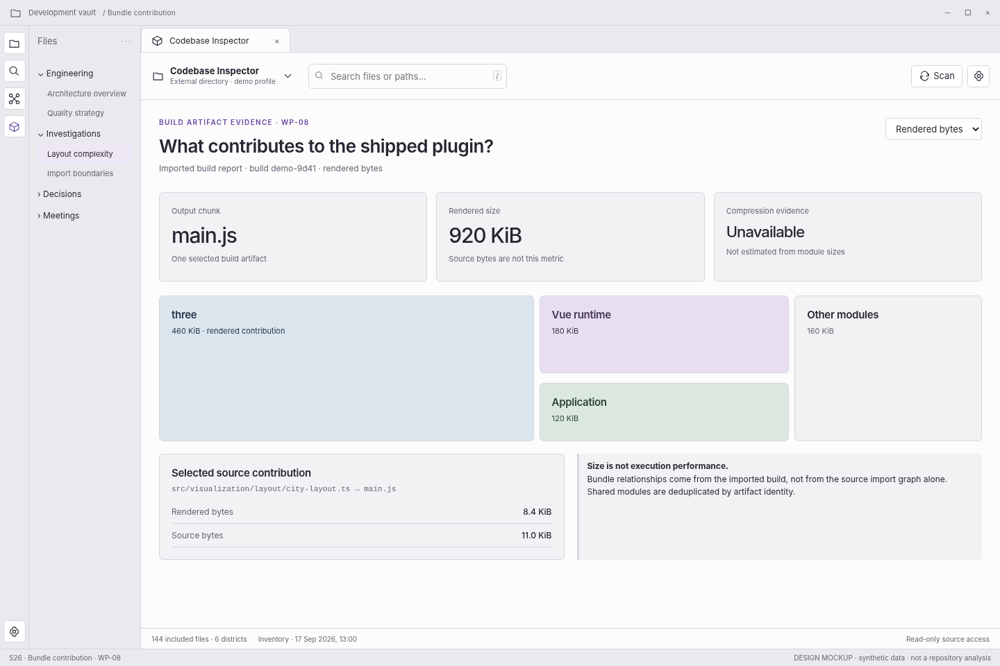
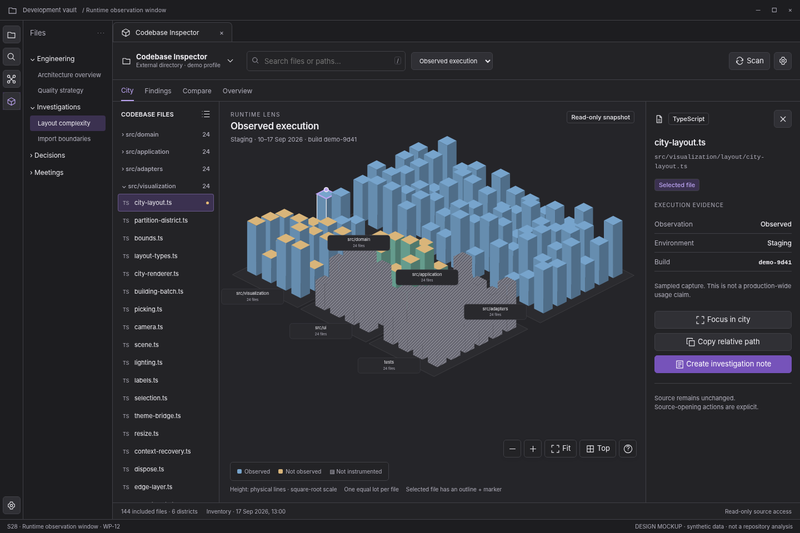

# Version 1.1 — first-release interaction refinement

Start with **[WP-01 review library](wp01-review/gallery.html)** or **[the offline interaction reference](wp01-review/index.html)**. The new **[design-to-implementation handoff](WP01-DESIGN-TO-IMPLEMENTATION.md)** resolves first-release interaction defaults and adds typed renderer contracts, eight build packets, and validation gates.

The existing 28 screen mockups/specifications and later-package concepts remain included below. Version 1.1 governs WP-01 behavior where it refines earlier optional wording. Existing implementation safety requirements remain binding. The older all-package SVG prototype is retained as a visual scenario browser, not the updated first-release interaction authority.

The new runnable reference uses a **Canvas 2D projection simulator**, not Three.js. Three.js is still the production requirement; only its integration contract is supplied here. No actual repository was scanned or modified.

**Reference validation: 31 state tests and 28 browser checks passed.** Actual Obsidian, Three.js, filesystem, assistive-technology, and performance gates remain open.

---

# Codebase Inspector — Complete UI/UX specification

Proposed design package v1.0 · 17 September 2026

Use the full extracted package so relative mockup links resolve. [Open visual library](index.html).

---

# Codebase Inspector — UI/UX design package

An Obsidian-native, incrementally implementable design for a Three.js codebase city, evidence inspection, and Markdown investigations.

**Start with [the visual design library](index.html).** Extract the complete package first, then open `index.html`. The gallery links each mockup to its screen specification and review scenario. No hosted service or installation is required for the design assets.

## Included

**28 numbered screen mockups with 28 matching Markdown specifications**, **4 annotated concept/interaction boards**, an optional image-generated visual exploration, a local click-through review prototype, **27 component contracts**, semantic token CSS/JSON, information architecture, user flows, camera/selection/keyboard rules, evidence-state and recovery definitions, accessibility and responsive guidance, microcopy, a note template, **23 use-case PBIs**, an agent implementation prompt, and validation materials.

The numbers, files, findings, report excerpts, and dates shown in the screens are synthetic. These are proposed designs, not screenshots of a working Obsidian plugin or an analysis of your repository. The prototype uses an SVG stand-in for the production Three.js renderer and simulated workflows. [Validation status](validation/validation-status.md) distinguishes completed asset checks from unperformed host and usability testing.

## Read in this order

1. [Design brief](foundations/01-design-brief.md), [information architecture](foundations/02-information-architecture.md), and [package map](handoff/package-map.md).
2. [Visual system](foundations/03-design-system.md), [component library](components/component-library.md), [interaction contract](interactions/01-core-interactions.md), and [accessibility](foundations/04-accessibility-and-responsive.md).
3. The numbered screens for the package being implemented, then [UI backlog](handoff/ui-backlog.md) and [agent prompt](handoff/agent-implementation-prompt.md).

## First delivery boundary

**WP-01 covers S01–S13 and S23.** It includes source selection, scope review, cancellable real inventory, structural city, selection, search, top view, native themes/settings, narrow leaves, and HTML fallback. It does not need fallow, dependencies, findings, note creation, or an overview dashboard to be useful.

Later-release controls are shown only in later-release screens. Do not implement their navigation as empty placeholders in the first release.

## Concept boards

- [01 — Native city, dark/light](concepts/01-native-city-dark-light.png)
- [02 — Interaction and investigation](concepts/02-interaction-and-investigation.png)
- [03 — Responsive and recovery states](concepts/03-responsive-and-recovery.png)
- [04 — Components and evidence semantics](concepts/04-component-and-evidence-semantics.png)

The [optional image-generated exploration](concepts/00-visual-exploration.png) conveys an early visual direction. Its decorative branding, sidebar/menu, broad “Phase 1” labels, and simplified copy are **not authoritative**. The numbered screens and written contracts supersede those elements. Do not implement that board literally.

## Screen catalogue

| Screen | Package | Specification | Mockup |
|---|---|---|---|
| S01 — Welcome and first run | WP-01 | [Spec](screens/s01-welcome.md) | [PNG](mockups/s01-welcome.png) |
| S02 — Choose a codebase source | WP-01 | [Spec](screens/s02-source.md) | [PNG](mockups/s02-source.png) |
| S03 — Review scope and read access | WP-01 | [Spec](screens/s03-scope.md) | [PNG](mockups/s03-scope.png) |
| S04 — Scan progress and cancellation | WP-01 | [Spec](screens/s04-scanning.md) | [PNG](mockups/s04-scanning.png) |
| S05 — Structural city — dark | WP-01 | [Spec](screens/s05-city.md) | [PNG](mockups/s05-city.png) |
| S06 — Structural city — light | WP-01 | [Spec](screens/s06-city-light.md) | [PNG](mockups/s06-city-light.png) |
| S07 — File selection and inspector | WP-01 | [Spec](screens/s07-selected.md) | [PNG](mockups/s07-selected.png) |
| S08 — Search and filtered context | WP-01 | [Spec](screens/s08-search.md) | [PNG](mockups/s08-search.png) |
| S09 — Top-down orientation | WP-01 | [Spec](screens/s09-top.md) | [PNG](mockups/s09-top.png) |
| S10 — Narrow leaf and inspector drawer | WP-01 | [Spec](screens/s10-narrow.md) | [PNG](mockups/s10-narrow.png) |
| S11 — Accessible list and 3D fallback | WP-01 | [Spec](screens/s11-fallback.md) | [PNG](mockups/s11-fallback.png) |
| S12 — Cancelled scan with previous snapshot | WP-01 | [Spec](screens/s12-cancelled.md) | [PNG](mockups/s12-cancelled.png) |
| S13 — Native settings and profiles | WP-01 | [Spec](screens/s13-settings.md) | [PNG](mockups/s13-settings.png) |
| S14 — Connect fallow evidence | WP-02 | [Spec](screens/s14-provider.md) | [PNG](mockups/s14-provider.png) |
| S15 — Fallow findings lens | WP-02 | [Spec](screens/s15-findings.md) | [PNG](mockups/s15-findings.png) |
| S16 — Dependency neighborhood | WP-03 | [Spec](screens/s16-dependencies.md) | [PNG](mockups/s16-dependencies.png) |
| S17 — Finding investigation workbench | WP-04 | [Spec](screens/s17-workbench.md) | [PNG](mockups/s17-workbench.png) |
| S18 — Create investigation note | WP-04 | [Spec](screens/s18-note.md) | [PNG](mockups/s18-note.png) |
| S19 — Compare compatible snapshots | WP-05 | [Spec](screens/s19-compare.md) | [PNG](mockups/s19-compare.png) |
| S20 — Coverage with unknown evidence | WP-06 | [Spec](screens/s20-coverage.md) | [PNG](mockups/s20-coverage.png) |
| S21 — Explainable overview | WP-09 | [Spec](screens/s21-overview.md) | [PNG](mockups/s21-overview.png) |
| S22 — Provider failure and retained evidence | WP-02 | [Spec](screens/s22-failure.md) | [PNG](mockups/s22-failure.png) |
| S23 — No matching files | WP-01 | [Spec](screens/s23-no-results.md) | [PNG](mockups/s23-no-results.png) |
| S24 — Investigation note and focused city | WP-11 | [Spec](screens/s24-embed.md) | [PNG](mockups/s24-embed.png) |
| S25 — Diagnostics and security evidence | WP-07 | [Spec](screens/s25-security.md) | [PNG](mockups/s25-security.png) |
| S26 — Bundle contribution | WP-08 | [Spec](screens/s26-bundle.md) | [PNG](mockups/s26-bundle.png) |
| S27 — CI artifacts and explicit watch | WP-10 | [Spec](screens/s27-artifacts.md) | [PNG](mockups/s27-artifacts.png) |
| S28 — Runtime observation window | WP-12 | [Spec](screens/s28-runtime.md) | [PNG](mockups/s28-runtime.png) |

## Shared contracts and implementation support

[User flows](flows/user-flows.md) · [State and recovery model](interactions/02-states-and-recovery.md) · [Evidence/visual encoding](interactions/03-evidence-and-visual-encoding.md) · [Microcopy](interactions/04-microcopy.md) · [Component contract JSON](components/component-contracts.json) · [Token CSS](components/design-tokens.css) · [Token JSON](components/design-tokens.json) · [Investigation-note template](templates/investigation-note.md)

[Usability study plan](validation/usability-plan.md) · [Acceptance scenarios](validation/acceptance-tests.feature) · [Review checklist](validation/design-review-checklist.md) · [Source register](sources/sources.md)

## Design authority and open decisions

Safety/evidence/accessibility contracts take precedence over images; screen specs take precedence over simplified prototype behavior. Actual Three.js/fallow/Obsidian versions, final performance budgets, production component API names, exact reference scales at very large repository sizes, and user-tested breakpoints remain implementation decisions to validate.

The selected direction is a **proposed baseline**, not a claim that user research has approved it. Keep English UI, Obsidian-native themes and workspace, independent leaf state, explicit source/execution authority, and absence of invented health/deletion scores as fixed constraints unless deliberately revisited.

## Files and formats

All Markdown specs embed their matching screenshot with a relative path. The package also contains HTML reading copies, PNG mockups, local SVG city source illustrations, editable HTML/CSS/JS review sources, and JSON registries. No Figma source file, font files, compiled plugin, production source code, or external runtime asset dependency is included.

---

# Design brief

## Product outcome

Codebase Inspector is an Obsidian desktop plugin for understanding the structure of a local codebase, inspecting analysis evidence, and recording engineering investigations in Markdown. Its first release is a real structural city rendered with Three.js, not a dashboard requiring every provider to be present.

**Primary task:** select a codebase → understand the scan scope → inspect the city → find a file → read exact measurements. Later: inspect a finding → understand its evidence and uncertainty → create an investigation note → revisit a compatible snapshot.

This package translates the existing 12 implementation packages into a proposed UI/UX specification. It does not replace their source-safety, analyzer, or data-contract requirements. No actual source repository was scanned for these designs; all quantities, paths, findings, and excerpts are synthetic fixtures. There has been no user study or Obsidian-host validation.

## Users and jobs

These are role-based design hypotheses, not research-validated personas.

| Role | Job to accomplish | Design consequence |
|---|---|---|
| Developer or maintainer | Find a file, understand its surrounding structure, inspect concrete findings | Search, exact paths, focused neighborhoods, fast keyboard operation |
| Technical lead or architect | Explain structure, assess boundaries, identify worthwhile investigations | Directory grouping, bounded relationships, provenance and comparison |
| Delivery/product colleague | Understand what an issue means and what needs doing without reading every source file | Plain-language descriptions, explicit uncertainty, linked investigation notes |
| New contributor | Build a mental model and navigate back to the source or architecture notes | Stable geometry, breadcrumbs, human explanations, repeatable focus links |

## Hard constraints

Use a native ItemView with the host ribbon, workspace, commands, settings, and theme. Do not add an account, avatar, logo in the product shell, a second global navigation sidebar, independent theme control, localhost server, iframe app, or mandatory companion application. The Obsidian view API supports custom workspace views and their lifecycle; the integration remains a host adapter [S1].

Package 1 supports current vault, a directory inside the vault, and an explicitly chosen external directory. It is desktop-only. Inventory must not run project scripts, Git, fallow, or dependency installation. Source writes remain out of scope. Deliberate Markdown note creation begins in WP-04 and is visibly a vault write, not a source-code edit.

All product UI and specifications are English. Filenames, technical IDs, and provider values retain their original spelling. Long and non-ASCII paths must work; “English UI” is not an ASCII-only data restriction.

## Experience principles

**Spatial orientation before metrics.** The city first explains what exists and where. A large building means many physical lines under the chosen display scale, not bad code.

**Evidence before judgment.** Every derived lens identifies the provider, scope, freshness, and metric. Missing evidence is not zero; an unused candidate is not safe-to-delete proof.

**2D and HTML are first-class.** An accessible file list and inspector provide the core information without WebGL. Use a table, treemap, or list whenever it communicates the question better than a 3D graph.

**Progressive capability.** Do not expose unimplemented modes. Later-release mockups show later-release capabilities; they are not a menu to render in WP-01. An implemented but unconfigured provider can have an explanatory setup state.

**Native context, independent state.** Obsidian owns its shell; each leaf owns camera, selection, search, and panel presentation. Profiles and validated snapshots may be shared as immutable data.

**Intentional work.** Enabling the plugin, reopening a view, displaying a note embed, and importing a report must not authorize filesystem scanning or process execution.

## Visual direction

Neutral native surfaces, restrained accent, six-pixel default corner radius, typographic hierarchy rather than marketing panels, and a dominant canvas. File categories use subdued semantic colors; active selection uses an independent outline and locator. No glowing neon city, decorative traffic, windows, fireworks, constantly rotating scene, or health-grade hero card.

The original image-generated board is a visual exploration, not the implementation source of truth. It includes legacy decorative branding/navigation and coarse phase language that the precise screen specifications deliberately supersede. Implement the numbered screen mockups and written contracts.

## Success evidence to collect

A new user can select the intended source and correctly describe what scanning will and will not do. A user can locate a named file through either the city or the list. Users can distinguish physical lines from complexity, a missing metric from measured zero, and a reported finding from a verified defect. A user can create a note without confusing it with a source-code change. The interface remains usable in narrow leaves, light/dark/custom themes, and without 3D.

These are validation goals; neither the mockups nor a successful browser render establish that they have been achieved.

References: [source register](sources/sources.md).

---

# Information architecture and host ownership

## Host versus plugin

| Surface | Owner | Contract |
|---|---|---|
| Vault file explorer, global ribbon, workspace tabs, command palette | Obsidian | Do not reimplement, reorder, or hijack |
| Codebase Inspector ItemView | Plugin host adapter | Create one UI/rendering scope per leaf; register through supported API |
| Source modal and settings rows | Obsidian adapter | Native Modal/Setting patterns; explicit focus and teardown |
| Codebase file list, inspector, quality lenses | Plugin UI | These concern the selected codebase, not the vault’s note navigation |
| Codebase snapshot and evidence | Application/domain | Validated immutable records, no DOM or GPU references |
| Three.js city | Visualization module | Geometry and rendering from normalized data, never direct filesystem access |
| Markdown investigations | Vault | Create/update only through explicit actions and supported Vault operations |

A visible host file explorer and a plugin codebase file list are not duplicate global navigation: one browses notes, the other the inspected source. Label the latter “Codebase files.” Let users collapse it. The host explorer can be closed independently.

## Navigation by capability

WP-01 has one city view. It does not need a navigation strip with one item. Commands: Open codebase city, Scan codebase, Cancel scan. Plugin settings are available through Obsidian Settings and the compact in-view settings action.

WP-02 adds evidence lenses and source-provider setup. WP-04 adds a local Findings mode. WP-05 adds Compare. WP-09 adds Overview. These modes belong to the same contextual inspection workspace; no permanent second global sidebar is required. A mode preserves its selected profile and compatible snapshot.

The review prototype’s scenario selector is **not product UI**. It is a design-review harness for jumping between states and release increments. Its host-theme preview button is also outside the product.

## Entity relationships

`CodebaseProfile → local SourceBinding → ScanJob → Snapshot → FileRecord`

`ProviderRun → Finding / MetricObservation / Relationship → Snapshot`

`InvestigationNote → profileId + snapshotId + findingIds + relative source references`

Absolute source paths are local bindings. A relative path is not globally unique without the codebase identity. Imported snapshots can be browsed without a local source binding; source-reading actions then need explicit binding and verification.

## State ownership and persistence

| State | Scope | Persistence policy |
|---|---|---|
| Profile label, source mode, exclusions | Plugin settings / local binding | Small validated data; do not serialize source text here |
| Approved root and execution consent | Explicit operation/session | Never restored as authority from an imported report or deep link |
| Snapshot | Application store | Immutable; separate from ordinary settings; retention user-visible |
| Camera, selected file, focused directory, query, panel widths | Workspace leaf | Presentation only; restore IDs if still valid |
| Provider connection | Local configuration | Restore configuration, not an approved pending execution |
| Draft investigation text | Composer draft | Preserve on recoverable error; confirm before intentional discard |
| Note embed | Markdown + bounded preview | Pin snapshot/reference; no scan or analyzer run on reading |

Opening the ribbon action should reveal an existing inspector leaf when sensible. “Open in new pane” is explicit. Never silently target another leaf’s source for scan commands. Resolve the active inspector leaf; otherwise ask for the profile.

## Return paths

Source selection returns to the prior leaf and preserves its last complete snapshot until a replacement is ready. Findings → city retains the finding/file context. Note → city resolves the pinned snapshot first, then the entity. A missing snapshot offers Import artifact or Select another snapshot; it does not silently resolve to a different revision. Settings close without starting a scan.

## Capability boundaries

An unimplemented feature is absent. A shipped feature with missing setup is discoverable in context, with a specific explanation. A disconnected provider disables only its lens, not the structural city. Importing older evidence is allowed when correctly marked; a mismatch must not be presented as current data.

References: [S1], [S3], [S4] in the [source register](sources/sources.md).

---

# Visual system, layout, and theme contract

## Layout tokens

Use a 4 px spacing grid: 4, 8, 12, 16, 20, 24, 32. Default component radius 6 px; modal 10 px; compact status badge 4 px. Prefer borders and spacing over layered shadows. Shadows belong primarily to popovers and temporary drawers.

At a sufficiently wide **leaf**, use: compact toolbar → optional shipped-mode strip → optional status/filter strip → file list + canvas + inspector → snapshot footer. The host sidebar width is not part of the plugin’s responsive calculation.

| Element | Default | Constraint |
|---|---|---|
| Toolbar | 52–60 px high | Wrap to two rows if required; never overlap source/search |
| File list | 192–224 px | Collapsible; optional resize 168–320 px |
| Inspector | 278–320 px | Wrap long paths; collapse into drawer before canvas is squeezed |
| Canvas | Remaining space | Minimum useful width around 420 px before compact mode |
| Footer | About 30 px | Can wrap; never the only place an important failure is reported |
| Icon button | 32 × 32 px | Larger 36/40 px where practical; visible focus |
| Normal input/button | 32–36 px | Preserve accessible target area at increased text size |
| Modal | About 590 px | `max-width: calc(100% - 32px)`; internal scrolling |
| Composer | About 740 px | Two columns only when enough space is available |

These are design defaults, not fixed pixel promises under every host theme or font scale. Use container queries or observed leaf dimensions; do not use the desktop-window width as a proxy for leaf width.

## Typography

Use Obsidian’s interface font and font-size variables. Normal body/control target 13–14 px, readable secondary text 12 px, section label 11–12 px, page title 22–26 px. Source paths use the host monospace font. Avoid all-caps except short low-frequency category labels. Secondary copy must remain readable; do not use faint text as a shortcut for de-emphasis.

The screen mockups are a fixed-size review composition. Their small captions and host chrome are not an instruction to make important product copy 9 px. At host zoom/text scaling, content reflows and panel widths adapt.

## Obsidian theme mapping

Production values resolve from host semantic CSS variables. The color documentation distinguishes semantic surfaces/text from theme-owned base colors and documents the user’s configurable accent [S2]. Do not overwrite Obsidian’s base palette or `body` selectors.

| Inspector token | Host semantic source |
|---|---|
| `--ci-surface` | `--background-primary` |
| `--ci-panel` | `--background-secondary` |
| `--ci-raised` | `--background-primary-alt` |
| `--ci-border` | `--background-modifier-border` |
| `--ci-text` | `--text-normal` |
| `--ci-text-muted` | `--text-muted` |
| `--ci-action` | `--interactive-accent` |
| `--ci-on-action` | `--text-on-accent` with actual host contrast validation |
| `--ci-focus` | `--background-modifier-border-focus`, falling back to accent |
| `--ci-error` | `--text-error` |
| `--ci-warning` | `--text-warning` |

See [token CSS](components/design-tokens.css) and [token JSON](components/design-tokens.json). The theme reference palettes in the prototype are illustrative only. Production must not import the prototype’s global CSS.

## City styling

Ground/district surfaces derive from host neutral surfaces. Category colors are moderately saturated: TypeScript blue, Vue teal, test code purple; production categories are extensible through a category registry. Category is not severity. Categorical colors never imply health.

A selected building receives a high-contrast outline plus a locator marker. A changed building in comparison uses a dashed outline and change badge; it must not look identical to selection. Unknown evidence uses a hatch/mark plus explicit text in the HTML equivalent. Do not rely on red versus green alone.

Lighting should support shape, not change metric interpretation. Disable costly shadows/postprocessing by default. Height is a visual mapping; exact numbers are always in the inspector. Limit labels to districts, a bounded visible subset, and the active selection. Never create a DOM tooltip or label for every file regardless of visibility.

Theme changes must recolor materials and labels without discarding file selection, changing layout, or restarting the scan. Resolve styles in the view’s owning window. GPU color parsing must accept the actual resolved CSS color representation; do not assume every host variable is a hex literal. The current Obsidian palette documentation includes OKLCH/color-mix guidance [S2].

## Iconography and motion

Use the host’s supported icons in production. Pair icons with labels for uncommon actions. Tooltip text explains an icon; accessible names must exist independently of hover.

Do not auto-orbit. Suggested focus transition: 160–220 ms with reduced-motion mode making it immediate. Hover should not move geometry. Scan activity is indeterminate until a real denominator exists. A user should be able to stop camera motion and cancel active work.

References: [S2], [S3], [S5–S9] in the [source register](sources/sources.md).

---

# Accessibility and constrained-leaf behavior

## Target, not certification

Target WCAG 2.2 AA for the plugin’s HTML interface and provide equivalent non-3D access to its information. This package is not a conformance claim. Static images, a browser render, and an accessibility checklist cannot establish host integration or assistive-technology support.

W3C documents normal-text contrast of at least 4.5:1 (3:1 for qualifying large text), meaningful non-text contrast of 3:1, and the target-size minimum with its exceptions [S5–S7]. The design prefers 32 px controls rather than treating the 24 px minimum as an ergonomic target.

## Core equivalent access

Every included file can be reached through the HTML list and search. Exact values, metric states, findings, and relation direction can be read without the canvas. The canvas is a complementary spatial representation, not thousands of individually tabbable buildings.

Provide a named canvas region and a short help description. A keyboard user can enter camera-control mode explicitly, use bounded commands, and leave it with Escape/Tab. Do not set a page-wide application role or trap focus in WebGL. Arrow keys continue to behave normally in source text, lists, native selectors, Markdown, and dialogs.

A functional alternative must exist for dragging. W3C’s dragging-movements guidance requires a non-drag single-pointer method unless an exception applies [S8]. Camera buttons, directory focus, file search, Fit, Top, zoom buttons, and step controls provide those alternatives. A keyboard-only alternative alone is not sufficient for the single-pointer requirement.

## Responsive rules (measure the leaf)

| Available leaf width | Default composition |
|---|---|
| ≥1180 px | File list + canvas + inspector when a file is selected |
| 900–1179 px | Collapse file list before reducing the canvas; inspector may dock |
| 640–899 px | Canvas with Files and Inspector drawers; show one overlay at a time |
| 420–639 px | Wrapped toolbar; large drawer; optional list-first view |
| <420 px | Offer list-first inspection; source/form content single-column |

Breakpoints are provisional and must be tuned against actual rendered minimum widths, large fonts, and host themes. A narrow desktop leaf is not evidence of mobile-platform support.

At 200% text zoom, dialogs and inspectors scroll internally; primary actions remain reachable. Preserve the full path through wrapping, a copy action, and accessible text. Do not expose crucial content only in an ellipsis tooltip. Horizontal scroll can be appropriate inside a code excerpt or table; not for the entire leaf.

## Dialog and drawer focus

Use native Modal for root/source and note-write confirmation. Set an accessible title, choose the initial focus deliberately, contain Tab within an actual modal, allow Escape when safe, and restore focus to the invoking control. WAI-ARIA’s modal pattern specifies focus containment and dialog labeling behavior [S9].

A nonmodal inspector drawer is a different surface: do not mark the background inert or trap focus unless the drawer is explicitly modal. Closing the inspector drawer keeps the selected file and returns focus to its opener. Clearing selection is a separate action. Resizing/collapsing panels must not remove keyboard focus without relocating it predictably.

## Announcements

Use a polite status region for scan stage transitions, completed snapshot, cancelled scan, selected-file changes initiated through a control, and note creation. Throttle rapidly changing counters. Use an assertive alert for a blocking user-action failure that otherwise goes unnoticed, not for each skipped file. Changing hover does not emit screen-reader announcements.

Represent indeterminate progress without `aria-valuenow`; add numeric progress only after a legitimate total is known. Counts such as “96 files read so far” are not a percentage. Preserve the readable file list during recoverable renderer failure.

## Reduced motion and visual alternatives

Respect reduced motion; stop damping/animations when hidden and on request. No auto-rotation. Unknown, failure, selection, and changed-state encodings need text or shape, not color alone. Test with monochrome, a custom accent, high-contrast OS settings, and custom themes. A low-contrast theme must not silently make selection or warnings unusable; provide an accessible alternative presentation and report limitations.

## Required manual test matrix

Keyboard only, NVDA on Windows or an equivalent target-platform screen reader, 200% text scaling, dark/light and one third-party theme, narrow leaf, two simultaneous leaves, pop-out migration, WebGL unavailable, GPU context recovery, reduced motion, and long Unicode paths. Run these inside actual supported Obsidian versions before release. Pop-out windows have distinct document/window contexts and require correct resource ownership [S3].

---

# Interaction specification

## The navigation model

A single click **selects**. Focus/frame is a deliberate secondary action. Selection alone must not make the camera jump. Double-click may focus as a convenience, but every double-click and drag action has an explicit control alternative.

Selection, hover, camera target, directory focus, query, and panel visibility are separate states. Closing a panel is not clearing selection. Recoloring a lens is not a new scan. Filtering is not changing the snapshot. Source authorization is not a presentation preference.

## Pointer and camera contract

| Input / control | Result | Recovery and caveat |
|---|---|---|
| Hover building, about 200 ms | Short path/category/value tooltip | No camera or selection change; dismiss on leave/Escape |
| Primary click, movement ≤5 CSS px | Select nearest visible building | Sync list and inspector; full path accessible |
| Primary drag, movement >5 CSS px | Orbit around current target | Never interpret release as a selection |
| Right drag or modified-primary drag | Pan | Do not open a conflicting context menu after a drag |
| Wheel over focused/engaged canvas | Dolly | Bound zoom; let text/list scrolling remain normal |
| Double-click building | Select and frame building neighborhood | Same action as Focus; reduced-motion alternative |
| Fit button | Frame current visible scope | Does not clear selected file, query, or provider |
| Focus in city | Frame selected file with surrounding context | Does not isolate/delete other files |
| Top button | Switch to top-down camera | Remember previous 3D camera so toggle back restores it |
| Zoom + / − | Step distance by a documented bounded factor | Single-pointer alternative to wheel/pinch |
| Direction/rotate step controls in help | Move camera by bounded steps | Single-pointer alternative to dragging |
| Click empty city space | Clear selection only if explicitly documented | Prefer no-op in initial release; provide Clear selection |
| File list item | Select matching file | Do not automatically focus camera on each arrow/navigation move |
| Relative-path copy | Copy codebase-relative path | Announce success; failure exposes selectable text |
| Source-opening action | Request supported viewer/editor target | No shell-built command string; invalid/unbound path explains next step |

Three.js OrbitControls supplies orbit/dolly/pan primitives and configurable controls [S10]. Configure and test them rather than assuming default global keyboard behavior is suitable inside Obsidian. Never attach keyboard listeners to the global window for inactive leaves.

Thresholds and timings are proposed interaction constants to test with mouse, trackpad, pen, and assistive input. Do not tie the drag threshold to device pixels.

## Keyboard contract

All required actions are normal focusable controls. Do not assign global shortcuts by default that conflict with Obsidian. Register commands so users may choose hotkeys.

While the canvas region itself has focus, optional local keys may be: `F` Fit, `T` Top/3D, `+`/`-` zoom, arrow keys pan, Shift+arrows rotate, Enter focus selection. `/` focuses file search only when the inspector workspace owns focus and the target is not a text input. These are proposals, not host-wide bindings.

Escape resolves the topmost transient state: modal or popover → camera interaction/help → nonmodal drawer → query/selection only when the corresponding control owns focus. One press performs one action. Do not clear a Markdown editor’s state or interfere with IME composition. With a dirty note composer, Escape offers Keep editing / Discard draft rather than silently losing work.

For ordinary list buttons, use native Tab navigation. If replacing them with a virtualized composite tree/list, implement its full documented keyboard pattern, stable accessible names, active-descendant/roving-focus semantics, and offscreen selection recovery. Do not add `role=tree` to an incomplete implementation.

## Search and filters

Search scope is included file paths, not every symbol, finding, or source text in WP-01. Do not label it “Search everything.” Case-insensitive path substring matching is an acceptable first implementation; ranking can prefer exact basename, basename prefix, path substring, then fuzzy results if implemented.

Debounce around 120–180 ms for large inventories, but keep input immediate. Update match count, dim nonmatches in place, and offer “Focus results” explicitly. Do not rebuild layout from the filtered set by default. No-results state says “0 of 144 files match,” not “Your codebase is empty.” Clearing search restores the same geometry and camera unless the user deliberately focused another scope.

A filter-hidden selection remains known. Explain “Selected file is outside these filters” and offer Reveal or Clear selection. Do not silently replace it with the first matching file. In the prototype, the review fixture implements simple matching and visual emphasis, not the full production focus/virtualization model.

## Selection synchronization

Publish `selection.changed` with `viewId`, `profileId`, `snapshotId`, `entityId`, and origin (`city`, `file-list`, `finding`, `link`). The UI resolves details once from the normalized snapshot. Do not bounce events in a list↔canvas loop. Camera focus uses a separate `camera.focusRequested` intent.

Immutable snapshot replacement reconciles selection by entity ID. A missing file becomes a descriptive state with its old path, not a new random selection. New provider results update only compatible observations. A late job for another profile cannot overwrite the active view.

## Source and scan controls

Source selection validates path existence, readable directory, supported adapter, and normalized resolved root before scope review. If validation fails, retain the typed value and place the error next to that field. Default consent is unchecked. Scan begins only through the explicit action after review. Editing the root invalidates the prior review.

The first click on Scan while idle enters review or a clearly authorized operation path. During a scan, show Cancel rather than starting duplicate jobs. A cancelled partial result does not replace the last complete snapshot. A completed scan swaps the snapshot atomically after validation and labels any skipped/unreadable scope. Reopening a tab may show retained evidence but does not start work.

## Provider and note actions

Import report → validate envelope/schema/version/scope/path mapping → show provenance → attach compatible evidence. Never execute report-specified commands. Installed analyzer → inspect executable/version/arguments/root/side effects → explicit approval → cancellable run. The community-plugin policy forbids installing/updating dependencies from the plugin [S4].

Create investigation note → confirm destination and content → create through Vault API → report actual result → offer Open note. Never announce success before write completion. A collision offers a distinct new name, explicit append, or cancel; no silent overwrite. A recovered draft remains editable after failure.

The UI does not offer “Delete unused code,” “Fix all,” or a fabricated probability of safe deletion.

---

# State model, feedback, and recovery

Treat inventory state, renderer state, provider state, evidence freshness, and quality verdict as independent axes. A valid report with findings is not an execution failure; a failed provider does not invalidate the filesystem city.

## Inventory state machine

Intentional configured exclusions do not automatically mean an incomplete scan; differentiate expected excluded scope from unexpected unreadable/skipped content. A complete scan can be complete **for its configured scope**, not complete for every file on disk.

## State catalogue

| State ID | User-facing state | Required content | Primary recovery | Retained state |
|---|---|---|---|---|
| ST-01 | No source selected | What the plugin does; source options; no automatic scan | Select codebase | Presentation preferences |
| ST-02 | Invalid directory | Specific cause near field | Edit path | Typed path and profile label |
| ST-03 | External read not approved | Resolved root; purpose; exclusions | Approve/read or cancel | Previous complete snapshot |
| ST-04 | Scanning, total unknown | Current stage, counts so far, Cancel | Cancel | Last complete result |
| ST-05 | Scanning, denominator known | Meaningful completed/total and stage | Cancel | Last complete result |
| ST-06 | Cancelled | “Incomplete result discarded” | Scan again | Previous snapshot and selection |
| ST-07 | Empty included scope | 0 included files; exclusions and root | Review scope | Profile and filters |
| ST-08 | No search matches | Match count vs snapshot count | Clear search | Snapshot and geometry |
| ST-09 | Partial read evidence | Known coverage and failed paths/reasons | Review gaps / retry | Valid measured observations |
| ST-10 | Root moved or unavailable | Missing binding/path; no fallback scanning | Rebind source | Offline snapshot |
| ST-11 | 3D unavailable | Cause category; HTML equivalent | Retry 3D / use list | All normalized records |
| ST-12 | WebGL context lost | Pause rendering; no scan restart | Rebuild renderer / list | Snapshot and camera if recoverable |
| ST-13 | Provider not connected | Optional capability, setup choices | Import/connect | Structural city |
| ST-14 | Invalid/unsupported report | Version/schema reason, no invented parsed metrics | Choose supported artifact | Existing evidence |
| ST-15 | Provider running | Name, phase, source, cancel action | Cancel provider | Existing evidence marked retained |
| ST-16 | Provider failed | Operational error, safe log excerpt, scope | Review configuration / retry | Old evidence visibly stale |
| ST-17 | Evidence mismatch | Source/build/config/snapshot mismatch | Rebind or use separately | Report preserved, not silently merged |
| ST-18 | Note destination invalid | Specific validation message | Edit folder/title | Composer draft |
| ST-19 | Note write failed | Honest failure, no success notice | Retry / copy draft | Full draft and evidence references |
| ST-20 | Snapshot incompatible | Which definitions or scopes differ | Pick compatible baseline | Both snapshots inspectable separately |
| ST-21 | Referenced file removed | Old identity/path and snapshot | View baseline / clear selection | Investigation context |
| ST-22 | No local source binding | Artifact can be read; source action unavailable | Bind source explicitly | Imported snapshot |

## Evidence badge axes

Do not compress all states into one colored dot. A provider may have `runStatus=complete`, `verdict=findings`, and `freshness=stale`. A file may have `lineCoverage=0/98` while another file has `measurementState=not-instrumented`. Tooltips and inspector text expose the axes.

A compact badge can show “Imported · 16 Sep” with a labeled stale warning. In details: provider/version, observed time, snapshot/content identity, configuration/scope digest, data availability, and normalization warnings. Display time zone in detailed provenance; “2 hours ago” alone is insufficient for pinned historical evidence.

## Feedback hierarchy

Use inline field errors for input. Use banners for ongoing actionable problems. Use status text for ordinary progress. Use notices/toasts for completed user actions, with an accessible equivalent; they must not be the only durable trace of an error. Use a modal only for source/execution authorization, deliberate writes with meaningful consequences, or a blocking choice.

No indefinite spinner without a cancel/recovery path. After a slow threshold, report the stage and offer cancellation, not a fake ETA. In production, actual job timeouts are explicit adapter settings; the UI never interprets timeout as zero findings.

## Async race and teardown

Every operation carries jobId/profileId/snapshot lineage. Source changes make prior jobs irrelevant to the current view. Cancelling a renderer task stops UI publication even when an external process needs additional time to terminate. Closed views ignore late completions. Shared immutable snapshots may outlive a view; DOM/GPU resources do not.

The user must be able to tell which snapshot is on screen throughout cancellation, retry, profile change, pop-out migration, and plugin reload.

---

# Visual encoding and evidence semantics

## Structural city: WP-01

City = selected codebase. District = configured directory grouping. Building = included file. Footprint = equal file lot. Height = physical text lines. Color = file category. Scope and exclusions are always inspectable.

For the reference fixture, use `height = 8 + 120 * sqrt(min(lines, 600) / 600)` in scene units. The 8-unit base keeps an empty measured file selectable. Label the display “physical lines · square-root scale.” The reference fixture uses only values below the 600-line cap. Production may choose another explicit scale, but it must preserve the metric definition, display cap, exact raw values, and legend. Do not silently apply a different scale in each district.

Physical line counting: empty file = 0; CRLF counts as one separator; final newline does not invent an additional phantom line; blank/comment lines count. Binary, invalid encoding, unreadable, or oversized content retains available metadata but its physical line count is unavailable. Do not use a 0-height building as a proxy for unknown. Use a neutral minimum-height shape with a question marker and expose the reason.

Top-down removes visible height cues; the inspector/list preserve all values. It is not a different metric. Changes to color lens preserve layout and camera. Changes to a snapshot may change layout in WP-01; stable cross-snapshot anchors are a WP-05 capability.

## Evidence lenses

| Lens | Data required | Encoding | Must not imply |
|---|---|---|---|
| Reported findings | Validated finding records and matching scope | Binned count / finding category, clear denominator | Files with no records are universally defect-free |
| Cognitive/cyclomatic complexity | Explicit function measurements or thresholded findings | Per-function or named aggregate with exact definition | Physical lines equal complexity; omitted function = 0 |
| Duplication | Clone groups and source spans | Linked members and unique grouped findings | Sum of per-file duplicated lines is unique duplicated code |
| Architecture | Typed directional dependency edges and rules | Focused arcs, edge list, boundary labels | Imports are call order or proven runtime impact |
| Coverage | Mapped covered/total observations by metric | Measured percentage, explicit zero, unknown hatch | Unknown means 0%; high coverage proves correct tests |
| Diagnostics/security | Original rule/advisory identities, target, severity | Source finding or package record, not indiscriminate heat | Dependency presence proves application exploitability |
| Bundle contribution | Exact build/chunk/module identities and units | Build treemap or city-linked contribution | Source size equals shipped size or runtime cost |
| Runtime observation | Build, source map, window, environment, sampling | Observed / not observed / not instrumented / unmapped | No observation means unused forever |

Fallow’s health command documents thresholded complexity findings and additional health/coverage sections [S11]. The adapter must inspect the actual report contract before claiming complete measurements. Do not repurpose a vendor grade as a composite product-health score.

## Aggregation rules

Count findings by stable canonical identity and distinguish groups, spans, files, symbols, and package advisories. The review fixture has 12 canonical findings across 11 files; its family breakdown is illustrative. Do not sum cards with different units as if they were a single defect count.

Coverage: sum covered and total observations of the same metric/scope before division. Never average file percentages. Show a zero denominator as not applicable/unavailable, not 0% or 100%. The same file must not be counted twice through overlapping source maps.

Complexity: a district aggregate must name `max function cognitive complexity`, `median measured function complexity`, or another defined statistic. Do not label an average of a thresholded subset “average codebase complexity.” Prefer counts of reported findings when the complete measurement universe is unknown.

Dependency graph: default to outgoing imports and one hop. Define importer → imported module. Distinguish import, type-only import, co-change, and runtime-call edges. Show edge caps and hidden counts. Expand only after explicit action; use a list for dense relationships.

Comparisons: require compatible definitions, scope, identity mapping, and provider configuration or show a mismatch. A failed provider cannot resolve earlier findings. Deleted, excluded, renamed, and unavailable files are different. Keep visual scales shared between before/after views.

## Always-visible evidence language

Prefer “No finding reported in this scope,” “Not measured,” “Measured zero,” “Not instrumented,” “Imported report,” “Source mismatch,” “Retained snapshot,” and “Not observed during this window.” Do not use “Safe to delete,” “Tests will pass,” “Healthy code,” or “No risk” without evidence supporting that precise claim.

An action recommendation is a next investigation step, not a correctness guarantee. Its explanation names contributing facts and missing evidence. An opaque confidence ring is excluded.

---

# Content style and microcopy catalogue

Use factual, action-oriented labels. Prefer exact scope over broad reassurance. Avoid slogans in daily workflows, unexplained acronyms, tool-centric internals, and fear-based warnings. A message explains what happened, what remains available, and what to do next.

| ID | Context | Approved copy / pattern |
|---|---|---|
| COPY-01 | First run | Understand your codebase. Start with its structure. |
| COPY-02 | Source action | Select a codebase |
| COPY-03 | External source | Read a local codebase outside this vault. |
| COPY-04 | Permission step | Review scope and read access |
| COPY-05 | Permission detail | Source text and file metadata are read. No project scripts, dependency installation, or source writes are performed. |
| COPY-06 | Permission checkbox | I approve read access to this directory for this scan. |
| COPY-07 | Start | Scan codebase |
| COPY-08 | Unknown progress | Reading included files. {count} files read so far. |
| COPY-09 | Cancel | Cancel scan |
| COPY-10 | Cancelled | Scan cancelled. The incomplete result was discarded. Your complete snapshot from {time} is unchanged. |
| COPY-11 | No matches | No matching files. The snapshot still contains {count} files. No paths match “{query}”. |
| COPY-12 | Empty scope | No files are included in this scope. Review the selected directory and exclusions. |
| COPY-13 | Partial inventory | Some files could not be read. Measurements cover {measured} of {included} included files. |
| COPY-14 | Renderer unavailable | The 3D view is unavailable. File inspection still works. |
| COPY-15 | Provider failure | {provider} analysis failed. The structural snapshot is still available. |
| COPY-16 | Stale provider | Showing evidence from {absoluteDate}. It is not current for this snapshot. |
| COPY-17 | Source mismatch | This report does not match the selected source revision. Review it separately or bind matching source. |
| COPY-18 | Unknown metric | Not measured. {reason} |
| COPY-19 | Zero coverage | Measured zero: 0 of {total} instrumented lines covered. |
| COPY-20 | Unused candidate | No static consumers reported in this analysis scope. Verify dynamic/framework usage before removal. |
| COPY-21 | Runtime | Not observed during {start}–{end} in {environment}. |
| COPY-22 | Note action | Create investigation note |
| COPY-23 | Note write disclosure | This creates a Markdown note in the current vault. It does not change the codebase. |
| COPY-24 | Note success | Investigation note created in {vaultRelativePath}. |
| COPY-25 | Note write failure | The note could not be created. Your draft is preserved. {reason} |
| COPY-26 | Missing baseline | No compatible baseline is selected. |
| COPY-27 | Copied path | Relative path copied. |
| COPY-28 | External binding lost | The saved source directory is unavailable on this machine. The stored snapshot can still be inspected. |
| COPY-29 | Imported artifact | Imported snapshot. Source access and execution are not authorized. |
| COPY-30 | Selection outside filter | The selected file is outside these filters. Reveal file or clear selection. |

Escape user-controlled values when rendering. Use readable text rather than HTML fragments from reports. Do not expose secrets in error logs; make diagnostic export deliberate and redact local absolute paths by default.

## Units and dates

Use physical lines, bytes/KiB/MiB (base 1024) for file inventory, and the exact build-report unit for bundle evidence. Show measured numerator/denominator where percentages could be misread. Do not shorten a source path so aggressively that identical basenames become indistinguishable.

Summary timestamps can be relative with an accessible full timestamp. Evidence details and historical notes include date, time zone, and snapshot identity. Do not display a Git branch in WP-01 unless collected without violating its no-Git execution boundary.

## Severity and action tone

Provider severity remains attributed to the provider. Product banners describe operational failures rather than borrowing vulnerability severity. “Review evidence” is preferable to “Fix now.” “No longer reported in a compatible run” is more precise than “Fixed” when the application did not verify the change itself.

---

# Component library

Build these as reusable components behind the host adapter. The registry defines design-level interfaces, not a committed TypeScript API. Consolidate names and shapes with the implementation model before coding.

## Shared contract

Presentation components receive immutable view models and emit user intents. The application layer checks authorization, source identity, job ordering, and note-write safety. DOM/GPU objects are view-scoped. All interactive elements have accessible names, focus-visible states, disabled reasons when relevant, and a keyboard/non-drag route. Never globally reset Obsidian styles.

| ID | Component | Surface |
|---|---|---|
| C01 | InspectorWorkspace | ItemView + Vue root |
| C02 | ProfileSelector | Native menu / compact toolbar |
| C03 | SourceSelector | Native Modal + validated fields |
| C04 | ScopeReview | Native Modal / settings detail |
| C05 | ScanProgress | Progressbar + status + cancel |
| C06 | FileSearch | Labeled search input |
| C07 | CodebaseFileList | HTML list / accessible virtual list |
| C08 | CityViewport | Three.js renderer port + HTML wrapper |
| C09 | CameraControls | Labeled button group |
| C10 | FileInspector | Complementary panel / nonmodal drawer |
| C11 | MetricLegend | HTML text and swatches |
| C12 | SnapshotStatus | Compact footer + details |
| C13 | EvidenceBadge | Text badge + details popover |
| C14 | ProviderConnection | Native setup panel |
| C15 | DialogFrame | Native Modal |
| C16 | StatusBanner | Status / alert / inline feedback |
| C17 | EmptyState | HTML content + primary action |
| C18 | ResponsivePanelHost | Container-query panel composition |
| C19 | EvidenceTable | Semantic table |
| C20 | InspectorSettings | Native Setting controls |
| C21 | DependencyNeighborhood | Edge query + city overlay + HTML list |
| C22 | FindingWorkbench | Queue + evidence details |
| C23 | InvestigationComposer | Native Modal + Markdown preview |
| C24 | SnapshotComparison | Selectors + linked city/table |
| C25 | EvidenceOverview | Independent cards + investigation queue |
| C26 | FocusedNoteEmbed | Markdown renderer integration + static preview |
| C27 | ArtifactAndWatchPanel | Artifact form + separate session controls |

## C01 — InspectorWorkspace

**Surface:** ItemView + Vue root.

**Inputs:** `profile, snapshot, capabilities, leafState`.

**Events:** `modeRequested; closeRequested`. Events carry `viewId` and appropriate `profileId`, `snapshotId`, and entity/finding/job identifiers; never raw command strings as UI authority.

**States:** empty, restoring, ready, unavailable.

**Behavior:** Own one renderer/UI scope per leaf. Keep shared data immutable; never share camera or focus across leaves.

**Verification:** test empty/loaded/error variants, keyboard focus, increased text size, dark/light palette inheritance, and cleanup when the owning view closes. Use a fixture with long Unicode paths and missing evidence. Confirm no hidden work occurs simply because this component mounts.

## C02 — ProfileSelector

**Surface:** Native menu / compact toolbar.

**Inputs:** `profiles, activeId, localBindings`.

**Events:** `profileSelected; sourceEditRequested`. Events carry `viewId` and appropriate `profileId`, `snapshotId`, and entity/finding/job identifiers; never raw command strings as UI authority.

**States:** none, bound, unbound, invalid.

**Behavior:** Selection changes presentation context; it is not source authorization. Long roots belong in details, not truncated identity labels.

**Verification:** test empty/loaded/error variants, keyboard focus, increased text size, dark/light palette inheritance, and cleanup when the owning view closes. Use a fixture with long Unicode paths and missing evidence. Confirm no hidden work occurs simply because this component mounts.

## C03 — SourceSelector

**Surface:** Native Modal + validated fields.

**Inputs:** `sourceKind, typedPath, validation`.

**Events:** `sourceChanged; validateRequested; continueRequested; cancelled`. Events carry `viewId` and appropriate `profileId`, `snapshotId`, and entity/finding/job identifiers; never raw command strings as UI authority.

**States:** editing, validating, valid, invalid.

**Behavior:** Validate path data through a port; do not interpolate into commands. Restore typed values and focus on errors.

**Verification:** test empty/loaded/error variants, keyboard focus, increased text size, dark/light palette inheritance, and cleanup when the owning view closes. Use a fixture with long Unicode paths and missing evidence. Confirm no hidden work occurs simply because this component mounts.

## C04 — ScopeReview

**Surface:** Native Modal / settings detail.

**Inputs:** `resolvedRoot, exclusions, limits, consent`.

**Events:** `consentChanged; scanRequested; backRequested`. Events carry `viewId` and appropriate `profileId`, `snapshotId`, and entity/finding/job identifiers; never raw command strings as UI authority.

**States:** unapproved, approved, invalidated.

**Behavior:** Consent defaults false and binds to reviewed inputs. It does not authorize analyzers or note creation.

**Verification:** test empty/loaded/error variants, keyboard focus, increased text size, dark/light palette inheritance, and cleanup when the owning view closes. Use a fixture with long Unicode paths and missing evidence. Confirm no hidden work occurs simply because this component mounts.

## C05 — ScanProgress

**Surface:** Progressbar + status + cancel.

**Inputs:** `stage, counts, optionalTotal, jobId, priorSnapshot`.

**Events:** `cancelRequested`. Events carry `viewId` and appropriate `profileId`, `snapshotId`, and entity/finding/job identifiers; never raw command strings as UI authority.

**States:** indeterminate, determinate, cancelling, complete, failed.

**Behavior:** Publish meaningful totals only. Throttle announcements; never swap a cancelled partial snapshot into the city.

**Verification:** test empty/loaded/error variants, keyboard focus, increased text size, dark/light palette inheritance, and cleanup when the owning view closes. Use a fixture with long Unicode paths and missing evidence. Confirm no hidden work occurs simply because this component mounts.

## C06 — FileSearch

**Surface:** Labeled search input.

**Inputs:** `query, matchCount, totalCount`.

**Events:** `queryChanged; clearRequested; focusResultsRequested`. Events carry `viewId` and appropriate `profileId`, `snapshotId`, and entity/finding/job identifiers; never raw command strings as UI authority.

**States:** idle, typing, matches, no-matches.

**Behavior:** WP-01 searches paths, not all symbols. Preserve geometry and selected identity across search changes.

**Verification:** test empty/loaded/error variants, keyboard focus, increased text size, dark/light palette inheritance, and cleanup when the owning view closes. Use a fixture with long Unicode paths and missing evidence. Confirm no hidden work occurs simply because this component mounts.

## C07 — CodebaseFileList

**Surface:** HTML list / accessible virtual list.

**Inputs:** `fileIds, grouping, selection, filters`.

**Events:** `selectionRequested; directoryFocusRequested`. Events carry `viewId` and appropriate `profileId`, `snapshotId`, and entity/finding/job identifiers; never raw command strings as UI authority.

**States:** loaded, filtered, empty, partial.

**Behavior:** All files remain accessible; native list buttons are preferable to an incomplete ARIA tree. Disambiguate duplicate basenames.

**Verification:** test empty/loaded/error variants, keyboard focus, increased text size, dark/light palette inheritance, and cleanup when the owning view closes. Use a fixture with long Unicode paths and missing evidence. Confirm no hidden work occurs simply because this component mounts.

## C08 — CityViewport

**Surface:** Three.js renderer port + HTML wrapper.

**Inputs:** `snapshot, layout, palette, selection, lens`.

**Events:** `entityPicked; hoverChanged; cameraChanged; rendererStateChanged`. Events carry `viewId` and appropriate `profileId`, `snapshotId`, and entity/finding/job identifiers; never raw command strings as UI authority.

**States:** initializing, ready, paused, lost, fallback.

**Behavior:** Consumes normalized data only. No direct filesystem or process access. Cap labels, isolate GPU objects from deep Vue reactivity.

**Verification:** test empty/loaded/error variants, keyboard focus, increased text size, dark/light palette inheritance, and cleanup when the owning view closes. Use a fixture with long Unicode paths and missing evidence. Confirm no hidden work occurs simply because this component mounts.

## C09 — CameraControls

**Surface:** Labeled button group.

**Inputs:** `cameraMode, zoomBounds, selection, reducedMotion`.

**Events:** `fitRequested; focusRequested; topRequested; stepRequested`. Events carry `viewId` and appropriate `profileId`, `snapshotId`, and entity/finding/job identifiers; never raw command strings as UI authority.

**States:** enabled, at-bound, no-selection.

**Behavior:** Every gesture has a non-drag alternative. Bind keys only to the active camera region, not the host window.

**Verification:** test empty/loaded/error variants, keyboard focus, increased text size, dark/light palette inheritance, and cleanup when the owning view closes. Use a fixture with long Unicode paths and missing evidence. Confirm no hidden work occurs simply because this component mounts.

## C10 — FileInspector

**Surface:** Complementary panel / nonmodal drawer.

**Inputs:** `fileRecord, observations, findings, sourceBinding`.

**Events:** `focusRequested; pathCopyRequested; sourceOpenRequested; closeRequested`. Events carry `viewId` and appropriate `profileId`, `snapshotId`, and entity/finding/job identifiers; never raw command strings as UI authority.

**States:** selected, unavailable-metric, stale, removed.

**Behavior:** Keep exact raw values and scope. Hiding panel does not clear selection; Clear selection is distinct.

**Verification:** test empty/loaded/error variants, keyboard focus, increased text size, dark/light palette inheritance, and cleanup when the owning view closes. Use a fixture with long Unicode paths and missing evidence. Confirm no hidden work occurs simply because this component mounts.

## C11 — MetricLegend

**Surface:** HTML text and swatches.

**Inputs:** `metricDefinition, scale, units, bins, missingStates`.

**Events:** `definitionRequested`. Events carry `viewId` and appropriate `profileId`, `snapshotId`, and entity/finding/job identifiers; never raw command strings as UI authority.

**States:** category, numeric, binned, unavailable.

**Behavior:** Names the raw metric, aggregation, scale, and cap. Color alone is insufficient; unknown is never zero.

**Verification:** test empty/loaded/error variants, keyboard focus, increased text size, dark/light palette inheritance, and cleanup when the owning view closes. Use a fixture with long Unicode paths and missing evidence. Confirm no hidden work occurs simply because this component mounts.

## C12 — SnapshotStatus

**Surface:** Compact footer + details.

**Inputs:** `snapshotId, observedAt, scope, jobState`.

**Events:** `provenanceRequested`. Events carry `viewId` and appropriate `profileId`, `snapshotId`, and entity/finding/job identifiers; never raw command strings as UI authority.

**States:** complete-for-scope, retained, partial.

**Behavior:** Absolute time and scope are available in details. Important errors also appear near the affected content.

**Verification:** test empty/loaded/error variants, keyboard focus, increased text size, dark/light palette inheritance, and cleanup when the owning view closes. Use a fixture with long Unicode paths and missing evidence. Confirm no hidden work occurs simply because this component mounts.

## C13 — EvidenceBadge

**Surface:** Text badge + details popover.

**Inputs:** `provider, status, freshness, availability, sourceMatch`.

**Events:** `detailsRequested`. Events carry `viewId` and appropriate `profileId`, `snapshotId`, and entity/finding/job identifiers; never raw command strings as UI authority.

**States:** current, imported, stale, unknown, mismatch.

**Behavior:** Do not reduce execution state, quality verdict, and freshness to one colored dot.

**Verification:** test empty/loaded/error variants, keyboard focus, increased text size, dark/light palette inheritance, and cleanup when the owning view closes. Use a fixture with long Unicode paths and missing evidence. Confirm no hidden work occurs simply because this component mounts.

## C14 — ProviderConnection

**Surface:** Native setup panel.

**Inputs:** `capabilities, importState, executableConfig`.

**Events:** `importRequested; runReviewRequested; disconnectRequested`. Events carry `viewId` and appropriate `profileId`, `snapshotId`, and entity/finding/job identifiers; never raw command strings as UI authority.

**States:** unconfigured, importing, configured, running, failed.

**Behavior:** Only installed trusted executables; no auto-install/update. Report content cannot create execution authority.

**Verification:** test empty/loaded/error variants, keyboard focus, increased text size, dark/light palette inheritance, and cleanup when the owning view closes. Use a fixture with long Unicode paths and missing evidence. Confirm no hidden work occurs simply because this component mounts.

## C15 — DialogFrame

**Surface:** Native Modal.

**Inputs:** `title, initialFocus, dirtyState, actions`.

**Events:** `confirmRequested; cancelRequested`. Events carry `viewId` and appropriate `profileId`, `snapshotId`, and entity/finding/job identifiers; never raw command strings as UI authority.

**States:** pristine, dirty, submitting, failed.

**Behavior:** Use real modal focus containment, safe Escape, and focus restoration; preserve drafts on errors.

**Verification:** test empty/loaded/error variants, keyboard focus, increased text size, dark/light palette inheritance, and cleanup when the owning view closes. Use a fixture with long Unicode paths and missing evidence. Confirm no hidden work occurs simply because this component mounts.

## C16 — StatusBanner

**Surface:** Status / alert / inline feedback.

**Inputs:** `cause, consequence, recoveryActions`.

**Events:** `recoveryRequested; dismissed`. Events carry `viewId` and appropriate `profileId`, `snapshotId`, and entity/finding/job identifiers; never raw command strings as UI authority.

**States:** info, warning, blocking-error.

**Behavior:** Explain what remains usable. No operational failure is turned into a clean result. Escape unsafe source strings.

**Verification:** test empty/loaded/error variants, keyboard focus, increased text size, dark/light palette inheritance, and cleanup when the owning view closes. Use a fixture with long Unicode paths and missing evidence. Confirm no hidden work occurs simply because this component mounts.

## C17 — EmptyState

**Surface:** HTML content + primary action.

**Inputs:** `reason, contextCounts, recovery`.

**Events:** `primaryRequested`. Events carry `viewId` and appropriate `profileId`, `snapshotId`, and entity/finding/job identifiers; never raw command strings as UI authority.

**States:** no-profile, no-files, no-matches, no-baseline.

**Behavior:** Different causes need different copy and actions. Do not show an empty city after a failed scan.

**Verification:** test empty/loaded/error variants, keyboard focus, increased text size, dark/light palette inheritance, and cleanup when the owning view closes. Use a fixture with long Unicode paths and missing evidence. Confirm no hidden work occurs simply because this component mounts.

## C18 — ResponsivePanelHost

**Surface:** Container-query panel composition.

**Inputs:** `leafWidth, panelWidths, openDrawer, selectedId`.

**Events:** `panelVisibilityChanged; panelSizeChanged`. Events carry `viewId` and appropriate `profileId`, `snapshotId`, and entity/finding/job identifiers; never raw command strings as UI authority.

**States:** docked, collapsed, drawer, list-first.

**Behavior:** Use leaf dimensions, not entire app width. Keep one narrow overlay at a time and preserve focus/selection.

**Verification:** test empty/loaded/error variants, keyboard focus, increased text size, dark/light palette inheritance, and cleanup when the owning view closes. Use a fixture with long Unicode paths and missing evidence. Confirm no hidden work occurs simply because this component mounts.

## C19 — EvidenceTable

**Surface:** Semantic table.

**Inputs:** `columns, rows, sort, pagination`.

**Events:** `rowSelected; sortChanged; pageChanged`. Events carry `viewId` and appropriate `profileId`, `snapshotId`, and entity/finding/job identifiers; never raw command strings as UI authority.

**States:** loaded, empty, partial, unmapped.

**Behavior:** Column headings name units/scope. Sort numeric values as numbers and give missing values an explicit policy.

**Verification:** test empty/loaded/error variants, keyboard focus, increased text size, dark/light palette inheritance, and cleanup when the owning view closes. Use a fixture with long Unicode paths and missing evidence. Confirm no hidden work occurs simply because this component mounts.

## C20 — InspectorSettings

**Surface:** Native Setting controls.

**Inputs:** `validatedSettings, profiles, storageSummary`.

**Events:** `settingsChanged; sourceRequested; clearBindingRequested`. Events carry `viewId` and appropriate `profileId`, `snapshotId`, and entity/finding/job identifiers; never raw command strings as UI authority.

**States:** valid, invalid, saving, error.

**Behavior:** Do not render future-release settings. Changes save configuration without starting scans or analyzers.

**Verification:** test empty/loaded/error variants, keyboard focus, increased text size, dark/light palette inheritance, and cleanup when the owning view closes. Use a fixture with long Unicode paths and missing evidence. Confirm no hidden work occurs simply because this component mounts.

## C21 — DependencyNeighborhood

**Surface:** Edge query + city overlay + HTML list.

**Inputs:** `edges, direction, hops, cap, hiddenCount`.

**Events:** `edgeSelected; directionChanged; expandRequested`. Events carry `viewId` and appropriate `profileId`, `snapshotId`, and entity/finding/job identifiers; never raw command strings as UI authority.

**States:** bounded, truncated, cycle, unresolved.

**Behavior:** Importer → imported target. Type-only, import, co-change and runtime relations are distinct, not interchangeable.

**Verification:** test empty/loaded/error variants, keyboard focus, increased text size, dark/light palette inheritance, and cleanup when the owning view closes. Use a fixture with long Unicode paths and missing evidence. Confirm no hidden work occurs simply because this component mounts.

## C22 — FindingWorkbench

**Surface:** Queue + evidence details.

**Inputs:** `findings, selectedFinding, provenance, sourceMatch`.

**Events:** `findingSelected; sourceReadRequested; noteRequested`. Events carry `viewId` and appropriate `profileId`, `snapshotId`, and entity/finding/job identifiers; never raw command strings as UI authority.

**States:** loaded, no-matches, stale, missing-source.

**Behavior:** Evidence supports and limitations are visible. No safe-to-delete score, automatic fix, or tests-will-pass claim.

**Verification:** test empty/loaded/error variants, keyboard focus, increased text size, dark/light palette inheritance, and cleanup when the owning view closes. Use a fixture with long Unicode paths and missing evidence. Confirm no hidden work occurs simply because this component mounts.

## C23 — InvestigationComposer

**Surface:** Native Modal + Markdown preview.

**Inputs:** `draft, vaultDestination, evidenceRefs, sourceInclusion`.

**Events:** `draftChanged; createRequested; discardRequested`. Events carry `viewId` and appropriate `profileId`, `snapshotId`, and entity/finding/job identifiers; never raw command strings as UI authority.

**States:** editing, validating, writing, collision, failed.

**Behavior:** Write human notes only on explicit action. No absolute machine paths/source text by default; never overwrite silently.

**Verification:** test empty/loaded/error variants, keyboard focus, increased text size, dark/light palette inheritance, and cleanup when the owning view closes. Use a fixture with long Unicode paths and missing evidence. Confirm no hidden work occurs simply because this component mounts.

## C24 — SnapshotComparison

**Surface:** Selectors + linked city/table.

**Inputs:** `baseline, current, compatibility, deltas, cameraLock`.

**Events:** `baselineChanged; selectionRequested; cameraLockChanged`. Events carry `viewId` and appropriate `profileId`, `snapshotId`, and entity/finding/job identifiers; never raw command strings as UI authority.

**States:** compatible, incompatible, missing-provider.

**Behavior:** Shared layout/scale and explicit matching. Deleted/excluded/unavailable are distinct; provider failure is not resolution.

**Verification:** test empty/loaded/error variants, keyboard focus, increased text size, dark/light palette inheritance, and cleanup when the owning view closes. Use a fixture with long Unicode paths and missing evidence. Confirm no hidden work occurs simply because this component mounts.

## C25 — EvidenceOverview

**Surface:** Independent cards + investigation queue.

**Inputs:** `metrics, definitions, providerStates, orderingRules`.

**Events:** `evidenceRequested; priorityRuleChanged`. Events carry `viewId` and appropriate `profileId`, `snapshotId`, and entity/finding/job identifiers; never raw command strings as UI authority.

**States:** inventory-only, partial-providers, complete-context.

**Behavior:** Every priority explains its inputs. Do not manufacture an aggregate quality percentage.

**Verification:** test empty/loaded/error variants, keyboard focus, increased text size, dark/light palette inheritance, and cleanup when the owning view closes. Use a fixture with long Unicode paths and missing evidence. Confirm no hidden work occurs simply because this component mounts.

## C26 — FocusedNoteEmbed

**Surface:** Markdown renderer integration + static preview.

**Inputs:** `pinnedReference, preview, availableSnapshot`.

**Events:** `openFocusRequested; artifactImportRequested`. Events carry `viewId` and appropriate `profileId`, `snapshotId`, and entity/finding/job identifiers; never raw command strings as UI authority.

**States:** static, unavailable, activated.

**Behavior:** No scan on render; bound renderer budget; no executable parameters. Human notes stay authoritative.

**Verification:** test empty/loaded/error variants, keyboard focus, increased text size, dark/light palette inheritance, and cleanup when the owning view closes. Use a fixture with long Unicode paths and missing evidence. Confirm no hidden work occurs simply because this component mounts.

## C27 — ArtifactAndWatchPanel

**Surface:** Artifact form + separate session controls.

**Inputs:** `artifactValidation, sourceBinding, watchSession, jobs`.

**Events:** `artifactImportRequested; watchReviewRequested; stopRequested`. Events carry `viewId` and appropriate `profileId`, `snapshotId`, and entity/finding/job identifiers; never raw command strings as UI authority.

**States:** unbound, ready, watching, stopping, failed.

**Behavior:** Import is not execution consent. Explicit source/scope/session lifetime, debounce, cancellation, newest-result ordering.

**Verification:** test empty/loaded/error variants, keyboard focus, increased text size, dark/light palette inheritance, and cleanup when the owning view closes. Use a fixture with long Unicode paths and missing evidence. Confirm no hidden work occurs simply because this component mounts.

## States and component variants

Standard controls have default, hover, focus-visible, pressed/selected, disabled, and busy states. Busy is not disabled-by-default: keep Cancel available where work is cancellable. Selected, keyboard focus, and hovered are distinct visuals. A popover cannot be the sole source of a critical value.

Native host components may have their own visual density; adapt to their semantics rather than reproducing a screenshot through global styles. Virtualization, popup focus, and persisted state require contract tests, not only screenshot tests.

---

# User flows and decision points

## F01 — First structural inspection (WP-01)

Success: the selected source is the one scanned; the user sees exact values; the source remains unchanged. Failures preserve inputs and previous completed evidence.

## F02 — Find and inspect without spatial navigation

S05 → search path → S08 matching list → select file → S07 inspector → Focus (optional). No match → S23 → clear query. WebGL unavailable → S11 list → same inspector. A keyboard user does not need to navigate buildings.

## F03 — External source binding

Choose external directory → paste path → validate → review resolved path and exclusions → approve read → scan. If the binding is unavailable on another machine, retain the snapshot and ask for a new explicit binding. Never infer a different root from a similarly named folder.

## F04 — Add analysis evidence

City → connect provider S14 → choose import **or** installed executable. Import validates version/schema/scope/source mapping; execution separately reviews executable, args, root, side effects, and consent. Valid compatible evidence → S15. Failure → S22 with structural city still available. Mismatch → keep report separate; no silent attachment.

## F05 — Investigate and document

S15 selected finding → S17 workbench → review evidence and limitations → S18 composer → validate vault destination → create note → Open note. Name collision offers deliberate alternatives. Write failure keeps the draft. Source text and absolute machine paths are excluded by default.

## F06 — Dependency reasoning

Select file → S16 outgoing one-hop neighborhood → inspect typed edge → optionally expand scope → read equivalent edge list → return to file. Cycle or boundary finding links to supporting edges. No transition claims proven behavioral impact from imports alone.

## F07 — Compare change

S19 choose baseline/current → validate definitions/scope/provider config → build identity mapping → shared-layout comparison → inspect file/finding delta. Incompatibility offers separate inspection or a matching baseline. A missing provider is not a resolved-finding transition.

## F08 — Constrained view

Leaf narrows → file list collapses → inspector changes to drawer → only one drawer at a time → close returns focus to opener → leaf widens → restore user-docked panels. Snapshot/camera/selection remain stable. Below practical 3D width, offer list-first inspection.

## F09 — Note to source context

Read S24 note → static pinned preview → Open focused city → resolve profile/snapshot/file → inspect. Missing snapshot offers artifact import. A stale file mapping offers the pinned baseline or explicit alternate revision. Reading the note starts no scan, watch, or process.

## F10 — Watch and artifact lifecycle

S27 import artifact → validate → inspect offline (no source authorization). Separate Watch action → review source/scope/session → start → debounce changes → newest completed valid result → stop. Window close or plugin unload cancels view work and stops sessions according to the explicit session contract, without losing the last complete snapshot.

See the [screen catalogue](README.md) for all main, failure, and later-release states.

---

# S01 — Welcome and first run

[Open review scenario](prototype/index.html?screen=S01) · [Component library](components/component-library.md) · [Interaction contract](interactions/01-core-interactions.md)

## Outcome and release boundary

Choose a source without implying that enabling the plugin starts a scan.

**Delivery:** WP-01. Initial structural release. The grey bottom caption and the optional review-harness controls are not production interface. The host chrome is an illustrative context, not a pixel-perfect specification of Obsidian itself.

## Entry and preconditions

Open the ribbon action or Open codebase city with no selected profile.

## Layout zones

1. Native workspace tab. 2. Task-oriented title and explanation. 3. Select a codebase action. 4. Read-only inventory explanation.

In production, panel sizes follow the leaf-container rules. The screenshot is a reference composition rather than a fixed resolution requirement. All long paths remain available as accessible text.

## User interactions

| Trigger | Expected behavior |
|---|---|
| Select a codebase | Open S02; do not scan. |
| Open settings | Open S13; no scan on close. |
| Close view | Release view resources; preserve small preferences. |

## States, errors, and edge cases

No profile is distinct from an empty source. Reopening this state must not trigger authorization or filesystem access.

Use the [state catalogue](interactions/02-states-and-recovery.md) and [microcopy](interactions/04-microcopy.md). Operational failure, missing observations, and quality findings are not the same state.

## Components and data

**Components:** C01, C02, C17. See the [component contract registry](components/component-contracts.json).

**Data consumed:** No file, quality, or Git data is required. Display no fabricated counts.

Components emit intents; the application validates and performs work. Neither the renderer nor a report artifact obtains authority to read paths, execute commands, or write notes.

## Keyboard, accessibility, and focus

Required actions are reachable through normal labeled HTML controls. Do not depend on hover, color, dragging, double-click, or a canvas-only route. Modal steps contain focus and return it to the opener; nonmodal inspector drawers do not pretend to be modal. Obsidian-wide shortcuts are not hijacked. See [accessibility and responsive rules](foundations/04-accessibility-and-responsive.md).

## Acceptance checks

Opening the view runs no scan or command. A keyboard user can reach source selection without entering a canvas.

Verify this screen in light/dark host themes, at increased text size, and in a narrow leaf. Confirm late asynchronous results cannot publish to another profile/view. Preserve the distinction between validated observations and the synthetic fixture shown here.

## Prototype limits

The review prototype uses an SVG city stand-in and simulated in-memory workflows. It does not scan, run fallow, validate real reports, write notes, execute inside Obsidian, or implement every production edge case. The written contracts are normative for implementation; the prototype is for discussing hierarchy, flow, and states.

---

# S02 — Choose a codebase source

[Open review scenario](prototype/index.html?screen=S02) · [Component library](components/component-library.md) · [Interaction contract](interactions/01-core-interactions.md)

## Outcome and release boundary

Select current vault, a vault directory, or an external local directory.

**Delivery:** WP-01. Initial structural release. The grey bottom caption and the optional review-harness controls are not production interface. The host chrome is an illustrative context, not a pixel-perfect specification of Obsidian itself.

## Entry and preconditions

Choose Select a codebase from S01 or the profile selector.

## Layout zones

1. Native modal title. 2. Three source-mode options. 3. Mode-specific path input. 4. Explicit next step.

In production, panel sizes follow the leaf-container rules. The screenshot is a reference composition rather than a fixed resolution requirement. All long paths remain available as accessible text.

## User interactions

| Trigger | Expected behavior |
|---|---|
| Choose source mode | Update field label and path validation; keep input by mode. |
| Paste path | Validate as data, not command text. |
| Review scope | Resolve root and enter S03 only on valid readable directory. |
| Cancel | Return to invoking view and restore focus. |

## States, errors, and edge cases

Invalid path, nonexistent directory, unreadable path, unsupported vault adapter, Unicode path, and external binding on another machine.

Use the [state catalogue](interactions/02-states-and-recovery.md) and [microcopy](interactions/04-microcopy.md). Operational failure, missing observations, and quality findings are not the same state.

## Components and data

**Components:** C02, C03, C15. See the [component contract registry](components/component-contracts.json).

**Data consumed:** Profile label; source kind; unresolved and resolved paths; validation reason. Paths are local bindings.

Components emit intents; the application validates and performs work. Neither the renderer nor a report artifact obtains authority to read paths, execute commands, or write notes.

## Keyboard, accessibility, and focus

Required actions are reachable through normal labeled HTML controls. Do not depend on hover, color, dragging, double-click, or a canvas-only route. Modal steps contain focus and return it to the opener; nonmodal inspector drawers do not pretend to be modal. Obsidian-wide shortcuts are not hijacked. See [accessibility and responsive rules](foundations/04-accessibility-and-responsive.md).

## Acceptance checks

Changing the root invalidates prior consent. Invalid input stays editable and creates no partially authorized profile.

Verify this screen in light/dark host themes, at increased text size, and in a narrow leaf. Confirm late asynchronous results cannot publish to another profile/view. Preserve the distinction between validated observations and the synthetic fixture shown here.

## Prototype limits

The review prototype uses an SVG city stand-in and simulated in-memory workflows. It does not scan, run fallow, validate real reports, write notes, execute inside Obsidian, or implement every production edge case. The written contracts are normative for implementation; the prototype is for discussing hierarchy, flow, and states.

---

# S03 — Review scope and read access

[Open review scenario](prototype/index.html?screen=S03) · [Component library](components/component-library.md) · [Interaction contract](interactions/01-core-interactions.md)

## Outcome and release boundary

Understand the resolved root and exclusions before starting a read-only inventory.

**Delivery:** WP-01. Initial structural release. The grey bottom caption and the optional review-harness controls are not production interface. The host chrome is an illustrative context, not a pixel-perfect specification of Obsidian itself.

## Entry and preconditions

A source has been resolved but the scan has not been approved.

## Layout zones

1. Resolved root summary. 2. Default and user exclusions. 3. Specific read-access explanation. 4. Unchecked acknowledgement and disabled Scan action.

In production, panel sizes follow the leaf-container rules. The screenshot is a reference composition rather than a fixed resolution requirement. All long paths remain available as accessible text.

## User interactions

| Trigger | Expected behavior |
|---|---|
| Review exclusions | Show exact configured scope; do not pretend a recursive count exists yet. |
| Approve checkbox | Enable Scan codebase for this reviewed root. |
| Scan codebase | Create a job and enter S04. |
| Back | Return S02 and invalidate review if root changes. |

## States, errors, and edge cases

Consent defaults to unchecked. Path normalization changes are visible. Root permissions can still change after review; failures recover without scanning a fallback root.

Use the [state catalogue](interactions/02-states-and-recovery.md) and [microcopy](interactions/04-microcopy.md). Operational failure, missing observations, and quality findings are not the same state.

## Components and data

**Components:** C03, C04, C15, C16. See the [component contract registry](components/component-contracts.json).

**Data consumed:** Resolved root; exclusion rules; traversal limits; scan-only capabilities; source revision unavailable until observed.

Components emit intents; the application validates and performs work. Neither the renderer nor a report artifact obtains authority to read paths, execute commands, or write notes.

## Keyboard, accessibility, and focus

Required actions are reachable through normal labeled HTML controls. Do not depend on hover, color, dragging, double-click, or a canvas-only route. Modal steps contain focus and return it to the opener; nonmodal inspector drawers do not pretend to be modal. Obsidian-wide shortcuts are not hijacked. See [accessibility and responsive rules](foundations/04-accessibility-and-responsive.md).

## Acceptance checks

A scan cannot start while consent is false. Approving read access does not authorize an analyzer or note write.

Verify this screen in light/dark host themes, at increased text size, and in a narrow leaf. Confirm late asynchronous results cannot publish to another profile/view. Preserve the distinction between validated observations and the synthetic fixture shown here.

## Prototype limits

The review prototype uses an SVG city stand-in and simulated in-memory workflows. It does not scan, run fallow, validate real reports, write notes, execute inside Obsidian, or implement every production edge case. The written contracts are normative for implementation; the prototype is for discussing hierarchy, flow, and states.

---

# S04 — Scan progress and cancellation

[Open review scenario](prototype/index.html?screen=S04) · [Component library](components/component-library.md) · [Interaction contract](interactions/01-core-interactions.md)

## Outcome and release boundary

Know what is happening, cancel safely, and retain previous complete results.

**Delivery:** WP-01. Initial structural release. The grey bottom caption and the optional review-harness controls are not production interface. The host chrome is an illustrative context, not a pixel-perfect specification of Obsidian itself.

## Entry and preconditions

The user has explicitly approved a structural inventory.

## Layout zones

1. Running stage. 2. Indeterminate activity bar. 3. Completed stages. 4. Counts read so far. 5. Cancel and retained-snapshot explanation.

In production, panel sizes follow the leaf-container rules. The screenshot is a reference composition rather than a fixed resolution requirement. All long paths remain available as accessible text.

## User interactions

| Trigger | Expected behavior |
|---|---|
| Cancel scan | Stop publication of partial work and enter S12 if a previous snapshot exists. |
| Complete scan | Validate and atomically publish the snapshot; enter S05. |
| Read failure | Show scope gaps or blocking error, not zero files. |

## States, errors, and edge cases

Unknown total: no percentage. Known denominator: accessible numerical progress is permitted. Large paths truncate visually with an accessible full value.

Use the [state catalogue](interactions/02-states-and-recovery.md) and [microcopy](interactions/04-microcopy.md). Operational failure, missing observations, and quality findings are not the same state.

## Components and data

**Components:** C05, C16, C17. See the [component contract registry](components/component-contracts.json).

**Data consumed:** jobId; profileId; stage; filesReadSoFar; exclusions; currentPath; elapsed time; optional legitimate total.

Components emit intents; the application validates and performs work. Neither the renderer nor a report artifact obtains authority to read paths, execute commands, or write notes.

## Keyboard, accessibility, and focus

Required actions are reachable through normal labeled HTML controls. Do not depend on hover, color, dragging, double-click, or a canvas-only route. Modal steps contain focus and return it to the opener; nonmodal inspector drawers do not pretend to be modal. Obsidian-wide shortcuts are not hijacked. See [accessibility and responsive rules](foundations/04-accessibility-and-responsive.md).

## Acceptance checks

The progressbar has no aria-valuenow for an unknown total. Cancelling never replaces the last complete snapshot.

Verify this screen in light/dark host themes, at increased text size, and in a narrow leaf. Confirm late asynchronous results cannot publish to another profile/view. Preserve the distinction between validated observations and the synthetic fixture shown here.

## Prototype limits

The review prototype uses an SVG city stand-in and simulated in-memory workflows. It does not scan, run fallow, validate real reports, write notes, execute inside Obsidian, or implement every production edge case. The written contracts are normative for implementation; the prototype is for discussing hierarchy, flow, and states.

---

# S05 — Structural city — dark

[Open review scenario](prototype/index.html?screen=S05) · [Component library](components/component-library.md) · [Interaction contract](interactions/01-core-interactions.md)

## Outcome and release boundary

Orient to directory districts and inspect the shape of a codebase.

**Delivery:** WP-01. Initial structural release. The grey bottom caption and the optional review-harness controls are not production interface. The host chrome is an illustrative context, not a pixel-perfect specification of Obsidian itself.

## Entry and preconditions

A complete structural snapshot is available; no file is selected.

## Layout zones

1. Profile/search/scan toolbar. 2. Codebase file list. 3. Directory city. 4. Category and height legends. 5. Camera controls. 6. Snapshot footer.

In production, panel sizes follow the leaf-container rules. The screenshot is a reference composition rather than a fixed resolution requirement. All long paths remain available as accessible text.

## User interactions

| Trigger | Expected behavior |
|---|---|
| Click building | Select without camera movement and open S07. |
| Search files | Filter emphasis in place; enter S08 behavior. |
| Top | Switch camera, not data; S09. |
| Fit | Frame current scope without scanning. |
| Scan | Review source authorization before a new job. |

## States, errors, and edge cases

Valid empty scope; partial read; stale snapshot; no WebGL; unsupported content metrics. Show only implemented controls.

Use the [state catalogue](interactions/02-states-and-recovery.md) and [microcopy](interactions/04-microcopy.md). Operational failure, missing observations, and quality findings are not the same state.

## Components and data

**Components:** C01, C06, C07, C08, C09, C11, C12. See the [component contract registry](components/component-contracts.json).

**Data consumed:** Included files and directories; categories; physical lines and bytes; scope; snapshot time. No analyzer data.

Components emit intents; the application validates and performs work. Neither the renderer nor a report artifact obtains authority to read paths, execute commands, or write notes.

## Keyboard, accessibility, and focus

Required actions are reachable through normal labeled HTML controls. Do not depend on hover, color, dragging, double-click, or a canvas-only route. Modal steps contain focus and return it to the opener; nonmodal inspector drawers do not pretend to be modal. Obsidian-wide shortcuts are not hijacked. See [accessibility and responsive rules](foundations/04-accessibility-and-responsive.md).

## Acceptance checks

144 synthetic buildings represent the 144 fixture files, not a measured repository. Changing a lens is not offered before an analysis capability exists.

Verify this screen in light/dark host themes, at increased text size, and in a narrow leaf. Confirm late asynchronous results cannot publish to another profile/view. Preserve the distinction between validated observations and the synthetic fixture shown here.

## Prototype limits

The review prototype uses an SVG city stand-in and simulated in-memory workflows. It does not scan, run fallow, validate real reports, write notes, execute inside Obsidian, or implement every production edge case. The written contracts are normative for implementation; the prototype is for discussing hierarchy, flow, and states.

---

# S06 — Structural city — light

[Open review scenario](prototype/index.html?screen=S06) · [Component library](components/component-library.md) · [Interaction contract](interactions/01-core-interactions.md)

## Outcome and release boundary

See the same source, layout, and selection through the host light theme.

**Delivery:** WP-01. Initial structural release. The grey bottom caption and the optional review-harness controls are not production interface. The host chrome is an illustrative context, not a pixel-perfect specification of Obsidian itself.

## Entry and preconditions

Same structural snapshot and selected file as S07, with a light host theme.

## Layout zones

1. Native light surfaces. 2. Identical geometry and selected identity. 3. Light-safe text/selection. 4. Exact measurements.

In production, panel sizes follow the leaf-container rules. The screenshot is a reference composition rather than a fixed resolution requirement. All long paths remain available as accessible text.

## User interactions

| Trigger | Expected behavior |
|---|---|
| Change host theme | Recolor surfaces/materials/labels without changing layout, camera, or source. |
| Select file | Same semantics as S07. |
| Use controls | Same hit areas and focus behavior as dark mode. |

## States, errors, and edge cases

Custom accent, light high-contrast theme, increased text size, theme change in a pop-out window.

Use the [state catalogue](interactions/02-states-and-recovery.md) and [microcopy](interactions/04-microcopy.md). Operational failure, missing observations, and quality findings are not the same state.

## Components and data

**Components:** C01, C06, C07, C08, C09, C10, C11, C12. See the [component contract registry](components/component-contracts.json).

**Data consumed:** Theme semantic variables resolved from owning document; shared snapshot and per-view presentation state.

Components emit intents; the application validates and performs work. Neither the renderer nor a report artifact obtains authority to read paths, execute commands, or write notes.

## Keyboard, accessibility, and focus

Required actions are reachable through normal labeled HTML controls. Do not depend on hover, color, dragging, double-click, or a canvas-only route. Modal steps contain focus and return it to the opener; nonmodal inspector drawers do not pretend to be modal. Obsidian-wide shortcuts are not hijacked. See [accessibility and responsive rules](foundations/04-accessibility-and-responsive.md).

## Acceptance checks

There is no in-plugin theme selector. Selected building and focus indicators remain distinguishable on light surfaces.

Verify this screen in light/dark host themes, at increased text size, and in a narrow leaf. Confirm late asynchronous results cannot publish to another profile/view. Preserve the distinction between validated observations and the synthetic fixture shown here.

## Prototype limits

The review prototype uses an SVG city stand-in and simulated in-memory workflows. It does not scan, run fallow, validate real reports, write notes, execute inside Obsidian, or implement every production edge case. The written contracts are normative for implementation; the prototype is for discussing hierarchy, flow, and states.

---

# S07 — File selection and inspector

[Open review scenario](prototype/index.html?screen=S07) · [Component library](components/component-library.md) · [Interaction contract](interactions/01-core-interactions.md)

## Outcome and release boundary

Select a building and read exact file measurements.

**Delivery:** WP-01. Initial structural release. The grey bottom caption and the optional review-harness controls are not production interface. The host chrome is an illustrative context, not a pixel-perfect specification of Obsidian itself.

## Entry and preconditions

A building or file-list item has been selected.

## Layout zones

1. Selected row. 2. Independent outline and marker. 3. Full relative path. 4. Physical lines, KiB, category. 5. Focus and Copy relative path.

In production, panel sizes follow the leaf-container rules. The screenshot is a reference composition rather than a fixed resolution requirement. All long paths remain available as accessible text.

## User interactions

| Trigger | Expected behavior |
|---|---|
| Single click | Update selection only. |
| Focus in city | Frame the file neighborhood with bounded motion. |
| Copy relative path | Copy and announce; expose selectable text on failure. |
| Clear file selection | Clear selection and inspector; do not reset camera. |
| Hide inspector drawer | Keep selection; return focus to opener. |

## States, errors, and edge cases

Long duplicate basenames, binary/oversized file, removed file after refresh, source moved, unavailable lines vs measured zero.

Use the [state catalogue](interactions/02-states-and-recovery.md) and [microcopy](interactions/04-microcopy.md). Operational failure, missing observations, and quality findings are not the same state.

## Components and data

**Components:** C01, C06, C07, C08, C09, C10, C11, C12. See the [component contract registry](components/component-contracts.json).

**Data consumed:** entityId; relativePath; category; line observation with state; byte size; directory; snapshot identity.

Components emit intents; the application validates and performs work. Neither the renderer nor a report artifact obtains authority to read paths, execute commands, or write notes.

## Keyboard, accessibility, and focus

Required actions are reachable through normal labeled HTML controls. Do not depend on hover, color, dragging, double-click, or a canvas-only route. Modal steps contain focus and return it to the opener; nonmodal inspector drawers do not pretend to be modal. Obsidian-wide shortcuts are not hijacked. See [accessibility and responsive rules](foundations/04-accessibility-and-responsive.md).

## Acceptance checks

Displayed values belong to the selected file. A file with unavailable physical lines does not display 0.

Verify this screen in light/dark host themes, at increased text size, and in a narrow leaf. Confirm late asynchronous results cannot publish to another profile/view. Preserve the distinction between validated observations and the synthetic fixture shown here.

## Prototype limits

The review prototype uses an SVG city stand-in and simulated in-memory workflows. It does not scan, run fallow, validate real reports, write notes, execute inside Obsidian, or implement every production edge case. The written contracts are normative for implementation; the prototype is for discussing hierarchy, flow, and states.

---

# S08 — Search and filtered context

[Open review scenario](prototype/index.html?screen=S08) · [Component library](components/component-library.md) · [Interaction contract](interactions/01-core-interactions.md)

## Outcome and release boundary

Find a path without destroying the spatial context.

**Delivery:** WP-01. Initial structural release. The grey bottom caption and the optional review-harness controls are not production interface. The host chrome is an illustrative context, not a pixel-perfect specification of Obsidian itself.

## Entry and preconditions

A query such as layout is entered in file-path search.

## Layout zones

1. Focused query field. 2. Match count and clear action. 3. Matching file list. 4. Nonmatching buildings dimmed in place.

In production, panel sizes follow the leaf-container rules. The screenshot is a reference composition rather than a fixed resolution requirement. All long paths remain available as accessible text.

## User interactions

| Trigger | Expected behavior |
|---|---|
| Type query | Update counts/list/emphasis with bounded debounce. |
| Select match | Select that ID without re-layout. |
| Focus results | Explicitly frame matching scope, if implemented. |
| Clear search | Restore emphasis and counts; preserve geometry. |

## States, errors, and edge cases

No matches leads S23. Selection outside filter remains identified. Changing source resets or validates the query context.

Use the [state catalogue](interactions/02-states-and-recovery.md) and [microcopy](interactions/04-microcopy.md). Operational failure, missing observations, and quality findings are not the same state.

## Components and data

**Components:** C06, C07, C08, C09, C10, C11. See the [component contract registry](components/component-contracts.json).

**Data consumed:** Included path index; match IDs; total snapshot files; current selection; query. Source text/symbol search is not implied.

Components emit intents; the application validates and performs work. Neither the renderer nor a report artifact obtains authority to read paths, execute commands, or write notes.

## Keyboard, accessibility, and focus

Required actions are reachable through normal labeled HTML controls. Do not depend on hover, color, dragging, double-click, or a canvas-only route. Modal steps contain focus and return it to the opener; nonmodal inspector drawers do not pretend to be modal. Obsidian-wide shortcuts are not hijacked. See [accessibility and responsive rules](foundations/04-accessibility-and-responsive.md).

## Acceptance checks

The query does not modify scope or evidence. The same file occupies the same lot before and after filtering.

Verify this screen in light/dark host themes, at increased text size, and in a narrow leaf. Confirm late asynchronous results cannot publish to another profile/view. Preserve the distinction between validated observations and the synthetic fixture shown here.

## Prototype limits

The review prototype uses an SVG city stand-in and simulated in-memory workflows. It does not scan, run fallow, validate real reports, write notes, execute inside Obsidian, or implement every production edge case. The written contracts are normative for implementation; the prototype is for discussing hierarchy, flow, and states.

---

# S09 — Top-down orientation

[Open review scenario](prototype/index.html?screen=S09) · [Component library](components/component-library.md) · [Interaction contract](interactions/01-core-interactions.md)

## Outcome and release boundary

Inspect overlapping districts without depending on orbit gestures.

**Delivery:** WP-01. Initial structural release. The grey bottom caption and the optional review-harness controls are not production interface. The host chrome is an illustrative context, not a pixel-perfect specification of Obsidian itself.

## Entry and preconditions

Use Top from the structural city.

## Layout zones

1. Overhead file lots. 2. Directory labels. 3. Identical file/category identity. 4. Top/3D toggle and exact-values inspector.

In production, panel sizes follow the leaf-container rules. The screenshot is a reference composition rather than a fixed resolution requirement. All long paths remain available as accessible text.

## User interactions

| Trigger | Expected behavior |
|---|---|
| Top to 3D | Restore prior orbit pose, not arbitrary default. |
| Select lot | Same selected entity and inspector as 3D. |
| Fit | Fit visible scope in overhead projection. |

## States, errors, and edge cases

Tall buildings no longer occlude nearby lots. A top view cannot communicate height magnitude reliably, so raw values stay available.

Use the [state catalogue](interactions/02-states-and-recovery.md) and [microcopy](interactions/04-microcopy.md). Operational failure, missing observations, and quality findings are not the same state.

## Components and data

**Components:** C08, C09, C10, C11. See the [component contract registry](components/component-contracts.json).

**Data consumed:** Same snapshot/layout; saved perspective camera; top-down camera; selection.

Components emit intents; the application validates and performs work. Neither the renderer nor a report artifact obtains authority to read paths, execute commands, or write notes.

## Keyboard, accessibility, and focus

Required actions are reachable through normal labeled HTML controls. Do not depend on hover, color, dragging, double-click, or a canvas-only route. Modal steps contain focus and return it to the opener; nonmodal inspector drawers do not pretend to be modal. Obsidian-wide shortcuts are not hijacked. See [accessibility and responsive rules](foundations/04-accessibility-and-responsive.md).

## Acceptance checks

Changing view never regenerates inventory. List and top-down selection agree on file identity.

Verify this screen in light/dark host themes, at increased text size, and in a narrow leaf. Confirm late asynchronous results cannot publish to another profile/view. Preserve the distinction between validated observations and the synthetic fixture shown here.

## Prototype limits

The review prototype uses an SVG city stand-in and simulated in-memory workflows. It does not scan, run fallow, validate real reports, write notes, execute inside Obsidian, or implement every production edge case. The written contracts are normative for implementation; the prototype is for discussing hierarchy, flow, and states.

---

# S10 — Narrow leaf and inspector drawer

[Open review scenario](prototype/index.html?screen=S10) · [Component library](components/component-library.md) · [Interaction contract](interactions/01-core-interactions.md)

## Outcome and release boundary

Complete the same tasks in a narrow desktop workspace leaf.

**Delivery:** WP-01. Initial structural release. The grey bottom caption and the optional review-harness controls are not production interface. The host chrome is an illustrative context, not a pixel-perfect specification of Obsidian itself.

## Entry and preconditions

Inspector leaf is around 620 px wide; a file is selected.

## Layout zones

1. Wrapped profile/search toolbar. 2. Canvas remains contextual. 3. File list collapses to Files action. 4. Inspector becomes a nonmodal drawer.

In production, panel sizes follow the leaf-container rules. The screenshot is a reference composition rather than a fixed resolution requirement. All long paths remain available as accessible text.

## User interactions

| Trigger | Expected behavior |
|---|---|
| Open Files | Show a file drawer; close another drawer if needed. |
| Open inspector | Expose full path and actions. |
| Close inspector | Preserve selected file and camera; return focus to opener. |
| Resize leaf | Transition panel layout without rescanning. |

## States, errors, and edge cases

One drawer at a time. Very narrow leaves offer list-first inspection. A narrow desktop leaf is not mobile support.

Use the [state catalogue](interactions/02-states-and-recovery.md) and [microcopy](interactions/04-microcopy.md). Operational failure, missing observations, and quality findings are not the same state.

## Components and data

**Components:** C01, C06, C08, C09, C10, C18. See the [component contract registry](components/component-contracts.json).

**Data consumed:** Leaf dimensions, panel preferences, selection, same snapshot; no window-width assumptions.

Components emit intents; the application validates and performs work. Neither the renderer nor a report artifact obtains authority to read paths, execute commands, or write notes.

## Keyboard, accessibility, and focus

Required actions are reachable through normal labeled HTML controls. Do not depend on hover, color, dragging, double-click, or a canvas-only route. Modal steps contain focus and return it to the opener; nonmodal inspector drawers do not pretend to be modal. Obsidian-wide shortcuts are not hijacked. See [accessibility and responsive rules](foundations/04-accessibility-and-responsive.md).

## Acceptance checks

Primary actions remain reachable at large text sizes. No entire-leaf horizontal scrolling is needed for ordinary content.

Verify this screen in light/dark host themes, at increased text size, and in a narrow leaf. Confirm late asynchronous results cannot publish to another profile/view. Preserve the distinction between validated observations and the synthetic fixture shown here.

## Prototype limits

The review prototype uses an SVG city stand-in and simulated in-memory workflows. It does not scan, run fallow, validate real reports, write notes, execute inside Obsidian, or implement every production edge case. The written contracts are normative for implementation; the prototype is for discussing hierarchy, flow, and states.

---

# S11 — Accessible list and 3D fallback

[Open review scenario](prototype/index.html?screen=S11) · [Component library](components/component-library.md) · [Interaction contract](interactions/01-core-interactions.md)

## Outcome and release boundary

Continue inspection when 3D is unavailable or deliberately not used.

**Delivery:** WP-01. Initial structural release. The grey bottom caption and the optional review-harness controls are not production interface. The host chrome is an illustrative context, not a pixel-perfect specification of Obsidian itself.

## Entry and preconditions

WebGL failed, was lost without recovery, or the user selected list-only inspection.

## Layout zones

1. Persistent 3D-unavailable explanation. 2. Search. 3. Equivalent file table. 4. Exact selected-file inspector. 5. Retry 3D.

In production, panel sizes follow the leaf-container rules. The screenshot is a reference composition rather than a fixed resolution requirement. All long paths remain available as accessible text.

## User interactions

| Trigger | Expected behavior |
|---|---|
| Select file row | Inspect all core values without WebGL. |
| Search | Search the included path universe. |
| Retry 3D | Reinitialize the renderer only; do not scan. |
| Continue in list | Dismiss optional renderer retries. |

## States, errors, and edge cases

Renderer initialization failure differs from no files. Large inventories require accessible paging/virtualization.

Use the [state catalogue](interactions/02-states-and-recovery.md) and [microcopy](interactions/04-microcopy.md). Operational failure, missing observations, and quality findings are not the same state.

## Components and data

**Components:** C06, C07, C10, C12, C16, C19. See the [component contract registry](components/component-contracts.json).

**Data consumed:** Full normalized snapshot and renderer status; no GPU needed for HTML information.

Components emit intents; the application validates and performs work. Neither the renderer nor a report artifact obtains authority to read paths, execute commands, or write notes.

## Keyboard, accessibility, and focus

Required actions are reachable through normal labeled HTML controls. Do not depend on hover, color, dragging, double-click, or a canvas-only route. Modal steps contain focus and return it to the opener; nonmodal inspector drawers do not pretend to be modal. Obsidian-wide shortcuts are not hijacked. See [accessibility and responsive rules](foundations/04-accessibility-and-responsive.md).

## Acceptance checks

The core find/select/read workflow succeeds without WebGL. A GPU error does not erase file or finding data.

Verify this screen in light/dark host themes, at increased text size, and in a narrow leaf. Confirm late asynchronous results cannot publish to another profile/view. Preserve the distinction between validated observations and the synthetic fixture shown here.

## Prototype limits

The review prototype uses an SVG city stand-in and simulated in-memory workflows. It does not scan, run fallow, validate real reports, write notes, execute inside Obsidian, or implement every production edge case. The written contracts are normative for implementation; the prototype is for discussing hierarchy, flow, and states.

---

# S12 — Cancelled scan with previous snapshot

[Open review scenario](prototype/index.html?screen=S12) · [Component library](components/component-library.md) · [Interaction contract](interactions/01-core-interactions.md)

## Outcome and release boundary

Understand that a cancelled run has not replaced a complete snapshot.

**Delivery:** WP-01. Initial structural release. The grey bottom caption and the optional review-harness controls are not production interface. The host chrome is an illustrative context, not a pixel-perfect specification of Obsidian itself.

## Entry and preconditions

A user cancelled a new inventory while an earlier complete snapshot existed.

## Layout zones

1. Cancelled banner. 2. Previous city unchanged. 3. Retained snapshot timestamp. 4. Explicit Scan again action.

In production, panel sizes follow the leaf-container rules. The screenshot is a reference composition rather than a fixed resolution requirement. All long paths remain available as accessible text.

## User interactions

| Trigger | Expected behavior |
|---|---|
| Scan again | Enter the reviewed authorization path; create a new job ID. |
| Inspect old snapshot | Continue normally with visible old timestamp. |
| Dismiss banner | Do not turn evidence into current data. |

## States, errors, and edge cases

No previous snapshot returns to first-run/profile state with cancellation feedback, not a fake empty scan result.

Use the [state catalogue](interactions/02-states-and-recovery.md) and [microcopy](interactions/04-microcopy.md). Operational failure, missing observations, and quality findings are not the same state.

## Components and data

**Components:** C05, C08, C10, C12, C16. See the [component contract registry](components/component-contracts.json).

**Data consumed:** Cancelled job identity; discarded partial result; retained complete snapshot and timestamp.

Components emit intents; the application validates and performs work. Neither the renderer nor a report artifact obtains authority to read paths, execute commands, or write notes.

## Keyboard, accessibility, and focus

Required actions are reachable through normal labeled HTML controls. Do not depend on hover, color, dragging, double-click, or a canvas-only route. Modal steps contain focus and return it to the opener; nonmodal inspector drawers do not pretend to be modal. Obsidian-wide shortcuts are not hijacked. See [accessibility and responsive rules](foundations/04-accessibility-and-responsive.md).

## Acceptance checks

No partial snapshot is published. A late response from the cancelled job cannot replace the retained snapshot.

Verify this screen in light/dark host themes, at increased text size, and in a narrow leaf. Confirm late asynchronous results cannot publish to another profile/view. Preserve the distinction between validated observations and the synthetic fixture shown here.

## Prototype limits

The review prototype uses an SVG city stand-in and simulated in-memory workflows. It does not scan, run fallow, validate real reports, write notes, execute inside Obsidian, or implement every production edge case. The written contracts are normative for implementation; the prototype is for discussing hierarchy, flow, and states.

---

# S13 — Native settings and profiles

[Open review scenario](prototype/index.html?screen=S13) · [Component library](components/component-library.md) · [Interaction contract](interactions/01-core-interactions.md)

## Outcome and release boundary

Manage source scope, exclusions, and storage without a second application shell.

**Delivery:** WP-01. Initial structural release. The grey bottom caption and the optional review-harness controls are not production interface. The host chrome is an illustrative context, not a pixel-perfect specification of Obsidian itself.

## Entry and preconditions

Open Obsidian settings for the plugin.

## Layout zones

1. Native settings context. 2. Profile and local binding. 3. Exclusions and limits. 4. Theme owned by host. 5. Storage controls and disclosures.

In production, panel sizes follow the leaf-container rules. The screenshot is a reference composition rather than a fixed resolution requirement. All long paths remain available as accessible text.

## User interactions

| Trigger | Expected behavior |
|---|---|
| Edit source | Enter S02/S03. |
| Review exclusions | Show configured patterns and scope effects. |
| Clear local binding | Confirm configuration removal; never delete source files. |
| Close settings | Save appropriate settings only; no scan. |

## States, errors, and edge cases

Invalid limits, missing external binding, output cache included accidentally, third-party theme. Future-provider settings remain absent before implementation.

Use the [state catalogue](interactions/02-states-and-recovery.md) and [microcopy](interactions/04-microcopy.md). Operational failure, missing observations, and quality findings are not the same state.

## Components and data

**Components:** C02, C03, C04, C20. See the [component contract registry](components/component-contracts.json).

**Data consumed:** Small profile/preferences; storage metadata and retention; resolved local binding; validated exclusion syntax.

Components emit intents; the application validates and performs work. Neither the renderer nor a report artifact obtains authority to read paths, execute commands, or write notes.

## Keyboard, accessibility, and focus

Required actions are reachable through normal labeled HTML controls. Do not depend on hover, color, dragging, double-click, or a canvas-only route. Modal steps contain focus and return it to the opener; nonmodal inspector drawers do not pretend to be modal. Obsidian-wide shortcuts are not hijacked. See [accessibility and responsive rules](foundations/04-accessibility-and-responsive.md).

## Acceptance checks

Default settings do not scan or execute anything. Clearing a profile never removes its source directory.

Verify this screen in light/dark host themes, at increased text size, and in a narrow leaf. Confirm late asynchronous results cannot publish to another profile/view. Preserve the distinction between validated observations and the synthetic fixture shown here.

## Prototype limits

The review prototype uses an SVG city stand-in and simulated in-memory workflows. It does not scan, run fallow, validate real reports, write notes, execute inside Obsidian, or implement every production edge case. The written contracts are normative for implementation; the prototype is for discussing hierarchy, flow, and states.

---

# S14 — Connect fallow evidence

[Open review scenario](prototype/index.html?screen=S14) · [Component library](components/component-library.md) · [Interaction contract](interactions/01-core-interactions.md)

## Outcome and release boundary

Choose report import or explicit execution of an already installed analyzer.

**Delivery:** WP-02. Later capability; do not expose before its implementation package. The grey bottom caption and the optional review-harness controls are not production interface. The host chrome is an illustrative context, not a pixel-perfect specification of Obsidian itself.

## Entry and preconditions

A user requests fallow evidence with no connected provider.

## Layout zones

1. Provider purpose. 2. Import-report route. 3. Installed-executable route. 4. No-installation disclosure.

In production, panel sizes follow the leaf-container rules. The screenshot is a reference composition rather than a fixed resolution requirement. All long paths remain available as accessible text.

## User interactions

| Trigger | Expected behavior |
|---|---|
| Import report | Choose artifact, validate schema/version/scope, review mapping, then attach evidence. |
| Use installed analyzer | Review executable/version/root/arguments/side effects before approval. |
| Cancel | Continue structural city unchanged. |

## States, errors, and edge cases

Missing binary; executable from untrusted repo; unsupported report version; JSON parse error; report source mismatch.

Use the [state catalogue](interactions/02-states-and-recovery.md) and [microcopy](interactions/04-microcopy.md). Operational failure, missing observations, and quality findings are not the same state.

## Components and data

**Components:** C13, C14, C15, C16. See the [component contract registry](components/component-contracts.json).

**Data consumed:** Provider capability descriptor; import metadata; run configuration; supported adapter versions. No report-provided command authority.

Components emit intents; the application validates and performs work. Neither the renderer nor a report artifact obtains authority to read paths, execute commands, or write notes.

## Keyboard, accessibility, and focus

Required actions are reachable through normal labeled HTML controls. Do not depend on hover, color, dragging, double-click, or a canvas-only route. Modal steps contain focus and return it to the opener; nonmodal inspector drawers do not pretend to be modal. Obsidian-wide shortcuts are not hijacked. See [accessibility and responsive rules](foundations/04-accessibility-and-responsive.md).

## Acceptance checks

The plugin does not download/install fallow. Unsupported data yields a specific error, not an all-green city.

Verify this screen in light/dark host themes, at increased text size, and in a narrow leaf. Confirm late asynchronous results cannot publish to another profile/view. Preserve the distinction between validated observations and the synthetic fixture shown here.

## Prototype limits

The review prototype uses an SVG city stand-in and simulated in-memory workflows. It does not scan, run fallow, validate real reports, write notes, execute inside Obsidian, or implement every production edge case. The written contracts are normative for implementation; the prototype is for discussing hierarchy, flow, and states.

---

# S15 — Fallow findings lens

[Open review scenario](prototype/index.html?screen=S15) · [Component library](components/component-library.md) · [Interaction contract](interactions/01-core-interactions.md)

## Outcome and release boundary

Distinguish reported findings from unavailable measurements.

**Delivery:** WP-02. Later capability; do not expose before its implementation package. The grey bottom caption and the optional review-harness controls are not production interface. The host chrome is an illustrative context, not a pixel-perfect specification of Obsidian itself.

## Entry and preconditions

Compatible fallow findings are attached to the structural snapshot.

## Layout zones

1. Reported-findings lens control. 2. Scope/freshness badge. 3. Count/category coloring. 4. Unknown/unreported hatch. 5. Evidence inspector.

In production, panel sizes follow the leaf-container rules. The screenshot is a reference composition rather than a fixed resolution requirement. All long paths remain available as accessible text.

## User interactions

| Trigger | Expected behavior |
|---|---|
| Select reported file | Inspect provider finding identity and location. |
| Switch to category | Restore category colors without relayout. |
| Review provenance | See provider/version/scope/time/source match. |

## States, errors, and edge cases

Thresholded output is not complete complexity measurement. Stale imported data has an explicit badge/banner.

Use the [state catalogue](interactions/02-states-and-recovery.md) and [microcopy](interactions/04-microcopy.md). Operational failure, missing observations, and quality findings are not the same state.

## Components and data

**Components:** C06, C08, C10, C11, C13, C14. See the [component contract registry](components/component-contracts.json).

**Data consumed:** Normalized finding IDs, locations, type, severity, provider scope; compatible source IDs; observation availability.

Components emit intents; the application validates and performs work. Neither the renderer nor a report artifact obtains authority to read paths, execute commands, or write notes.

## Keyboard, accessibility, and focus

Required actions are reachable through normal labeled HTML controls. Do not depend on hover, color, dragging, double-click, or a canvas-only route. Modal steps contain focus and return it to the opener; nonmodal inspector drawers do not pretend to be modal. Obsidian-wide shortcuts are not hijacked. See [accessibility and responsive rules](foundations/04-accessibility-and-responsive.md).

## Acceptance checks

No-finding files are not labeled healthy or zero complexity. Each highlighted record resolves to source-relative evidence.

Verify this screen in light/dark host themes, at increased text size, and in a narrow leaf. Confirm late asynchronous results cannot publish to another profile/view. Preserve the distinction between validated observations and the synthetic fixture shown here.

## Prototype limits

The review prototype uses an SVG city stand-in and simulated in-memory workflows. It does not scan, run fallow, validate real reports, write notes, execute inside Obsidian, or implement every production edge case. The written contracts are normative for implementation; the prototype is for discussing hierarchy, flow, and states.

---

# S16 — Dependency neighborhood

[Open review scenario](prototype/index.html?screen=S16) · [Component library](components/component-library.md) · [Interaction contract](interactions/01-core-interactions.md)

## Outcome and release boundary

Read direction and investigate a bounded set of actual dependency edges.

**Delivery:** WP-03. Later capability; do not expose before its implementation package. The grey bottom caption and the optional review-harness controls are not production interface. The host chrome is an illustrative context, not a pixel-perfect specification of Obsidian itself.

## Entry and preconditions

Actual normalized dependency edges are available and a file is selected.

## Layout zones

1. Direction and hop controls. 2. Bounded arcs. 3. Shown/hidden counts. 4. Edge list and inspector.

In production, panel sizes follow the leaf-container rules. The screenshot is a reference composition rather than a fixed resolution requirement. All long paths remain available as accessible text.

## User interactions

| Trigger | Expected behavior |
|---|---|
| Outgoing/incoming | Change relation query; do not reverse stored semantics. |
| Expand one hop | Request bounded neighborhood; update hidden count. |
| Select edge | Read importer, imported target, relation type, and evidence. |
| Show edge list | Provide equivalent readable relationships. |

## States, errors, and edge cases

Cycles; unresolved targets; type-only edges; dense graphs; stale source; no outgoing edges.

Use the [state catalogue](interactions/02-states-and-recovery.md) and [microcopy](interactions/04-microcopy.md). Operational failure, missing observations, and quality findings are not the same state.

## Components and data

**Components:** C08, C09, C10, C11, C21. See the [component contract registry](components/component-contracts.json).

**Data consumed:** Typed directional edges; node IDs; provenance; query depth; edge cap; hidden count.

Components emit intents; the application validates and performs work. Neither the renderer nor a report artifact obtains authority to read paths, execute commands, or write notes.

## Keyboard, accessibility, and focus

Required actions are reachable through normal labeled HTML controls. Do not depend on hover, color, dragging, double-click, or a canvas-only route. Modal steps contain focus and return it to the opener; nonmodal inspector drawers do not pretend to be modal. Obsidian-wide shortcuts are not hijacked. See [accessibility and responsive rules](foundations/04-accessibility-and-responsive.md).

## Acceptance checks

Importer → imported module direction is consistent in arcs and list. A static import is never labeled a runtime call.

Verify this screen in light/dark host themes, at increased text size, and in a narrow leaf. Confirm late asynchronous results cannot publish to another profile/view. Preserve the distinction between validated observations and the synthetic fixture shown here.

## Prototype limits

The review prototype uses an SVG city stand-in and simulated in-memory workflows. It does not scan, run fallow, validate real reports, write notes, execute inside Obsidian, or implement every production edge case. The written contracts are normative for implementation; the prototype is for discussing hierarchy, flow, and states.

---

# S17 — Finding investigation workbench

[Open review scenario](prototype/index.html?screen=S17) · [Component library](components/component-library.md) · [Interaction contract](interactions/01-core-interactions.md)

## Outcome and release boundary

Investigate the selected finding using provenance and evidence.

**Delivery:** WP-04. Later capability; do not expose before its implementation package. The grey bottom caption and the optional review-harness controls are not production interface. The host chrome is an illustrative context, not a pixel-perfect specification of Obsidian itself.

## Entry and preconditions

Open a finding from a city inspector or local Findings mode.

## Layout zones

1. Filterable finding queue. 2. Selected finding and exact location. 3. Optional verified excerpt. 4. Supports/unknown evidence. 5. Note action and provenance.

In production, panel sizes follow the leaf-container rules. The screenshot is a reference composition rather than a fixed resolution requirement. All long paths remain available as accessible text.

## User interactions

| Trigger | Expected behavior |
|---|---|
| Select finding | Load its own record and preserve queue position. |
| Read excerpt | Require explicit source access and exact source match. |
| Focus file in city | Return to correct profile/snapshot/file. |
| Create note | Enter S18 with evidence prefilled. |

## States, errors, and edge cases

Missing source; changed content; unsupported precise trace; stale provider; suppressed finding; no finding matches.

Use the [state catalogue](interactions/02-states-and-recovery.md) and [microcopy](interactions/04-microcopy.md). Operational failure, missing observations, and quality findings are not the same state.

## Components and data

**Components:** C10, C13, C14, C19, C22. See the [component contract registry](components/component-contracts.json).

**Data consumed:** Canonical finding, provider record, source hash check, evidence explanation, unavailable fields with reasons.

Components emit intents; the application validates and performs work. Neither the renderer nor a report artifact obtains authority to read paths, execute commands, or write notes.

## Keyboard, accessibility, and focus

Required actions are reachable through normal labeled HTML controls. Do not depend on hover, color, dragging, double-click, or a canvas-only route. Modal steps contain focus and return it to the opener; nonmodal inspector drawers do not pretend to be modal. Obsidian-wide shortcuts are not hijacked. See [accessibility and responsive rules](foundations/04-accessibility-and-responsive.md).

## Acceptance checks

A displayed excerpt is not assumed current from line number alone. No probability-of-safe-deletion or automatic-fix action appears.

Verify this screen in light/dark host themes, at increased text size, and in a narrow leaf. Confirm late asynchronous results cannot publish to another profile/view. Preserve the distinction between validated observations and the synthetic fixture shown here.

## Prototype limits

The review prototype uses an SVG city stand-in and simulated in-memory workflows. It does not scan, run fallow, validate real reports, write notes, execute inside Obsidian, or implement every production edge case. The written contracts are normative for implementation; the prototype is for discussing hierarchy, flow, and states.

---

# S18 — Create investigation note

[Open review scenario](prototype/index.html?screen=S18) · [Component library](components/component-library.md) · [Interaction contract](interactions/01-core-interactions.md)

## Outcome and release boundary

Preview a deliberate Markdown note write without changing source code.

**Delivery:** WP-04. Later capability; do not expose before its implementation package. The grey bottom caption and the optional review-harness controls are not production interface. The host chrome is an illustrative context, not a pixel-perfect specification of Obsidian itself.

## Entry and preconditions

Create note was chosen from a selected finding.

## Layout zones

1. Explicit vault-write disclosure. 2. Title and destination. 3. Human investigation question. 4. Optional evidence/excerpt choices. 5. Markdown preview.

In production, panel sizes follow the leaf-container rules. The screenshot is a reference composition rather than a fixed resolution requirement. All long paths remain available as accessible text.

## User interactions

| Trigger | Expected behavior |
|---|---|
| Edit title/folder | Validate destination using vault semantics; preserve text. |
| Include excerpt | Explicit additional inclusion; show source-sharing implication. |
| Create note | Write after validation; show actual result and offer Open. |
| Cancel dirty draft | Confirm discard or keep editing. |

## States, errors, and edge cases

Name collision; read-only vault; invalid folder; stale evidence; missing snapshot; source excerpt unavailable.

Use the [state catalogue](interactions/02-states-and-recovery.md) and [microcopy](interactions/04-microcopy.md). Operational failure, missing observations, and quality findings are not the same state.

## Components and data

**Components:** C15, C16, C22, C23. See the [component contract registry](components/component-contracts.json).

**Data consumed:** Vault-relative destination; user-authored question; profile/snapshot/finding references; optional source excerpt with provenance.

Components emit intents; the application validates and performs work. Neither the renderer nor a report artifact obtains authority to read paths, execute commands, or write notes.

## Keyboard, accessibility, and focus

Required actions are reachable through normal labeled HTML controls. Do not depend on hover, color, dragging, double-click, or a canvas-only route. Modal steps contain focus and return it to the opener; nonmodal inspector drawers do not pretend to be modal. Obsidian-wide shortcuts are not hijacked. See [accessibility and responsive rules](foundations/04-accessibility-and-responsive.md).

## Acceptance checks

Default export omits absolute source paths and source text. Failed creation preserves the draft and does not announce success.

Verify this screen in light/dark host themes, at increased text size, and in a narrow leaf. Confirm late asynchronous results cannot publish to another profile/view. Preserve the distinction between validated observations and the synthetic fixture shown here.

## Prototype limits

The review prototype uses an SVG city stand-in and simulated in-memory workflows. It does not scan, run fallow, validate real reports, write notes, execute inside Obsidian, or implement every production edge case. The written contracts are normative for implementation; the prototype is for discussing hierarchy, flow, and states.

---

# S19 — Compare compatible snapshots

[Open review scenario](prototype/index.html?screen=S19) · [Component library](components/component-library.md) · [Interaction contract](interactions/01-core-interactions.md)

## Outcome and release boundary

Compare evidence without reshuffling the city or hiding incompatibilities.

**Delivery:** WP-05. Later capability; do not expose before its implementation package. The grey bottom caption and the optional review-harness controls are not production interface. The host chrome is an illustrative context, not a pixel-perfect specification of Obsidian itself.

## Entry and preconditions

Select two compatible snapshots in Compare.

## Layout zones

1. Baseline/current identities. 2. Shared-layout city pair. 3. Changed files and finding deltas. 4. Compatibility explanation.

In production, panel sizes follow the leaf-container rules. The screenshot is a reference composition rather than a fixed resolution requirement. All long paths remain available as accessible text.

## User interactions

| Trigger | Expected behavior |
|---|---|
| Choose baseline/current | Validate compatibility before computing deltas. |
| Select changed file | Keep matching selection in both panes. |
| Move camera | Synchronize only when lock is enabled. |
| Inspect delta | Show raw before/after observations and scope. |

## States, errors, and edge cases

Renames; deleted vs excluded files; missing provider; changed threshold; incomplete snapshots.

Use the [state catalogue](interactions/02-states-and-recovery.md) and [microcopy](interactions/04-microcopy.md). Operational failure, missing observations, and quality findings are not the same state.

## Components and data

**Components:** C11, C13, C19, C24. See the [component contract registry](components/component-contracts.json).

**Data consumed:** Snapshot identities, configuration digests, entity mapping, comparable observations, delta reason.

Components emit intents; the application validates and performs work. Neither the renderer nor a report artifact obtains authority to read paths, execute commands, or write notes.

## Keyboard, accessibility, and focus

Required actions are reachable through normal labeled HTML controls. Do not depend on hover, color, dragging, double-click, or a canvas-only route. Modal steps contain focus and return it to the opener; nonmodal inspector drawers do not pretend to be modal. Obsidian-wide shortcuts are not hijacked. See [accessibility and responsive rules](foundations/04-accessibility-and-responsive.md).

## Acceptance checks

A failed provider cannot resolve findings. Layout and scale do not change independently between panes.

Verify this screen in light/dark host themes, at increased text size, and in a narrow leaf. Confirm late asynchronous results cannot publish to another profile/view. Preserve the distinction between validated observations and the synthetic fixture shown here.

## Prototype limits

The review prototype uses an SVG city stand-in and simulated in-memory workflows. It does not scan, run fallow, validate real reports, write notes, execute inside Obsidian, or implement every production edge case. The written contracts are normative for implementation; the prototype is for discussing hierarchy, flow, and states.

---

# S20 — Coverage with unknown evidence

[Open review scenario](prototype/index.html?screen=S20) · [Component library](components/component-library.md) · [Interaction contract](interactions/01-core-interactions.md)

## Outcome and release boundary

Distinguish measured zero coverage from unavailable coverage.

**Delivery:** WP-06. Later capability; do not expose before its implementation package. The grey bottom caption and the optional review-harness controls are not production interface. The host chrome is an illustrative context, not a pixel-perfect specification of Obsidian itself.

## Entry and preconditions

A mapped test-coverage report is attached.

## Layout zones

1. Measured/unmeasured file counts. 2. Measured, measured-zero, unknown encodings. 3. Numerator/denominator inspector. 4. Report provenance.

In production, panel sizes follow the leaf-container rules. The screenshot is a reference composition rather than a fixed resolution requirement. All long paths remain available as accessible text.

## User interactions

| Trigger | Expected behavior |
|---|---|
| Select metric | Separate lines/branches/functions/statements. |
| Select file | Show the mapped covered/total values and reason for missing evidence. |
| View report scope | Explain excluded or noninstrumented files. |

## States, errors, and edge cases

0 covered with nonzero total; no instrumentation; zero denominator; source-map mismatch; stale capture.

Use the [state catalogue](interactions/02-states-and-recovery.md) and [microcopy](interactions/04-microcopy.md). Operational failure, missing observations, and quality findings are not the same state.

## Components and data

**Components:** C08, C10, C11, C13, C19. See the [component contract registry](components/component-contracts.json).

**Data consumed:** Coverage observations with covered/total, kind, source map/build identity, instrumented scope, provider run.

Components emit intents; the application validates and performs work. Neither the renderer nor a report artifact obtains authority to read paths, execute commands, or write notes.

## Keyboard, accessibility, and focus

Required actions are reachable through normal labeled HTML controls. Do not depend on hover, color, dragging, double-click, or a canvas-only route. Modal steps contain focus and return it to the opener; nonmodal inspector drawers do not pretend to be modal. Obsidian-wide shortcuts are not hijacked. See [accessibility and responsive rules](foundations/04-accessibility-and-responsive.md).

## Acceptance checks

Measured zero differs visually and textually from absent data. Aggregate ratios use totals, not averages of file percentages.

Verify this screen in light/dark host themes, at increased text size, and in a narrow leaf. Confirm late asynchronous results cannot publish to another profile/view. Preserve the distinction between validated observations and the synthetic fixture shown here.

## Prototype limits

The review prototype uses an SVG city stand-in and simulated in-memory workflows. It does not scan, run fallow, validate real reports, write notes, execute inside Obsidian, or implement every production edge case. The written contracts are normative for implementation; the prototype is for discussing hierarchy, flow, and states.

---

# S21 — Explainable overview

[Open review scenario](prototype/index.html?screen=S21) · [Component library](components/component-library.md) · [Interaction contract](interactions/01-core-interactions.md)

## Outcome and release boundary

Prioritize investigation through explicit signals rather than a synthetic score.

**Delivery:** WP-09. Later capability; do not expose before its implementation package. The grey bottom caption and the optional review-harness controls are not production interface. The host chrome is an illustrative context, not a pixel-perfect specification of Obsidian itself.

## Entry and preconditions

Overview capability is implemented and at least inventory is available.

## Layout zones

1. Current snapshot/scope. 2. Separate evidence cards. 3. Explainable investigation queue. 4. Provider availability.

In production, panel sizes follow the leaf-container rules. The screenshot is a reference composition rather than a fixed resolution requirement. All long paths remain available as accessible text.

## User interactions

| Trigger | Expected behavior |
|---|---|
| Inspect evidence | Open underlying records, not an opaque score explanation. |
| Change priority filter | Show the applied rule/order and missing signals. |
| Open city | Preserve profile/snapshot. |

## States, errors, and edge cases

Only inventory connected; no baseline; coverage partial; provider stale; zero findings in known scope.

Use the [state catalogue](interactions/02-states-and-recovery.md) and [microcopy](interactions/04-microcopy.md). Operational failure, missing observations, and quality findings are not the same state.

## Components and data

**Components:** C13, C14, C19, C25. See the [component contract registry](components/component-contracts.json).

**Data consumed:** Counts with units; delta compatibility; queue explanations; provider states. No synthetic universal grade.

Components emit intents; the application validates and performs work. Neither the renderer nor a report artifact obtains authority to read paths, execute commands, or write notes.

## Keyboard, accessibility, and focus

Required actions are reachable through normal labeled HTML controls. Do not depend on hover, color, dragging, double-click, or a canvas-only route. Modal steps contain focus and return it to the opener; nonmodal inspector drawers do not pretend to be modal. Obsidian-wide shortcuts are not hijacked. See [accessibility and responsive rules](foundations/04-accessibility-and-responsive.md).

## Acceptance checks

Every card reconciles to a defined set of records. Losing a provider cannot make apparent quality improve.

Verify this screen in light/dark host themes, at increased text size, and in a narrow leaf. Confirm late asynchronous results cannot publish to another profile/view. Preserve the distinction between validated observations and the synthetic fixture shown here.

## Prototype limits

The review prototype uses an SVG city stand-in and simulated in-memory workflows. It does not scan, run fallow, validate real reports, write notes, execute inside Obsidian, or implement every production edge case. The written contracts are normative for implementation; the prototype is for discussing hierarchy, flow, and states.

---

# S22 — Provider failure and retained evidence

[Open review scenario](prototype/index.html?screen=S22) · [Component library](components/component-library.md) · [Interaction contract](interactions/01-core-interactions.md)

## Outcome and release boundary

Recover a failed provider while keeping the structural city usable.

**Delivery:** WP-02. Later capability; do not expose before its implementation package. The grey bottom caption and the optional review-harness controls are not production interface. The host chrome is an illustrative context, not a pixel-perfect specification of Obsidian itself.

## Entry and preconditions

Fallow failed after older evidence had already been imported.

## Layout zones

1. Operational-failure banner. 2. Structural snapshot remains available. 3. Old evidence dated and marked noncurrent. 4. Review provider action.

In production, panel sizes follow the leaf-container rules. The screenshot is a reference composition rather than a fixed resolution requirement. All long paths remain available as accessible text.

## User interactions

| Trigger | Expected behavior |
|---|---|
| Review provider | Inspect safe error/context and configuration. |
| Retry | Explicitly authorize a new execution, unless a still-valid bounded session applies. |
| Switch to structure | Continue without stale lens coloring. |

## States, errors, and edge cases

Timeout; missing binary; process denied; malformed output; source mismatch after scan.

Use the [state catalogue](interactions/02-states-and-recovery.md) and [microcopy](interactions/04-microcopy.md). Operational failure, missing observations, and quality findings are not the same state.

## Components and data

**Components:** C08, C10, C13, C14, C16. See the [component contract registry](components/component-contracts.json).

**Data consumed:** runStatus failed; error category; safe log; retained evidence timestamp; current structural snapshot.

Components emit intents; the application validates and performs work. Neither the renderer nor a report artifact obtains authority to read paths, execute commands, or write notes.

## Keyboard, accessibility, and focus

Required actions are reachable through normal labeled HTML controls. Do not depend on hover, color, dragging, double-click, or a canvas-only route. Modal steps contain focus and return it to the opener; nonmodal inspector drawers do not pretend to be modal. Obsidian-wide shortcuts are not hijacked. See [accessibility and responsive rules](foundations/04-accessibility-and-responsive.md).

## Acceptance checks

No failure is rendered as zero findings. Retry cannot overwrite evidence for a different active profile.

Verify this screen in light/dark host themes, at increased text size, and in a narrow leaf. Confirm late asynchronous results cannot publish to another profile/view. Preserve the distinction between validated observations and the synthetic fixture shown here.

## Prototype limits

The review prototype uses an SVG city stand-in and simulated in-memory workflows. It does not scan, run fallow, validate real reports, write notes, execute inside Obsidian, or implement every production edge case. The written contracts are normative for implementation; the prototype is for discussing hierarchy, flow, and states.

---

# S23 — No matching files

[Open review scenario](prototype/index.html?screen=S23) · [Component library](components/component-library.md) · [Interaction contract](interactions/01-core-interactions.md)

## Outcome and release boundary

Recover from a filter that hides all files without mistaking it for an empty repository.

**Delivery:** WP-01. Initial structural release. The grey bottom caption and the optional review-harness controls are not production interface. The host chrome is an illustrative context, not a pixel-perfect specification of Obsidian itself.

## Entry and preconditions

A path query returns no matches against a nonempty snapshot.

## Layout zones

1. Query and 0-of-total strip. 2. Empty-results message. 3. Clear search action.

In production, panel sizes follow the leaf-container rules. The screenshot is a reference composition rather than a fixed resolution requirement. All long paths remain available as accessible text.

## User interactions

| Trigger | Expected behavior |
|---|---|
| Clear search | Restore all included files and prior geometry. |
| Edit query | Search the same snapshot. |
| Switch source | Follow explicit profile selection flow. |

## States, errors, and edge cases

Differentiate no matches, no included files, unreadable root, and failed scan.

Use the [state catalogue](interactions/02-states-and-recovery.md) and [microcopy](interactions/04-microcopy.md). Operational failure, missing observations, and quality findings are not the same state.

## Components and data

**Components:** C06, C16, C17. See the [component contract registry](components/component-contracts.json).

**Data consumed:** Query, included file count, match count, active filters.

Components emit intents; the application validates and performs work. Neither the renderer nor a report artifact obtains authority to read paths, execute commands, or write notes.

## Keyboard, accessibility, and focus

Required actions are reachable through normal labeled HTML controls. Do not depend on hover, color, dragging, double-click, or a canvas-only route. Modal steps contain focus and return it to the opener; nonmodal inspector drawers do not pretend to be modal. Obsidian-wide shortcuts are not hijacked. See [accessibility and responsive rules](foundations/04-accessibility-and-responsive.md).

## Acceptance checks

The message does not imply the repository is empty. Clearing a filter does not perform a new inventory.

Verify this screen in light/dark host themes, at increased text size, and in a narrow leaf. Confirm late asynchronous results cannot publish to another profile/view. Preserve the distinction between validated observations and the synthetic fixture shown here.

## Prototype limits

The review prototype uses an SVG city stand-in and simulated in-memory workflows. It does not scan, run fallow, validate real reports, write notes, execute inside Obsidian, or implement every production edge case. The written contracts are normative for implementation; the prototype is for discussing hierarchy, flow, and states.

---

# S24 — Investigation note and focused city

[Open review scenario](prototype/index.html?screen=S24) · [Component library](components/component-library.md) · [Interaction contract](interactions/01-core-interactions.md)

## Outcome and release boundary

Navigate from notes to a pinned, focused snapshot without authorizing a scan.

**Delivery:** WP-11. Later capability; do not expose before its implementation package. The grey bottom caption and the optional review-harness controls are not production interface. The host chrome is an illustrative context, not a pixel-perfect specification of Obsidian itself.

## Entry and preconditions

Open a Markdown investigation containing a pinned Inspector reference.

## Layout zones

1. Human-authored note. 2. Portable properties. 3. Bounded static city preview. 4. Open focused city action.

In production, panel sizes follow the leaf-container rules. The screenshot is a reference composition rather than a fixed resolution requirement. All long paths remain available as accessible text.

## User interactions

| Trigger | Expected behavior |
|---|---|
| Open focused city | Resolve profile/snapshot/entity; no automatic scan. |
| Missing artifact | Offer import or explicit alternate snapshot; keep note unchanged. |
| Activate preview | Only if interactive embeds are implemented and resource-budgeted. |

## States, errors, and edge cases

Missing plugin; unknown profile; unavailable snapshot; stale source; multiple embeds; pop-out note.

Use the [state catalogue](interactions/02-states-and-recovery.md) and [microcopy](interactions/04-microcopy.md). Operational failure, missing observations, and quality findings are not the same state.

## Components and data

**Components:** C23, C26. See the [component contract registry](components/component-contracts.json).

**Data consumed:** Pinned portable identifiers, optional preview image, source-relative path. No absolute execution path or command.

Components emit intents; the application validates and performs work. Neither the renderer nor a report artifact obtains authority to read paths, execute commands, or write notes.

## Keyboard, accessibility, and focus

Required actions are reachable through normal labeled HTML controls. Do not depend on hover, color, dragging, double-click, or a canvas-only route. Modal steps contain focus and return it to the opener; nonmodal inspector drawers do not pretend to be modal. Obsidian-wide shortcuts are not hijacked. See [accessibility and responsive rules](foundations/04-accessibility-and-responsive.md).

## Acceptance checks

Reading a note starts no analyzer/watcher. Updating codebase evidence does not overwrite human investigation text.

Verify this screen in light/dark host themes, at increased text size, and in a narrow leaf. Confirm late asynchronous results cannot publish to another profile/view. Preserve the distinction between validated observations and the synthetic fixture shown here.

## Prototype limits

The review prototype uses an SVG city stand-in and simulated in-memory workflows. It does not scan, run fallow, validate real reports, write notes, execute inside Obsidian, or implement every production edge case. The written contracts are normative for implementation; the prototype is for discussing hierarchy, flow, and states.

---

# S25 — Diagnostics and security evidence

[Open review scenario](prototype/index.html?screen=S25) · [Component library](components/component-library.md) · [Interaction contract](interactions/01-core-interactions.md)

## Outcome and release boundary

Separate package advisories from source diagnostics and exploitability claims.

**Delivery:** WP-07. Later capability; do not expose before its implementation package. The grey bottom caption and the optional review-harness controls are not production interface. The host chrome is an illustrative context, not a pixel-perfect specification of Obsidian itself.

## Entry and preconditions

Supported diagnostics/security reports have been imported.

## Layout zones

1. Separate report families. 2. Original rule/advisory IDs. 3. Exact source or package targets. 4. Attribution and limits.

In production, panel sizes follow the leaf-container rules. The screenshot is a reference composition rather than a fixed resolution requirement. All long paths remain available as accessible text.

## User interactions

| Trigger | Expected behavior |
|---|---|
| Select record | Open matching location or package identity, not arbitrary source heat. |
| Inspect severity | Show provider-native severity and provenance. |
| Create investigation | Document uncertainty and verification. |

## States, errors, and edge cases

Duplicate reports; overlapping IDs; conflicting severities; untrusted URLs/HTML; nonexistent source mapping.

Use the [state catalogue](interactions/02-states-and-recovery.md) and [microcopy](interactions/04-microcopy.md). Operational failure, missing observations, and quality findings are not the same state.

## Components and data

**Components:** C13, C14, C19, C25. See the [component contract registry](components/component-contracts.json).

**Data consumed:** Provider/rule/fingerprint, exact package version where applicable, source location, native severity, observation scope.

Components emit intents; the application validates and performs work. Neither the renderer nor a report artifact obtains authority to read paths, execute commands, or write notes.

## Keyboard, accessibility, and focus

Required actions are reachable through normal labeled HTML controls. Do not depend on hover, color, dragging, double-click, or a canvas-only route. Modal steps contain focus and return it to the opener; nonmodal inspector drawers do not pretend to be modal. Obsidian-wide shortcuts are not hijacked. See [accessibility and responsive rules](foundations/04-accessibility-and-responsive.md).

## Acceptance checks

An advisory never automatically marks all files vulnerable. Report content is escaped and cannot execute or open arbitrary paths.

Verify this screen in light/dark host themes, at increased text size, and in a narrow leaf. Confirm late asynchronous results cannot publish to another profile/view. Preserve the distinction between validated observations and the synthetic fixture shown here.

## Prototype limits

The review prototype uses an SVG city stand-in and simulated in-memory workflows. It does not scan, run fallow, validate real reports, write notes, execute inside Obsidian, or implement every production edge case. The written contracts are normative for implementation; the prototype is for discussing hierarchy, flow, and states.

---

# S26 — Bundle contribution

[Open review scenario](prototype/index.html?screen=S26) · [Component library](components/component-library.md) · [Interaction contract](interactions/01-core-interactions.md)

## Outcome and release boundary

Inspect shipped bytes without conflating them with source size or runtime speed.

**Delivery:** WP-08. Later capability; do not expose before its implementation package. The grey bottom caption and the optional review-harness controls are not production interface. The host chrome is an illustrative context, not a pixel-perfect specification of Obsidian itself.

## Entry and preconditions

A build artifact report with known module/chunk identity is imported.

## Layout zones

1. Build and byte metric selector. 2. Build treemap. 3. Source-to-chunk contribution. 4. Compression availability.

In production, panel sizes follow the leaf-container rules. The screenshot is a reference composition rather than a fixed resolution requirement. All long paths remain available as accessible text.

## User interactions

| Trigger | Expected behavior |
|---|---|
| Select module | Resolve its artifact contributions and optional source link. |
| Change byte metric | Show only reported comparable definitions. |
| Compare build | Require compatible artifact metrics and mapping. |

## States, errors, and edge cases

Shared chunks; multiple dependency versions; missing source maps; unavailable gzip data; virtual modules.

Use the [state catalogue](interactions/02-states-and-recovery.md) and [microcopy](interactions/04-microcopy.md). Operational failure, missing observations, and quality findings are not the same state.

## Components and data

**Components:** C11, C13, C19, C25. See the [component contract registry](components/component-contracts.json).

**Data consumed:** Build ID, chunks/modules, rendered/minified/compressed definitions, exact source mapping and unknowns.

Components emit intents; the application validates and performs work. Neither the renderer nor a report artifact obtains authority to read paths, execute commands, or write notes.

## Keyboard, accessibility, and focus

Required actions are reachable through normal labeled HTML controls. Do not depend on hover, color, dragging, double-click, or a canvas-only route. Modal steps contain focus and return it to the opener; nonmodal inspector drawers do not pretend to be modal. Obsidian-wide shortcuts are not hijacked. See [accessibility and responsive rules](foundations/04-accessibility-and-responsive.md).

## Acceptance checks

Source, rendered, and compressed sizes are not mixed. Compressed per-module estimates are not blindly summed as chunk size.

Verify this screen in light/dark host themes, at increased text size, and in a narrow leaf. Confirm late asynchronous results cannot publish to another profile/view. Preserve the distinction between validated observations and the synthetic fixture shown here.

## Prototype limits

The review prototype uses an SVG city stand-in and simulated in-memory workflows. It does not scan, run fallow, validate real reports, write notes, execute inside Obsidian, or implement every production edge case. The written contracts are normative for implementation; the prototype is for discussing hierarchy, flow, and states.

---

# S27 — CI artifacts and explicit watch

[Open review scenario](prototype/index.html?screen=S27) · [Component library](components/component-library.md) · [Interaction contract](interactions/01-core-interactions.md)

## Outcome and release boundary

Import results and authorize a bounded watch session explicitly.

**Delivery:** WP-10. Later capability; do not expose before its implementation package. The grey bottom caption and the optional review-harness controls are not production interface. The host chrome is an illustrative context, not a pixel-perfect specification of Obsidian itself.

## Entry and preconditions

Watch/CI-artifact support is implemented.

## Layout zones

1. Artifact import and validation. 2. Separate explicit watch setup. 3. Job completion versus quality verdict table.

In production, panel sizes follow the leaf-container rules. The screenshot is a reference composition rather than a fixed resolution requirement. All long paths remain available as accessible text.

## User interactions

| Trigger | Expected behavior |
|---|---|
| Import artifact | Validate before publishing; no implied source binding. |
| Start watch | Review source, scope, triggers, limits, and session lifetime. |
| Stop watch | Stop future work; clearly retain last complete snapshot. |
| Export snapshot | Preview included data and omit source text by default. |

## States, errors, and edge cases

Rapid events; pending jobs; source changed; unsupported schema; unbound artifact; plugin unload.

Use the [state catalogue](interactions/02-states-and-recovery.md) and [microcopy](interactions/04-microcopy.md). Operational failure, missing observations, and quality findings are not the same state.

## Components and data

**Components:** C05, C13, C14, C16, C27. See the [component contract registry](components/component-contracts.json).

**Data consumed:** Artifact schema/capabilities, source binding status, watch-session permissions, job IDs and result states.

Components emit intents; the application validates and performs work. Neither the renderer nor a report artifact obtains authority to read paths, execute commands, or write notes.

## Keyboard, accessibility, and focus

Required actions are reachable through normal labeled HTML controls. Do not depend on hover, color, dragging, double-click, or a canvas-only route. Modal steps contain focus and return it to the opener; nonmodal inspector drawers do not pretend to be modal. Obsidian-wide shortcuts are not hijacked. See [accessibility and responsive rules](foundations/04-accessibility-and-responsive.md).

## Acceptance checks

An imported artifact never authorizes commands. Latest-job ordering prevents old results replacing new snapshots.

Verify this screen in light/dark host themes, at increased text size, and in a narrow leaf. Confirm late asynchronous results cannot publish to another profile/view. Preserve the distinction between validated observations and the synthetic fixture shown here.

## Prototype limits

The review prototype uses an SVG city stand-in and simulated in-memory workflows. It does not scan, run fallow, validate real reports, write notes, execute inside Obsidian, or implement every production edge case. The written contracts are normative for implementation; the prototype is for discussing hierarchy, flow, and states.

---

# S28 — Runtime observation window

[Open review scenario](prototype/index.html?screen=S28) · [Component library](components/component-library.md) · [Interaction contract](interactions/01-core-interactions.md)

## Outcome and release boundary

Distinguish not observed, not instrumented, and unmapped execution evidence.

**Delivery:** WP-12. Later capability; do not expose before its implementation package. The grey bottom caption and the optional review-harness controls are not production interface. The host chrome is an illustrative context, not a pixel-perfect specification of Obsidian itself.

## Entry and preconditions

Optional runtime evidence is imported with build/window mapping.

## Layout zones

1. Environment/time window/build. 2. Observed/unobserved/uninstrumented colors and text. 3. Per-file observation inspector. 4. Sampling limitations.

In production, panel sizes follow the leaf-container rules. The screenshot is a reference composition rather than a fixed resolution requirement. All long paths remain available as accessible text.

## User interactions

| Trigger | Expected behavior |
|---|---|
| Change observation window | Display explicitly provided capture and matching source. |
| Select file | Inspect observation and instrumentation state. |
| Review mapping | Explain unmapped source or mismatched build. |

## States, errors, and edge cases

Rare workflow; sampled capture; partial instrumentation; source-map mismatch; stale deployment; unmapped ranges.

Use the [state catalogue](interactions/02-states-and-recovery.md) and [microcopy](interactions/04-microcopy.md). Operational failure, missing observations, and quality findings are not the same state.

## Components and data

**Components:** C08, C10, C11, C13, C19. See the [component contract registry](components/component-contracts.json).

**Data consumed:** Capture ID, build/environment, observation period, sampling, instrumented inventory, mapped observations.

Components emit intents; the application validates and performs work. Neither the renderer nor a report artifact obtains authority to read paths, execute commands, or write notes.

## Keyboard, accessibility, and focus

Required actions are reachable through normal labeled HTML controls. Do not depend on hover, color, dragging, double-click, or a canvas-only route. Modal steps contain focus and return it to the opener; nonmodal inspector drawers do not pretend to be modal. Obsidian-wide shortcuts are not hijacked. See [accessibility and responsive rules](foundations/04-accessibility-and-responsive.md).

## Acceptance checks

Not observed never becomes unused or safe to delete. Test coverage and runtime execution are not merged as the same evidence.

Verify this screen in light/dark host themes, at increased text size, and in a narrow leaf. Confirm late asynchronous results cannot publish to another profile/view. Preserve the distinction between validated observations and the synthetic fixture shown here.

## Prototype limits

The review prototype uses an SVG city stand-in and simulated in-memory workflows. It does not scan, run fallow, validate real reports, write notes, execute inside Obsidian, or implement every production edge case. The written contracts are normative for implementation; the prototype is for discussing hierarchy, flow, and states.

---

# Implementation-agent prompt

You are implementing the Obsidian desktop plugin `codebase-inspector`. Use this design package alongside the current Obsidian implementation kit. Work on the requested implementation package only; default to WP-01 if no package is specified.

## Inspect before editing

Read the repository instructions, existing package/manifest/build setup, current data model and tests. Read design README, foundations, interactions, component contracts, package map, and all screens assigned to the target package. Identify code already implemented and consolidate with its actual snapshot/profile/observation model; do not create parallel domain models merely because a mockup uses convenient fixture fields.

The synthetic fixture is not the user repository. Do not hard-code 144 files, six districts, example findings, dates, source paths, or a health score. No real plugin capability should depend on the review prototype.

## Architectural boundaries

Obsidian owns workspace/ribbon/settings/themes. Use one native ItemView; no server, iframe, Webviewer wrapper, account UI, or second application sidebar. Mount one Vue/Pinia UI scope per leaf. Keep Three.js objects out of deep reactivity. The renderer takes normalized snapshots and emits presentation intents; it does not read the filesystem or execute providers.

Source selection supports current vault, vault directory, and explicit external directory. Inventory is bounded and read-only. Do not run project configs/scripts, Git, or an analyzer to implement WP-01. No automatic scan when enabling/reopening the plugin. Follow symlink/junction, exclusions, output-cache, and path-security requirements from the implementation kit.

## Deliver the screen flows

Build source selection, review/consent, cancellable inventory, city, list, search, selection, exact-value inspector, camera controls, top view, narrow layout, fallback, retained-snapshot recovery, and native settings. Use actual host semantic theme variables and support light/dark/custom themes. Implement explicit unavailable measurements, not fabricated zero values.

Use the numbered PNGs as visual targets, and the Markdown specs as interaction truth. The prototype uses an SVG city to communicate design; replace that stand-in with the required Three.js implementation, not an embedded HTML demo. Avoid decorative city features until performance and accessibility are proven.

## Acceptance evidence

Unit tests: physical lines, availability semantics, path normalization, deterministic layout, selection/query state. Contract tests: snapshot/UI model, provider interface when relevant. Integration: source → real inventory → renderer/list/inspector. Host tests: close/reopen, two leaves, pop-out, theme change, resize, disabled WebGL, late async result, plugin unload. Use actual Obsidian release artifacts in an isolated vault.

Record benchmarks on documented hardware and runtime. Performance targets are proposals until measured. Report precisely which checks passed, failed, or were not run. Screenshot tests alone do not establish usability or WCAG conformance.

## Finish

Provide changed files, implemented scenarios, test evidence, known limitations, and the next dependency-ready work item. Never mark mock-data-only flows as completed real-codebase functionality. Do not proceed to future packages without the current acceptance gate.

---

# UI/UX delivery map

The design follows the existing 12 Obsidian implementation packages. A mockup for a later package is not permission to add nonfunctional navigation to an earlier release.

| Package | Design coverage | Mandatory UI outcome |
|---|---|---|
| WP-01 — Native codebase city | S01, S02, S03, S04, S05, S06, S07, S08, S09, S10, S11, S12, S13, S23 | Native real-source structural workflow |
| WP-02 — Fallow ingestion and lenses | S14, S15, S22 | Fallow ingestion and lenses |
| WP-03 — Dependencies and architecture | S16 | Dependencies and architecture |
| WP-04 — Investigation and notes | S17, S18 | Investigation and notes |
| WP-05 — Snapshot history | S19 | Snapshot history |
| WP-06 — Test evidence | S20 | Test evidence |
| WP-07 — Diagnostics and security | S25 | Diagnostics and security |
| WP-08 — Bundle footprint | S26 | Bundle footprint |
| WP-09 — Overview and prioritization | S21 | Overview and prioritization |
| WP-10 — Watch and CI artifacts | S27 | Watch and CI artifacts |
| WP-11 — Note embeds and focus links | S24 | Note embeds and focus links |
| WP-12 — Runtime evidence | S28 | Runtime evidence |

## WP-01 design slice

Implement S01–S13 plus S23, shared components C01–C12 and relevant native/status/responsive components. C13–C27 are not all prerequisites. Build the real plugin shell and source-to-city path; add failure, fallback, and lifecycle states before moving to provider dashboards.

The implementation order is: host adapter → source/snapshot contract → source/scope UI → filesystem/progress integration → pure layout → renderer → list/search/inspector → theme/leaf lifecycle → accessibility/fallback → release verification. UI fixture work may proceed in parallel, but it must integrate with real data before acceptance.

## Design versus implementation changes

Consolidate with existing source/snapshot/provider models before adding presentation DTOs. A renderer port and per-view presentation state are legitimate boundaries; duplicating the domain schema in UI stores is not. Use the screenshots for hierarchy and spacing and the textual rules for permissions, state, evidence meaning, and accessibility.

Screens S25–S28 provide complete workflow direction for later evidence families but require provider-specific schema mapping and error-fixture validation during implementation. They are not claims that those integrations already exist.

## Handoff precedence

1. Source-safety, privacy, accessibility, and evidence contracts.
2. Screen specification and component interaction contract.
3. Numbered screen mockup composition.
4. Review prototype behavior (deliberately partial).
5. Exploratory image-generated board.

Resolve any conflict explicitly; do not reproduce a decorative or misleading element from a concept image over the written baseline.

---

# UI/UX implementation backlog

Status: **designed, not yet estimated or ready**. Each PBI is phrased as a use case and belongs to the corresponding implementation package. Refine contracts and validate prerequisites before marking ready. No engineering estimates are invented here.

## UX-PBI-01 — Select a codebase for inspection

**Package:** WP-01. **Screens:** S01–S03.

**User agreement:** the user can select a codebase for inspection without losing context or changing source unintentionally.

**Tasks:** Choose source modes; validate root; review exclusions; explicit read acknowledgement.

**Acceptance:** Valid directory and deliberate approval reach inventory; invalid input stays editable.

**Done evidence:** unit/state contract checks, visual comparison to applicable mockups, relevant failure/focus test, and actual Obsidian-host demonstration when integration is involved. Preserve synthetic-fixture labels in design-only assets.

## UX-PBI-02 — Observe and cancel an inventory

**Package:** WP-01. **Screens:** S04, S12.

**User agreement:** the user can observe and cancel an inventory without losing context or changing source unintentionally.

**Tasks:** Stage/status region; bounded progress; cancel intent; retained-result banner.

**Acceptance:** Cancelling cannot publish partial results or reset previous evidence.

**Done evidence:** unit/state contract checks, visual comparison to applicable mockups, relevant failure/focus test, and actual Obsidian-host demonstration when integration is involved. Preserve synthetic-fixture labels in design-only assets.

## UX-PBI-03 — Explore the structural city

**Package:** WP-01. **Screens:** S05, S09.

**User agreement:** the user can explore the structural city without losing context or changing source unintentionally.

**Tasks:** Instanced Three.js building view; category/height legend; fit/top controls.

**Acceptance:** Every included file maps to the correct building; exact values are available in HTML.

**Done evidence:** unit/state contract checks, visual comparison to applicable mockups, relevant failure/focus test, and actual Obsidian-host demonstration when integration is involved. Preserve synthetic-fixture labels in design-only assets.

## UX-PBI-04 — Select and inspect a file

**Package:** WP-01. **Screens:** S06, S07.

**User agreement:** the user can select and inspect a file without losing context or changing source unintentionally.

**Tasks:** Selected ID propagation; inspector; copy path; focus action; missing metrics.

**Acceptance:** Click selects without camera movement and does not fabricate missing measurements.

**Done evidence:** unit/state contract checks, visual comparison to applicable mockups, relevant failure/focus test, and actual Obsidian-host demonstration when integration is involved. Preserve synthetic-fixture labels in design-only assets.

## UX-PBI-05 — Find a file without losing context

**Package:** WP-01. **Screens:** S08, S23.

**User agreement:** the user can find a file without losing context without losing context or changing source unintentionally.

**Tasks:** Path search; result counts; dim nonmatches; no-results recovery.

**Acceptance:** Search does not reshape the layout and zero matches does not imply empty codebase.

**Done evidence:** unit/state contract checks, visual comparison to applicable mockups, relevant failure/focus test, and actual Obsidian-host demonstration when integration is involved. Preserve synthetic-fixture labels in design-only assets.

## UX-PBI-06 — Use the inspector without 3D

**Package:** WP-01. **Screens:** S11.

**User agreement:** the user can use the inspector without 3D without losing context or changing source unintentionally.

**Tasks:** List-first route; renderer recovery; accessible table; equivalent detail.

**Acceptance:** Core tasks succeed when WebGL is unavailable.

**Done evidence:** unit/state contract checks, visual comparison to applicable mockups, relevant failure/focus test, and actual Obsidian-host demonstration when integration is involved. Preserve synthetic-fixture labels in design-only assets.

## UX-PBI-07 — Use a narrow workspace leaf

**Package:** WP-01. **Screens:** S10.

**User agreement:** the user can use a narrow workspace leaf without losing context or changing source unintentionally.

**Tasks:** Leaf size observation; panel collapse; drawer controls; safe focus return.

**Acceptance:** No source task is lost when panel composition changes.

**Done evidence:** unit/state contract checks, visual comparison to applicable mockups, relevant failure/focus test, and actual Obsidian-host demonstration when integration is involved. Preserve synthetic-fixture labels in design-only assets.

## UX-PBI-08 — Manage codebase profiles and limits

**Package:** WP-01. **Screens:** S13.

**User agreement:** the user can manage codebase profiles and limits without losing context or changing source unintentionally.

**Tasks:** Native settings; local bindings; exclusions; retention/read disclosures.

**Acceptance:** Settings changes do not trigger scans or remove source files.

**Done evidence:** unit/state contract checks, visual comparison to applicable mockups, relevant failure/focus test, and actual Obsidian-host demonstration when integration is involved. Preserve synthetic-fixture labels in design-only assets.

## UX-PBI-09 — Keep views independent and cleanly dispose them

**Package:** WP-01. **Screens:** S05–S13.

**User agreement:** the user can keep views independent and cleanly dispose them without losing context or changing source unintentionally.

**Tasks:** Leaf-scoped camera/query; resize; hidden-state pause; pop-out rebind; unload.

**Acceptance:** Two views do not share selection or leak GPU/listener resources.

**Done evidence:** unit/state contract checks, visual comparison to applicable mockups, relevant failure/focus test, and actual Obsidian-host demonstration when integration is involved. Preserve synthetic-fixture labels in design-only assets.

## UX-PBI-10 — Use host themes and accessible controls

**Package:** WP-01. **Screens:** S06, S10, S11.

**User agreement:** the user can use host themes and accessible controls without losing context or changing source unintentionally.

**Tasks:** Semantic token bridge; keyboard/non-drag alternatives; contrast and text scaling.

**Acceptance:** Actual-host accessibility checks produce recorded outcomes rather than assumptions.

**Done evidence:** unit/state contract checks, visual comparison to applicable mockups, relevant failure/focus test, and actual Obsidian-host demonstration when integration is involved. Preserve synthetic-fixture labels in design-only assets.

## UX-PBI-11 — Attach fallow evidence to a snapshot

**Package:** WP-02. **Screens:** S14, S15.

**User agreement:** the user can attach fallow evidence to a snapshot without losing context or changing source unintentionally.

**Tasks:** Import route; executable review; schema/provenance; availability badges.

**Acceptance:** A report cannot grant command authority and a missing provider cannot produce healthy coloring.

**Done evidence:** unit/state contract checks, visual comparison to applicable mockups, relevant failure/focus test, and actual Obsidian-host demonstration when integration is involved. Preserve synthetic-fixture labels in design-only assets.

## UX-PBI-12 — Recover from a provider failure

**Package:** WP-02. **Screens:** S22.

**User agreement:** the user can recover from a provider failure without losing context or changing source unintentionally.

**Tasks:** Failed-run banner; safe diagnostics; stale retention; explicit retry.

**Acceptance:** Structural city remains usable and zero findings is not inferred.

**Done evidence:** unit/state contract checks, visual comparison to applicable mockups, relevant failure/focus test, and actual Obsidian-host demonstration when integration is involved. Preserve synthetic-fixture labels in design-only assets.

## UX-PBI-13 — Investigate a dependency neighborhood

**Package:** WP-03. **Screens:** S16.

**User agreement:** the user can investigate a dependency neighborhood without losing context or changing source unintentionally.

**Tasks:** Direction/hop query; edge cap; readable edge list; cycle context.

**Acceptance:** Graph and list agree on typed edge direction and source identity.

**Done evidence:** unit/state contract checks, visual comparison to applicable mockups, relevant failure/focus test, and actual Obsidian-host demonstration when integration is involved. Preserve synthetic-fixture labels in design-only assets.

## UX-PBI-14 — Inspect a finding and its evidence

**Package:** WP-04. **Screens:** S17.

**User agreement:** the user can inspect a finding and its evidence without losing context or changing source unintentionally.

**Tasks:** Queue; source match; excerpt permissions; evidence limitations; provenance.

**Acceptance:** No unsafe confidence score or unverified current-source excerpt appears.

**Done evidence:** unit/state contract checks, visual comparison to applicable mockups, relevant failure/focus test, and actual Obsidian-host demonstration when integration is involved. Preserve synthetic-fixture labels in design-only assets.

## UX-PBI-15 — Create an investigation note in the vault

**Package:** WP-04. **Screens:** S18.

**User agreement:** the user can create an investigation note in the vault without losing context or changing source unintentionally.

**Tasks:** Composer; destination validation; preview; collision/failed-write handling.

**Acceptance:** User text is preserved and source code is not edited.

**Done evidence:** unit/state contract checks, visual comparison to applicable mockups, relevant failure/focus test, and actual Obsidian-host demonstration when integration is involved. Preserve synthetic-fixture labels in design-only assets.

## UX-PBI-16 — Compare compatible snapshots

**Package:** WP-05. **Screens:** S19.

**User agreement:** the user can compare compatible snapshots without losing context or changing source unintentionally.

**Tasks:** Baseline selectors; compatibility reasons; common layout; identity deltas.

**Acceptance:** Missing providers and excluded files are not mistaken for improvements/deletions.

**Done evidence:** unit/state contract checks, visual comparison to applicable mockups, relevant failure/focus test, and actual Obsidian-host demonstration when integration is involved. Preserve synthetic-fixture labels in design-only assets.

## UX-PBI-17 — Interpret measured testing evidence

**Package:** WP-06. **Screens:** S20.

**User agreement:** the user can interpret measured testing evidence without losing context or changing source unintentionally.

**Tasks:** Coverage metric selector; correct aggregation; measured-zero and unknown states.

**Acceptance:** All numerator/denominator and mapping evidence is traceable.

**Done evidence:** unit/state contract checks, visual comparison to applicable mockups, relevant failure/focus test, and actual Obsidian-host demonstration when integration is involved. Preserve synthetic-fixture labels in design-only assets.

## UX-PBI-18 — Investigate diagnostics and package advisories

**Package:** WP-07. **Screens:** S25.

**User agreement:** the user can investigate diagnostics and package advisories without losing context or changing source unintentionally.

**Tasks:** Provider-native IDs/severity; exact targets; safe report rendering.

**Acceptance:** Package presence is not displayed as confirmed exploitable source code.

**Done evidence:** unit/state contract checks, visual comparison to applicable mockups, relevant failure/focus test, and actual Obsidian-host demonstration when integration is involved. Preserve synthetic-fixture labels in design-only assets.

## UX-PBI-19 — Inspect shipped artifact contribution

**Package:** WP-08. **Screens:** S26.

**User agreement:** the user can inspect shipped artifact contribution without losing context or changing source unintentionally.

**Tasks:** Build report import; byte-definition selector; source/chunk links; treemap.

**Acceptance:** Source/rendered/compressed bytes are not mixed or double-counted.

**Done evidence:** unit/state contract checks, visual comparison to applicable mockups, relevant failure/focus test, and actual Obsidian-host demonstration when integration is involved. Preserve synthetic-fixture labels in design-only assets.

## UX-PBI-20 — Prioritize investigations through explainable evidence

**Package:** WP-09. **Screens:** S21.

**User agreement:** the user can prioritize investigations through explainable evidence without losing context or changing source unintentionally.

**Tasks:** Independent cards; provider availability; transparent ordering; drill-down.

**Acceptance:** Every queue entry names its inputs and missing evidence.

**Done evidence:** unit/state contract checks, visual comparison to applicable mockups, relevant failure/focus test, and actual Obsidian-host demonstration when integration is involved. Preserve synthetic-fixture labels in design-only assets.

## UX-PBI-21 — Import CI artifacts and explicitly watch a source

**Package:** WP-10. **Screens:** S27.

**User agreement:** the user can import CI artifacts and explicitly watch a source without losing context or changing source unintentionally.

**Tasks:** Artifact validation; separate session approval; job ordering; stop/export.

**Acceptance:** Import is not execution permission and old jobs cannot replace newer results.

**Done evidence:** unit/state contract checks, visual comparison to applicable mockups, relevant failure/focus test, and actual Obsidian-host demonstration when integration is involved. Preserve synthetic-fixture labels in design-only assets.

## UX-PBI-22 — Return to a pinned codebase context from a note

**Package:** WP-11. **Screens:** S24.

**User agreement:** the user can return to a pinned codebase context from a note without losing context or changing source unintentionally.

**Tasks:** Portable reference syntax; bounded previews; missing-reference recovery.

**Acceptance:** Reading the note starts no work and does not rewrite human content.

**Done evidence:** unit/state contract checks, visual comparison to applicable mockups, relevant failure/focus test, and actual Obsidian-host demonstration when integration is involved. Preserve synthetic-fixture labels in design-only assets.

## UX-PBI-23 — Interpret a runtime observation window

**Package:** WP-12. **Screens:** S28.

**User agreement:** the user can interpret a runtime observation window without losing context or changing source unintentionally.

**Tasks:** Build/environment/window selector; sampling/mapping states; separate test/runtime lenses.

**Acceptance:** Not observed remains bounded evidence, not proof of global nonuse.

**Done evidence:** unit/state contract checks, visual comparison to applicable mockups, relevant failure/focus test, and actual Obsidian-host demonstration when integration is involved. Preserve synthetic-fixture labels in design-only assets.

## Readiness gate

The responsible developer and designer agree on data inputs, ownership, empty/error/partial states, accessible interaction, source/execution authority, and test fixtures. Screens/images alone do not satisfy readiness. The delivery manager can sequence by package dependencies; no broad dashboard work is required to finish WP-01.

---

# Validation status

## Completed on the authored review assets

- Rendered all 28 numbered screen states in headless Chromium with no captured JavaScript page errors.
- Checked all 28 for horizontal document overflow at their reference viewport: none detected. S10 used a 620 × 960 viewport; other screens used 1440 × 960.
- Passed 13 prototype smoke checks: fixture building count, initial unchecked consent, disabled scan, enable-on-approval, indeterminate progress semantics, cancellation feedback, search dimming, selected-file inspector, top view, note-write disclosure, simulated note outcome, drawer selection retention, and narrow-page overflow.
- Computed contrast for six normal/secondary/primary-button reference text pairs; all six exceeded 4.5:1. This checks only those exact pairs, not every UI state or chart.
- Visually inspected selected-file city, narrow leaf, source review, investigation workbench, and the native dark/light board. Other screens were rendered and programmatically checked, not all exhaustively manually audited.

Raw records: [renders](validation/render-checks.json), [smoke checks](validation/prototype-smoke-tests.json), [reference contrast](validation/reference-contrast-checks.json).

## Method limitations

Browser navigation to local files/URLs was unavailable in this environment. The authored local HTML, CSS, fixtures, and scripts were injected into headless Chromium for rendering and interaction checks. No browser-policy or host restriction was altered. The prototype remains packaged with local assets for ordinary review after extraction, but launching that extracted folder in the user’s browser was not verified here.

## Not completed

No actual Obsidian plugin installation or runtime test; no actual Three.js/GPU performance benchmark; no real codebase scan; no fallow run/schema integration; no source security or cross-platform filesystem validation; no real note write; no screen-reader or full keyboard audit; no third-party-theme test; no actual pop-out/multiple-leaf lifecycle validation; no user research sessions; no WCAG conformance determination.

The implementation must validate these before marking a package done. The specs contain acceptance requirements, not statements that a product implementation has passed them.

---

# Usability validation plan

## Study status and purpose

This is a proposed moderated study, not a completed study. Validate whether the city improves orientation, whether evidence is understood correctly, and whether Obsidian integration avoids unnecessary friction. Do not collect background telemetry: the community-plugin policies prohibit client-side telemetry [S4]. Use explicit, consent-based research sessions and deliberately shared observations instead.

Recruit approximately 5–6 representative participants for a formative round: maintainers, a technical lead, a new contributor, and at least one keyboard-first participant. This is a pragmatic study size, not a claim of statistical representativeness. Use participants’ own nonconfidential repositories or a provided fixture with known structure.

## Tasks and observation questions

| Task | Scenario | Success evidence | What to observe |
|---|---|---|---|
| U01 | Open plugin and select an external codebase | Correct root, understood scope, explicit start | Do users expect code copying or automatic script execution? |
| U02 | Find city-layout.ts and report its physical lines | Correct file and exact value | Do they confuse building height with complexity? |
| U03 | Find a file without touching the city | Search/list route completed | Is 3D a helpful option or an obstacle? |
| U04 | Explain a no-finding file and a measured-zero coverage file | Correct distinction from unknown evidence | Does absence look like quality or safety? |
| U05 | Cancel a scan and identify which snapshot is shown | Retained snapshot/time correctly identified | Does cancellation appear destructive or ambiguous? |
| U06 | Create an investigation note | Correct vault destination and content | Do they mistake note writing for a source edit? |
| U07 | Inspect a one-hop dependency | Correct importer → imported explanation | Do arcs imply runtime execution to them? |
| U08 | Use narrow leaf, light theme, and list fallback | Same task outcomes without lost context | Focus, contrast, overflow and panel discoverability |

## Measures

Task completion (independent/assisted/failed), time-on-task, wrong-root attempts, mistaken evidence interpretations, recovery steps, unnecessary camera movement, and participant explanation in their own words. Time targets are not set from invented benchmarks; first establish a baseline with current file-navigation practices.

Suggested gate for first release: no participant interprets inventory as executing project code; core tasks can be completed without camera gestures; all critical data-meaning errors are resolved before broad release. This is a safety/comprehension gate, not a measured result.

## Session protocol

Introduce the task without teaching the interface. Obtain permission for any recording or shared source content. Ask the participant to narrate goals and expectations; avoid directing them to the intended button. Record observation versus interpretation separately. After tasks, ask what a tall building, gray/hatching, “not observed,” and a provider failure mean. These questions expose misleading visual semantics.

Use sanitized logs and fixture references. Do not collect secrets or assume research consent authorizes storing code. Summarize issues with screen ID, observed behavior, task impact, evidence, hypothesis, change, and retest result.

## Follow-up round

Retest revised first-run, unknown-evidence, narrow-leaf, and cancellation flows. Compare completion and comprehension to the baseline; do not use enthusiasm for the 3D aesthetic as a substitute for task performance.

---

# Design and implementation review checklist

## Structure and scope

- [ ] One native Obsidian workspace view; no independent app shell/account/theme setting.
- [ ] WP-01 exposes only implemented structural features.
- [ ] File list is clearly distinct from the host vault note explorer.
- [ ] Current-vault, vault-directory, and external-directory flows work.
- [ ] Enabling/reopening the plugin does not start scans or analyzers.
- [ ] A supplied source or provider report is treated as data, not execution authority.

## City and inspection

- [ ] Buildings map to unique normalized file IDs; different basenames do not collide.
- [ ] Height metric/scale/cap and equal-lot meaning are explained.
- [ ] Exact values remain accessible in list/inspector.
- [ ] Unknown measurements are not encoded as zero.
- [ ] Click selects; drag does not also select; focus is explicit.
- [ ] Search/filter does not arbitrarily reshuffle the city.
- [ ] Category, selected, changed, warning, and unknown states are distinguishable.
- [ ] Directional edges agree with readable edge lists.

## Host behavior

- [ ] All CSS is scoped; host globals and base colors are not overwritten.
- [ ] Light/dark/custom theme changes preserve state and readable selection.
- [ ] Two leaves maintain independent camera, query, selection, and panel state.
- [ ] Pop-out migration uses the owning document/window.
- [ ] Closing a view cancels frames, listeners, observers, and GPU resources.
- [ ] Hidden leaves pause unnecessary rendering.
- [ ] Keyboard input in a Markdown editor is not intercepted by inspector controls.

## Accessibility and resilience

- [ ] Complete core task via keyboard and HTML list without 3D.
- [ ] Non-drag single-pointer camera alternatives exist.
- [ ] Accessible names, focus-visible states, modal focus return, and safe Escape.
- [ ] Increased text size and narrow leaves retain primary actions.
- [ ] Measured contrast checked in supported default/theme combinations.
- [ ] Reduced motion disables nonessential camera transitions and auto-motion.
- [ ] Progress uses real denominators; cancellation retains completed evidence.
- [ ] WebGL failure does not remove normalized file/analysis data.

## Evidence and note writing

- [ ] Provider operation status, verdict, freshness, and metric availability are distinct.
- [ ] Scope/version/source match visible for important evidence.
- [ ] No safe-deletion probability, synthetic overall health score, or pass guarantee.
- [ ] Coverage totals aggregate correctly; omitted metrics remain unknown.
- [ ] Notes use deliberate vault writes, safe paths, collision handling, and preserved drafts.
- [ ] Absolute machine paths/source text are excluded from exports by default.
- [ ] Note embeds/deep links do not authorize work or rewrite human content.

## Release evidence

- [ ] Actual plugin installed from release artifacts in an isolated Obsidian vault.
- [ ] Real repository and current-vault workflow exercised read-only.
- [ ] Performance benchmarks recorded with hardware, versions, dataset, and actual results.
- [ ] Accessibility/host checks record pass/fail/not-run, not assumed compliance.
- [ ] Synthetic review fixtures are not shipped as the only functioning experience.

---

# Source register

Reviewed 17 September 2026. Product behavior described as “must,” “should,” or “proposed” is a design decision unless explicitly attributed below. Screens contain synthetic data and are not evidence about the user’s codebase. Current provider/version compatibility still needs to be verified in implementation.

| ID | Primary source | What it grounds |
|---|---|---|
| S1 | [Obsidian — custom views](https://github.com/obsidianmd/obsidian-developer-docs/blob/main/en/Plugins/User%20interface/Views.md) | ItemView, registration, lifecycle and multiple view instances; source content was present in the preceding project discussion |
| S2 | [Obsidian — Colors](https://docs.obsidian.md/Reference/CSS%20variables/Foundations/Colors) | Host semantic surface/text/action variables; theme-owned palette; current color representation guidance |
| S3 | [Obsidian — Pop-out windows](https://docs.obsidian.md/plugins/guides/pop-out-windows) | Owning window/document, cross-window handling, renderer migration |
| S4 | [Obsidian — Developer policies](https://docs.obsidian.md/community-directory/developer-policies) | No dependency auto-install/update; external-file/network disclosures; client telemetry policy |
| S5 | [W3C — Contrast minimum](https://www.w3.org/WAI/WCAG22/Understanding/contrast-minimum.html) | Normal and large-text contrast criteria |
| S6 | [W3C — Non-text contrast](https://www.w3.org/WAI/WCAG22/Understanding/non-text-contrast.html) | Meaningful controls/graphics contrast |
| S7 | [W3C — Target size minimum](https://www.w3.org/WAI/WCAG22/Understanding/target-size-minimum.html) | 24 CSS px criterion and exceptions; larger project design defaults remain recommendations |
| S8 | [W3C — Dragging movements](https://www.w3.org/WAI/WCAG22/Understanding/dragging-movements) | Non-drag single-pointer alternative requirement |
| S9 | [WAI-ARIA APG — Modal dialog](https://www.w3.org/WAI/ARIA/apg/patterns/dialog-modal/) | Dialog focus, keyboard and semantic guidance |
| S10 | [Three.js — OrbitControls](https://threejs.org/docs/pages/OrbitControls.html) | Orbit/pan/dolly primitives, configurable inputs and lifecycle |
| S11 | [fallow — health CLI](https://docs.fallow.tools/cli/health) | Thresholded complexity findings and different optional evidence sections |
| S12 | [WAI-ARIA APG — Tabs](https://www.w3.org/WAI/ARIA/apg/patterns/tabs/) | Accessible tab semantics and keyboard handling when true tab patterns are used |

The actual production minimum Obsidian version, Three.js version, and supported fallow report versions are intentionally not invented in this design pack. Select and verify them in the implementation repository. A design concern such as “keep selection stable on theme change” is a proposed acceptance condition, not a claim the host implements it for the plugin.

## Input documents

The existing `codebase-inspector-obsidian-implementation-kit` and its WP-01 native-city specification, supplied earlier in this conversation, establish the 12 implementation packages and the plugin-first architecture. This design package is a companion, not a rewrite of their safety and data contracts.

## Non-evidence

No interviews, analytics, user testing, production screenshots, actual code scans, Figma source, or compiled plugin were supplied or produced as research evidence. The role/job model and usability targets are hypotheses. The prototype is locally authored and uses a synthetic 144-file fixture; its city is an SVG stand-in, not a Three.js implementation.
