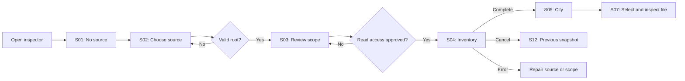

# User flows and decision points

## F01 — First structural inspection (WP-01)

Success: the selected source is the one scanned; the user sees exact values; the source remains unchanged. Failures preserve inputs and previous completed evidence.

## F02 — Find and inspect without spatial navigation

S05 → search path → S08 matching list → select file → S07 inspector → Focus (optional). No match → S23 → clear query. WebGL unavailable → S11 list → same inspector. A keyboard user does not need to navigate buildings.

## F03 — External source binding

Choose external directory → paste path → validate → review resolved path and exclusions → approve read → scan. If the binding is unavailable on another machine, retain the snapshot and ask for a new explicit binding. Never infer a different root from a similarly named folder.

## F04 — Add analysis evidence

City → connect provider S14 → choose import **or** installed executable. Import validates version/schema/scope/source mapping; execution separately reviews executable, args, root, side effects, and consent. Valid compatible evidence → S15. Failure → S22 with structural city still available. Mismatch → keep report separate; no silent attachment.

## F05 — Investigate and document

S15 selected finding → S17 workbench → review evidence and limitations → S18 composer → validate vault destination → create note → Open note. Name collision offers deliberate alternatives. Write failure keeps the draft. Source text and absolute machine paths are excluded by default.

## F06 — Dependency reasoning

Select file → S16 outgoing one-hop neighborhood → inspect typed edge → optionally expand scope → read equivalent edge list → return to file. Cycle or boundary finding links to supporting edges. No transition claims proven behavioral impact from imports alone.

## F07 — Compare change

S19 choose baseline/current → validate definitions/scope/provider config → build identity mapping → shared-layout comparison → inspect file/finding delta. Incompatibility offers separate inspection or a matching baseline. A missing provider is not a resolved-finding transition.

## F08 — Constrained view

Leaf narrows → file list collapses → inspector changes to drawer → only one drawer at a time → close returns focus to opener → leaf widens → restore user-docked panels. Snapshot/camera/selection remain stable. Below practical 3D width, offer list-first inspection.

## F09 — Note to source context

Read S24 note → static pinned preview → Open focused city → resolve profile/snapshot/file → inspect. Missing snapshot offers artifact import. A stale file mapping offers the pinned baseline or explicit alternate revision. Reading the note starts no scan, watch, or process.

## F10 — Watch and artifact lifecycle

S27 import artifact → validate → inspect offline (no source authorization). Separate Watch action → review source/scope/session → start → debounce changes → newest completed valid result → stop. Window close or plugin unload cancels view work and stops sessions according to the explicit session contract, without losing the last complete snapshot.

See the [screen catalogue](../README.md) for all main, failure, and later-release states.
