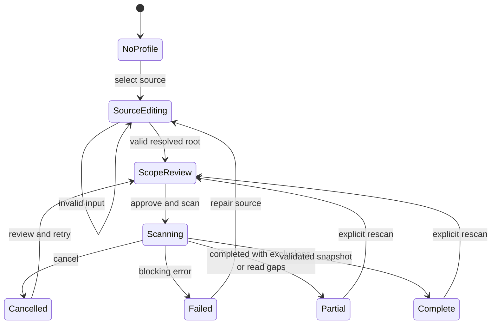

# State model, feedback, and recovery

Treat inventory state, renderer state, provider state, evidence freshness, and quality verdict as independent axes. A valid report with findings is not an execution failure; a failed provider does not invalidate the filesystem city.

## Inventory state machine

Intentional configured exclusions do not automatically mean an incomplete scan; differentiate expected excluded scope from unexpected unreadable/skipped content. A complete scan can be complete **for its configured scope**, not complete for every file on disk.

## State catalogue

| State ID | User-facing state | Required content | Primary recovery | Retained state |
|---|---|---|---|---|
| ST-01 | No source selected | What the plugin does; source options; no automatic scan | Select codebase | Presentation preferences |
| ST-02 | Invalid directory | Specific cause near field | Edit path | Typed path and profile label |
| ST-03 | External read not approved | Resolved root; purpose; exclusions | Approve/read or cancel | Previous complete snapshot |
| ST-04 | Scanning, total unknown | Current stage, counts so far, Cancel | Cancel | Last complete result |
| ST-05 | Scanning, denominator known | Meaningful completed/total and stage | Cancel | Last complete result |
| ST-06 | Cancelled | “Incomplete result discarded” | Scan again | Previous snapshot and selection |
| ST-07 | Empty included scope | 0 included files; exclusions and root | Review scope | Profile and filters |
| ST-08 | No search matches | Match count vs snapshot count | Clear search | Snapshot and geometry |
| ST-09 | Partial read evidence | Known coverage and failed paths/reasons | Review gaps / retry | Valid measured observations |
| ST-10 | Root moved or unavailable | Missing binding/path; no fallback scanning | Rebind source | Offline snapshot |
| ST-11 | 3D unavailable | Cause category; HTML equivalent | Retry 3D / use list | All normalized records |
| ST-12 | WebGL context lost | Pause rendering; no scan restart | Rebuild renderer / list | Snapshot and camera if recoverable |
| ST-13 | Provider not connected | Optional capability, setup choices | Import/connect | Structural city |
| ST-14 | Invalid/unsupported report | Version/schema reason, no invented parsed metrics | Choose supported artifact | Existing evidence |
| ST-15 | Provider running | Name, phase, source, cancel action | Cancel provider | Existing evidence marked retained |
| ST-16 | Provider failed | Operational error, safe log excerpt, scope | Review configuration / retry | Old evidence visibly stale |
| ST-17 | Evidence mismatch | Source/build/config/snapshot mismatch | Rebind or use separately | Report preserved, not silently merged |
| ST-18 | Note destination invalid | Specific validation message | Edit folder/title | Composer draft |
| ST-19 | Note write failed | Honest failure, no success notice | Retry / copy draft | Full draft and evidence references |
| ST-20 | Snapshot incompatible | Which definitions or scopes differ | Pick compatible baseline | Both snapshots inspectable separately |
| ST-21 | Referenced file removed | Old identity/path and snapshot | View baseline / clear selection | Investigation context |
| ST-22 | No local source binding | Artifact can be read; source action unavailable | Bind source explicitly | Imported snapshot |

## Evidence badge axes

Do not compress all states into one colored dot. A provider may have `runStatus=complete`, `verdict=findings`, and `freshness=stale`. A file may have `lineCoverage=0/98` while another file has `measurementState=not-instrumented`. Tooltips and inspector text expose the axes.

A compact badge can show “Imported · 16 Sep” with a labeled stale warning. In details: provider/version, observed time, snapshot/content identity, configuration/scope digest, data availability, and normalization warnings. Display time zone in detailed provenance; “2 hours ago” alone is insufficient for pinned historical evidence.

## Feedback hierarchy

Use inline field errors for input. Use banners for ongoing actionable problems. Use status text for ordinary progress. Use notices/toasts for completed user actions, with an accessible equivalent; they must not be the only durable trace of an error. Use a modal only for source/execution authorization, deliberate writes with meaningful consequences, or a blocking choice.

No indefinite spinner without a cancel/recovery path. After a slow threshold, report the stage and offer cancellation, not a fake ETA. In production, actual job timeouts are explicit adapter settings; the UI never interprets timeout as zero findings.

## Async race and teardown

Every operation carries jobId/profileId/snapshot lineage. Source changes make prior jobs irrelevant to the current view. Cancelling a renderer task stops UI publication even when an external process needs additional time to terminate. Closed views ignore late completions. Shared immutable snapshots may outlive a view; DOM/GPU resources do not.

The user must be able to tell which snapshot is on screen throughout cancellation, retry, profile change, pop-out migration, and plugin reload.
