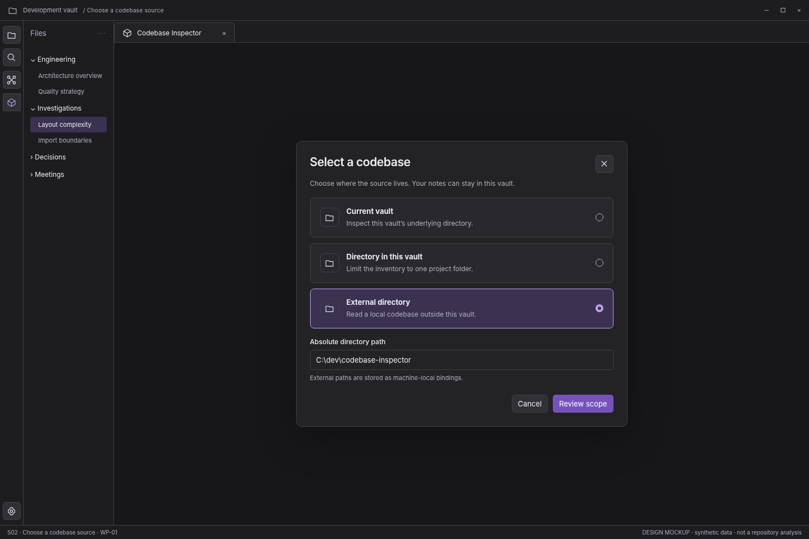

> **WP-01 refinement:** apply the [version 1.1 behavior baseline](../wp01-review/docs/01-behavior-baseline.md) and [validated interaction reference](../wp01-review/index.html) where they resolve earlier optional behavior. This screen remains a visual specification.

# S02 — Choose a codebase source

[Open review scenario](../prototype/index.html?screen=S02) · [Component library](../components/component-library.md) · [Interaction contract](../interactions/01-core-interactions.md)

## Outcome and release boundary

Select current vault, a vault directory, or an external local directory.

**Delivery:** WP-01. Initial structural release. The grey bottom caption and the optional review-harness controls are not production interface. The host chrome is an illustrative context, not a pixel-perfect specification of Obsidian itself.

## Entry and preconditions

Choose Select a codebase from S01 or the profile selector.

## Layout zones

1. Native modal title. 2. Three source-mode options. 3. Mode-specific path input. 4. Explicit next step.

In production, panel sizes follow the leaf-container rules. The screenshot is a reference composition rather than a fixed resolution requirement. All long paths remain available as accessible text.

## User interactions

| Trigger | Expected behavior |
|---|---|
| Choose source mode | Update field label and path validation; keep input by mode. |
| Paste path | Validate as data, not command text. |
| Review scope | Resolve root and enter S03 only on valid readable directory. |
| Cancel | Return to invoking view and restore focus. |

## States, errors, and edge cases

Invalid path, nonexistent directory, unreadable path, unsupported vault adapter, Unicode path, and external binding on another machine.

Use the [state catalogue](../interactions/02-states-and-recovery.md) and [microcopy](../interactions/04-microcopy.md). Operational failure, missing observations, and quality findings are not the same state.

## Components and data

**Components:** C02, C03, C15. See the [component contract registry](../components/component-contracts.json).

**Data consumed:** Profile label; source kind; unresolved and resolved paths; validation reason. Paths are local bindings.

Components emit intents; the application validates and performs work. Neither the renderer nor a report artifact obtains authority to read paths, execute commands, or write notes.

## Keyboard, accessibility, and focus

Required actions are reachable through normal labeled HTML controls. Do not depend on hover, color, dragging, double-click, or a canvas-only route. Modal steps contain focus and return it to the opener; nonmodal inspector drawers do not pretend to be modal. Obsidian-wide shortcuts are not hijacked. See [accessibility and responsive rules](../foundations/04-accessibility-and-responsive.md).

## Acceptance checks

Changing the root invalidates prior consent. Invalid input stays editable and creates no partially authorized profile.

Verify this screen in light/dark host themes, at increased text size, and in a narrow leaf. Confirm late asynchronous results cannot publish to another profile/view. Preserve the distinction between validated observations and the synthetic fixture shown here.

## Prototype limits

The review prototype uses an SVG city stand-in and simulated in-memory workflows. It does not scan, run fallow, validate real reports, write notes, execute inside Obsidian, or implement every production edge case. The written contracts are normative for implementation; the prototype is for discussing hierarchy, flow, and states.
