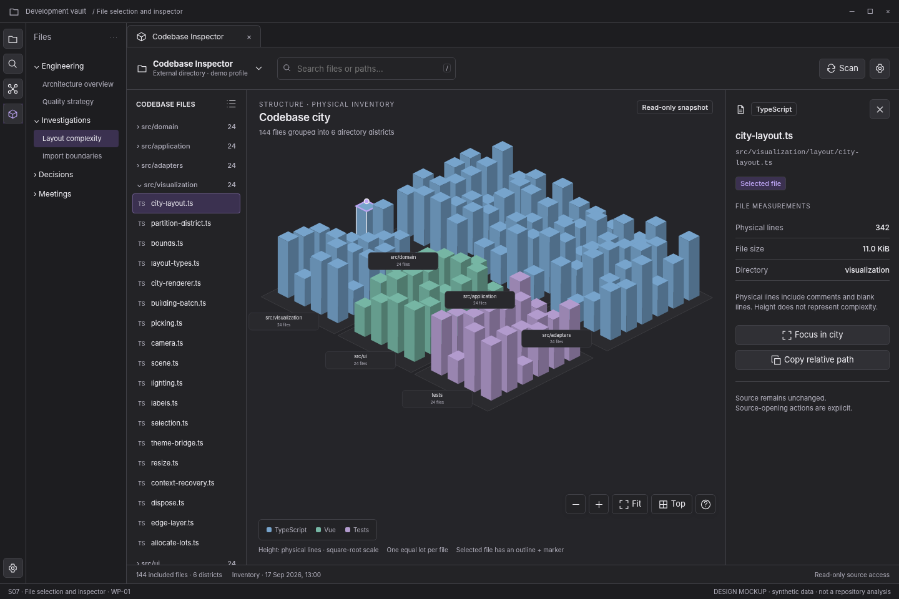

> **WP-01 refinement:** apply the [version 1.1 behavior baseline](../wp01-review/docs/01-behavior-baseline.md) and [validated interaction reference](../wp01-review/index.html) where they resolve earlier optional behavior. This screen remains a visual specification.

# S07 — File selection and inspector

[Open review scenario](../prototype/index.html?screen=S07) · [Component library](../components/component-library.md) · [Interaction contract](../interactions/01-core-interactions.md)

## Outcome and release boundary

Select a building and read exact file measurements.

**Delivery:** WP-01. Initial structural release. The grey bottom caption and the optional review-harness controls are not production interface. The host chrome is an illustrative context, not a pixel-perfect specification of Obsidian itself.

## Entry and preconditions

A building or file-list item has been selected.

## Layout zones

1. Selected row. 2. Independent outline and marker. 3. Full relative path. 4. Physical lines, KiB, category. 5. Focus and Copy relative path.

In production, panel sizes follow the leaf-container rules. The screenshot is a reference composition rather than a fixed resolution requirement. All long paths remain available as accessible text.

## User interactions

| Trigger | Expected behavior |
|---|---|
| Single click | Update selection only. |
| Focus in city | Frame the file neighborhood with bounded motion. |
| Copy relative path | Copy and announce; expose selectable text on failure. |
| Clear file selection | Clear selection and inspector; do not reset camera. |
| Hide inspector drawer | Keep selection; return focus to opener. |

## States, errors, and edge cases

Long duplicate basenames, binary/oversized file, removed file after refresh, source moved, unavailable lines vs measured zero.

Use the [state catalogue](../interactions/02-states-and-recovery.md) and [microcopy](../interactions/04-microcopy.md). Operational failure, missing observations, and quality findings are not the same state.

## Components and data

**Components:** C01, C06, C07, C08, C09, C10, C11, C12. See the [component contract registry](../components/component-contracts.json).

**Data consumed:** entityId; relativePath; category; line observation with state; byte size; directory; snapshot identity.

Components emit intents; the application validates and performs work. Neither the renderer nor a report artifact obtains authority to read paths, execute commands, or write notes.

## Keyboard, accessibility, and focus

Required actions are reachable through normal labeled HTML controls. Do not depend on hover, color, dragging, double-click, or a canvas-only route. Modal steps contain focus and return it to the opener; nonmodal inspector drawers do not pretend to be modal. Obsidian-wide shortcuts are not hijacked. See [accessibility and responsive rules](../foundations/04-accessibility-and-responsive.md).

## Acceptance checks

Displayed values belong to the selected file. A file with unavailable physical lines does not display 0.

Verify this screen in light/dark host themes, at increased text size, and in a narrow leaf. Confirm late asynchronous results cannot publish to another profile/view. Preserve the distinction between validated observations and the synthetic fixture shown here.

## Prototype limits

The review prototype uses an SVG city stand-in and simulated in-memory workflows. It does not scan, run fallow, validate real reports, write notes, execute inside Obsidian, or implement every production edge case. The written contracts are normative for implementation; the prototype is for discussing hierarchy, flow, and states.
