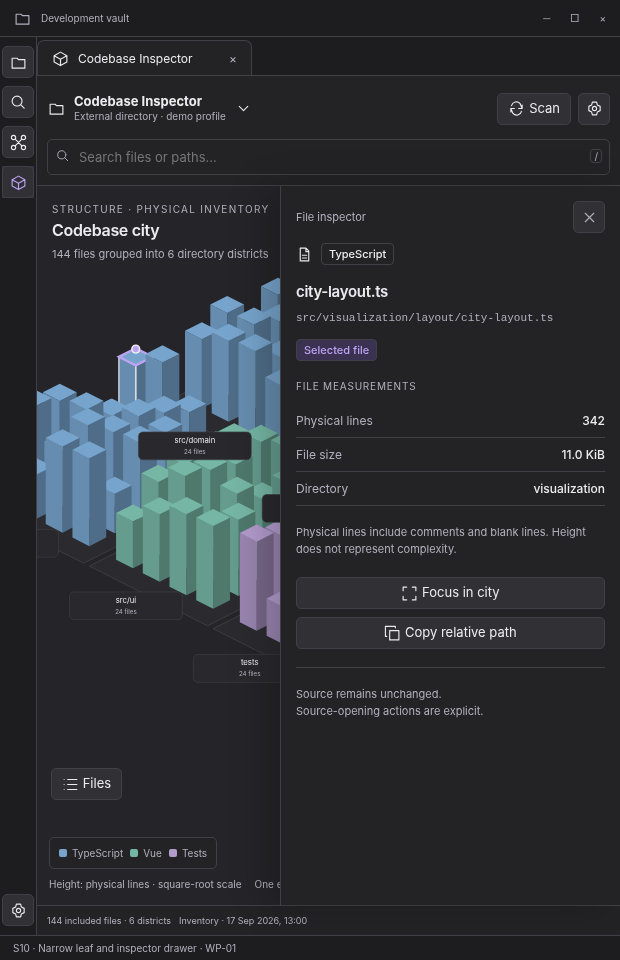

> **WP-01 refinement:** apply the [version 1.1 behavior baseline](../wp01-review/docs/01-behavior-baseline.md) and [validated interaction reference](../wp01-review/index.html) where they resolve earlier optional behavior. This screen remains a visual specification.

# S10 — Narrow leaf and inspector drawer

[Open review scenario](../prototype/index.html?screen=S10) · [Component library](../components/component-library.md) · [Interaction contract](../interactions/01-core-interactions.md)

## Outcome and release boundary

Complete the same tasks in a narrow desktop workspace leaf.

**Delivery:** WP-01. Initial structural release. The grey bottom caption and the optional review-harness controls are not production interface. The host chrome is an illustrative context, not a pixel-perfect specification of Obsidian itself.

## Entry and preconditions

Inspector leaf is around 620 px wide; a file is selected.

## Layout zones

1. Wrapped profile/search toolbar. 2. Canvas remains contextual. 3. File list collapses to Files action. 4. Inspector becomes a nonmodal drawer.

In production, panel sizes follow the leaf-container rules. The screenshot is a reference composition rather than a fixed resolution requirement. All long paths remain available as accessible text.

## User interactions

| Trigger | Expected behavior |
|---|---|
| Open Files | Show a file drawer; close another drawer if needed. |
| Open inspector | Expose full path and actions. |
| Close inspector | Preserve selected file and camera; return focus to opener. |
| Resize leaf | Transition panel layout without rescanning. |

## States, errors, and edge cases

One drawer at a time. Very narrow leaves offer list-first inspection. A narrow desktop leaf is not mobile support.

Use the [state catalogue](../interactions/02-states-and-recovery.md) and [microcopy](../interactions/04-microcopy.md). Operational failure, missing observations, and quality findings are not the same state.

## Components and data

**Components:** C01, C06, C08, C09, C10, C18. See the [component contract registry](../components/component-contracts.json).

**Data consumed:** Leaf dimensions, panel preferences, selection, same snapshot; no window-width assumptions.

Components emit intents; the application validates and performs work. Neither the renderer nor a report artifact obtains authority to read paths, execute commands, or write notes.

## Keyboard, accessibility, and focus

Required actions are reachable through normal labeled HTML controls. Do not depend on hover, color, dragging, double-click, or a canvas-only route. Modal steps contain focus and return it to the opener; nonmodal inspector drawers do not pretend to be modal. Obsidian-wide shortcuts are not hijacked. See [accessibility and responsive rules](../foundations/04-accessibility-and-responsive.md).

## Acceptance checks

Primary actions remain reachable at large text sizes. No entire-leaf horizontal scrolling is needed for ordinary content.

Verify this screen in light/dark host themes, at increased text size, and in a narrow leaf. Confirm late asynchronous results cannot publish to another profile/view. Preserve the distinction between validated observations and the synthetic fixture shown here.

## Prototype limits

The review prototype uses an SVG city stand-in and simulated in-memory workflows. It does not scan, run fallow, validate real reports, write notes, execute inside Obsidian, or implement every production edge case. The written contracts are normative for implementation; the prototype is for discussing hierarchy, flow, and states.
