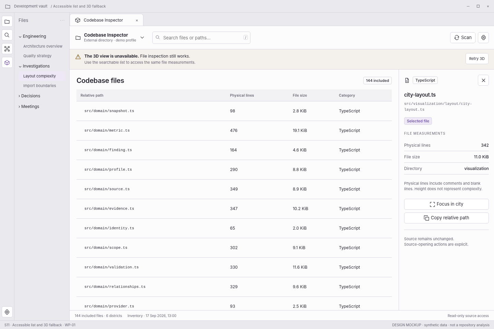

> **WP-01 refinement:** apply the [version 1.1 behavior baseline](../wp01-review/docs/01-behavior-baseline.md) and [validated interaction reference](../wp01-review/index.html) where they resolve earlier optional behavior. This screen remains a visual specification.

# S11 — Accessible list and 3D fallback

[Open review scenario](../prototype/index.html?screen=S11) · [Component library](../components/component-library.md) · [Interaction contract](../interactions/01-core-interactions.md)

## Outcome and release boundary

Continue inspection when 3D is unavailable or deliberately not used.

**Delivery:** WP-01. Initial structural release. The grey bottom caption and the optional review-harness controls are not production interface. The host chrome is an illustrative context, not a pixel-perfect specification of Obsidian itself.

## Entry and preconditions

WebGL failed, was lost without recovery, or the user selected list-only inspection.

## Layout zones

1. Persistent 3D-unavailable explanation. 2. Search. 3. Equivalent file table. 4. Exact selected-file inspector. 5. Retry 3D.

In production, panel sizes follow the leaf-container rules. The screenshot is a reference composition rather than a fixed resolution requirement. All long paths remain available as accessible text.

## User interactions

| Trigger | Expected behavior |
|---|---|
| Select file row | Inspect all core values without WebGL. |
| Search | Search the included path universe. |
| Retry 3D | Reinitialize the renderer only; do not scan. |
| Continue in list | Dismiss optional renderer retries. |

## States, errors, and edge cases

Renderer initialization failure differs from no files. Large inventories require accessible paging/virtualization.

Use the [state catalogue](../interactions/02-states-and-recovery.md) and [microcopy](../interactions/04-microcopy.md). Operational failure, missing observations, and quality findings are not the same state.

## Components and data

**Components:** C06, C07, C10, C12, C16, C19. See the [component contract registry](../components/component-contracts.json).

**Data consumed:** Full normalized snapshot and renderer status; no GPU needed for HTML information.

Components emit intents; the application validates and performs work. Neither the renderer nor a report artifact obtains authority to read paths, execute commands, or write notes.

## Keyboard, accessibility, and focus

Required actions are reachable through normal labeled HTML controls. Do not depend on hover, color, dragging, double-click, or a canvas-only route. Modal steps contain focus and return it to the opener; nonmodal inspector drawers do not pretend to be modal. Obsidian-wide shortcuts are not hijacked. See [accessibility and responsive rules](../foundations/04-accessibility-and-responsive.md).

## Acceptance checks

The core find/select/read workflow succeeds without WebGL. A GPU error does not erase file or finding data.

Verify this screen in light/dark host themes, at increased text size, and in a narrow leaf. Confirm late asynchronous results cannot publish to another profile/view. Preserve the distinction between validated observations and the synthetic fixture shown here.

## Prototype limits

The review prototype uses an SVG city stand-in and simulated in-memory workflows. It does not scan, run fallow, validate real reports, write notes, execute inside Obsidian, or implement every production edge case. The written contracts are normative for implementation; the prototype is for discussing hierarchy, flow, and states.
