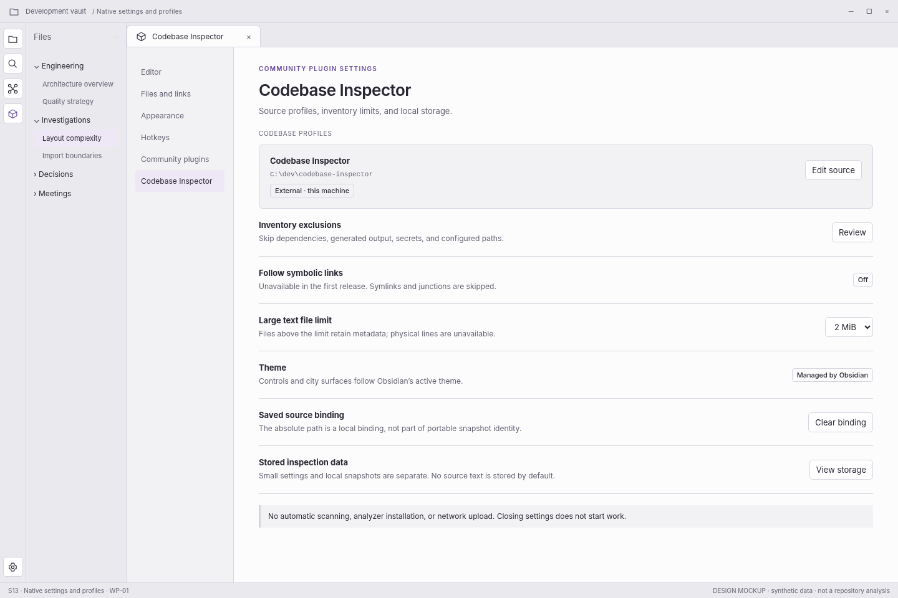

> **WP-01 refinement:** apply the [version 1.1 behavior baseline](../wp01-review/docs/01-behavior-baseline.md) and [validated interaction reference](../wp01-review/index.html) where they resolve earlier optional behavior. This screen remains a visual specification.

# S13 — Native settings and profiles

[Open review scenario](../prototype/index.html?screen=S13) · [Component library](../components/component-library.md) · [Interaction contract](../interactions/01-core-interactions.md)

## Outcome and release boundary

Manage source scope, exclusions, and storage without a second application shell.

**Delivery:** WP-01. Initial structural release. The grey bottom caption and the optional review-harness controls are not production interface. The host chrome is an illustrative context, not a pixel-perfect specification of Obsidian itself.

## Entry and preconditions

Open Obsidian settings for the plugin.

## Layout zones

1. Native settings context. 2. Profile and local binding. 3. Exclusions and limits. 4. Theme owned by host. 5. Storage controls and disclosures.

In production, panel sizes follow the leaf-container rules. The screenshot is a reference composition rather than a fixed resolution requirement. All long paths remain available as accessible text.

## User interactions

| Trigger | Expected behavior |
|---|---|
| Edit source | Enter S02/S03. |
| Review exclusions | Show configured patterns and scope effects. |
| Clear local binding | Confirm configuration removal; never delete source files. |
| Close settings | Save appropriate settings only; no scan. |

## States, errors, and edge cases

Invalid limits, missing external binding, output cache included accidentally, third-party theme. Future-provider settings remain absent before implementation.

Use the [state catalogue](../interactions/02-states-and-recovery.md) and [microcopy](../interactions/04-microcopy.md). Operational failure, missing observations, and quality findings are not the same state.

## Components and data

**Components:** C02, C03, C04, C20. See the [component contract registry](../components/component-contracts.json).

**Data consumed:** Small profile/preferences; storage metadata and retention; resolved local binding; validated exclusion syntax.

Components emit intents; the application validates and performs work. Neither the renderer nor a report artifact obtains authority to read paths, execute commands, or write notes.

## Keyboard, accessibility, and focus

Required actions are reachable through normal labeled HTML controls. Do not depend on hover, color, dragging, double-click, or a canvas-only route. Modal steps contain focus and return it to the opener; nonmodal inspector drawers do not pretend to be modal. Obsidian-wide shortcuts are not hijacked. See [accessibility and responsive rules](../foundations/04-accessibility-and-responsive.md).

## Acceptance checks

Default settings do not scan or execute anything. Clearing a profile never removes its source directory.

Verify this screen in light/dark host themes, at increased text size, and in a narrow leaf. Confirm late asynchronous results cannot publish to another profile/view. Preserve the distinction between validated observations and the synthetic fixture shown here.

## Prototype limits

The review prototype uses an SVG city stand-in and simulated in-memory workflows. It does not scan, run fallow, validate real reports, write notes, execute inside Obsidian, or implement every production edge case. The written contracts are normative for implementation; the prototype is for discussing hierarchy, flow, and states.
