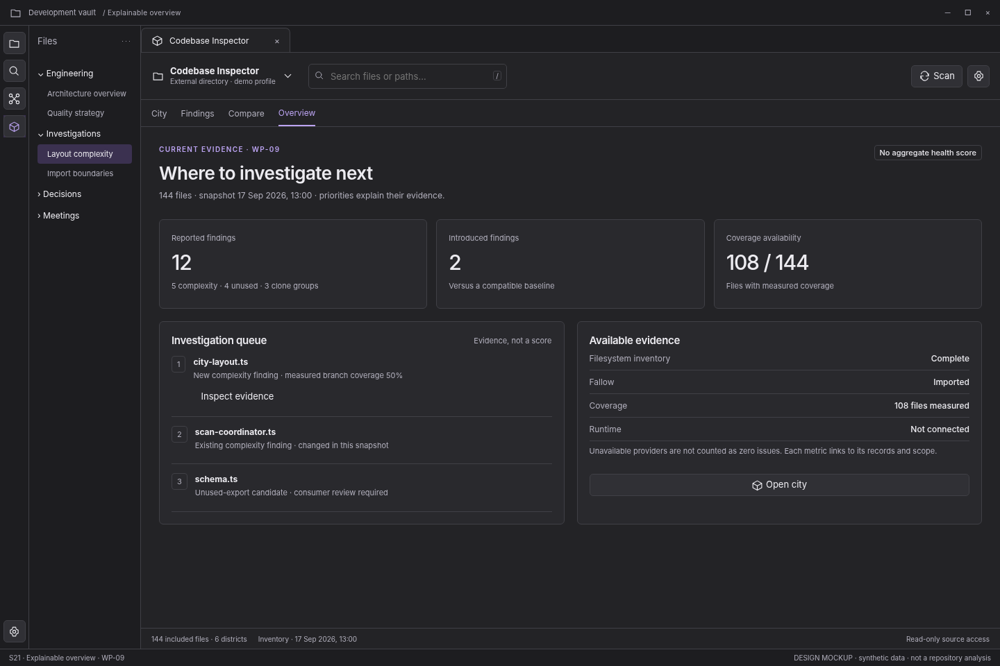

# S21 — Explainable overview

[Open review scenario](../prototype/index.html?screen=S21) · [Component library](../components/component-library.md) · [Interaction contract](../interactions/01-core-interactions.md)

## Outcome and release boundary

Prioritize investigation through explicit signals rather than a synthetic score.

**Delivery:** WP-09. Later capability; do not expose before its implementation package. The grey bottom caption and the optional review-harness controls are not production interface. The host chrome is an illustrative context, not a pixel-perfect specification of Obsidian itself.

## Entry and preconditions

Overview capability is implemented and at least inventory is available.

## Layout zones

1. Current snapshot/scope. 2. Separate evidence cards. 3. Explainable investigation queue. 4. Provider availability.

In production, panel sizes follow the leaf-container rules. The screenshot is a reference composition rather than a fixed resolution requirement. All long paths remain available as accessible text.

## User interactions

| Trigger | Expected behavior |
|---|---|
| Inspect evidence | Open underlying records, not an opaque score explanation. |
| Change priority filter | Show the applied rule/order and missing signals. |
| Open city | Preserve profile/snapshot. |

## States, errors, and edge cases

Only inventory connected; no baseline; coverage partial; provider stale; zero findings in known scope.

Use the [state catalogue](../interactions/02-states-and-recovery.md) and [microcopy](../interactions/04-microcopy.md). Operational failure, missing observations, and quality findings are not the same state.

## Components and data

**Components:** C13, C14, C19, C25. See the [component contract registry](../components/component-contracts.json).

**Data consumed:** Counts with units; delta compatibility; queue explanations; provider states. No synthetic universal grade.

Components emit intents; the application validates and performs work. Neither the renderer nor a report artifact obtains authority to read paths, execute commands, or write notes.

## Keyboard, accessibility, and focus

Required actions are reachable through normal labeled HTML controls. Do not depend on hover, color, dragging, double-click, or a canvas-only route. Modal steps contain focus and return it to the opener; nonmodal inspector drawers do not pretend to be modal. Obsidian-wide shortcuts are not hijacked. See [accessibility and responsive rules](../foundations/04-accessibility-and-responsive.md).

## Acceptance checks

Every card reconciles to a defined set of records. Losing a provider cannot make apparent quality improve.

Verify this screen in light/dark host themes, at increased text size, and in a narrow leaf. Confirm late asynchronous results cannot publish to another profile/view. Preserve the distinction between validated observations and the synthetic fixture shown here.

## Prototype limits

The review prototype uses an SVG city stand-in and simulated in-memory workflows. It does not scan, run fallow, validate real reports, write notes, execute inside Obsidian, or implement every production edge case. The written contracts are normative for implementation; the prototype is for discussing hierarchy, flow, and states.
