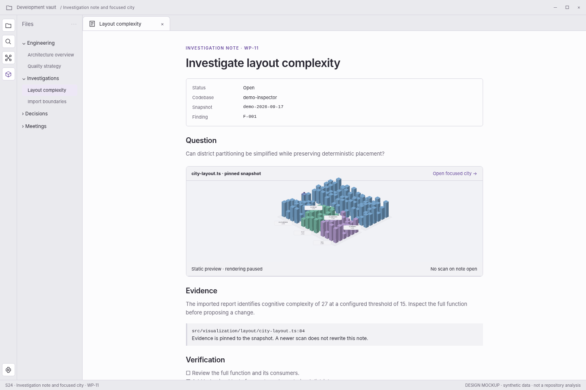

# S24 — Investigation note and focused city

[Open review scenario](../prototype/index.html?screen=S24) · [Component library](../components/component-library.md) · [Interaction contract](../interactions/01-core-interactions.md)

## Outcome and release boundary

Navigate from notes to a pinned, focused snapshot without authorizing a scan.

**Delivery:** WP-11. Later capability; do not expose before its implementation package. The grey bottom caption and the optional review-harness controls are not production interface. The host chrome is an illustrative context, not a pixel-perfect specification of Obsidian itself.

## Entry and preconditions

Open a Markdown investigation containing a pinned Inspector reference.

## Layout zones

1. Human-authored note. 2. Portable properties. 3. Bounded static city preview. 4. Open focused city action.

In production, panel sizes follow the leaf-container rules. The screenshot is a reference composition rather than a fixed resolution requirement. All long paths remain available as accessible text.

## User interactions

| Trigger | Expected behavior |
|---|---|
| Open focused city | Resolve profile/snapshot/entity; no automatic scan. |
| Missing artifact | Offer import or explicit alternate snapshot; keep note unchanged. |
| Activate preview | Only if interactive embeds are implemented and resource-budgeted. |

## States, errors, and edge cases

Missing plugin; unknown profile; unavailable snapshot; stale source; multiple embeds; pop-out note.

Use the [state catalogue](../interactions/02-states-and-recovery.md) and [microcopy](../interactions/04-microcopy.md). Operational failure, missing observations, and quality findings are not the same state.

## Components and data

**Components:** C23, C26. See the [component contract registry](../components/component-contracts.json).

**Data consumed:** Pinned portable identifiers, optional preview image, source-relative path. No absolute execution path or command.

Components emit intents; the application validates and performs work. Neither the renderer nor a report artifact obtains authority to read paths, execute commands, or write notes.

## Keyboard, accessibility, and focus

Required actions are reachable through normal labeled HTML controls. Do not depend on hover, color, dragging, double-click, or a canvas-only route. Modal steps contain focus and return it to the opener; nonmodal inspector drawers do not pretend to be modal. Obsidian-wide shortcuts are not hijacked. See [accessibility and responsive rules](../foundations/04-accessibility-and-responsive.md).

## Acceptance checks

Reading a note starts no analyzer/watcher. Updating codebase evidence does not overwrite human investigation text.

Verify this screen in light/dark host themes, at increased text size, and in a narrow leaf. Confirm late asynchronous results cannot publish to another profile/view. Preserve the distinction between validated observations and the synthetic fixture shown here.

## Prototype limits

The review prototype uses an SVG city stand-in and simulated in-memory workflows. It does not scan, run fallow, validate real reports, write notes, execute inside Obsidian, or implement every production edge case. The written contracts are normative for implementation; the prototype is for discussing hierarchy, flow, and states.
