# Screen specification

**Product:** codebase-inspector · **Artifact:** full offline interactive UI prototype · **Language:** English.

All evidence is synthetic. Existing production Three.js code was not imported; the city in this artifact is a replaceable Canvas UI fixture. Screen routes are hash routes in `index.html`.

## Shared interaction rules

Maintain source, snapshot and selected file across views. Selection must not move the city camera. Search should preserve spatial placement. Dialogs trap keyboard focus and restore it on close. Every visible action has a handler. Missing evidence remains unknown. Review actions never execute source changes. Stale, failed and empty scan states retain the last demo evidence and show a warning outside the source screen.

Tables expose file identities and raw values rather than relying on color alone. The inventory is a first-class alternative to the visual city. Native controls, visible focus outlines, modal Escape, command search and explicit status checks are implemented. This is not a claim of WCAG certification or assistive-technology validation.

## 01 — Code city

**Route:** `#city` · **Area:** Explore

**User outcome:** Build a spatial mental model and select the next file to investigate.

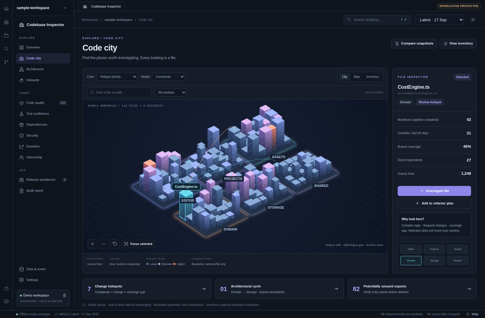

[Light-theme reference](../screenshots/city-light.png)

**Information:** A shared 144-file dataset is mapped into six stable module districts. Footprint represents source lines; height and color lenses are selectable.

**Interactions:** Rotate, pan, zoom, focus explicitly, reset, select a building, search without re-layout, filter a module, switch City / Map / Inventory, open the inspector, and create a work item.

**States and constraints:** No search results; filtered districts; selected file; keyboard inventory; dark/light; narrow pane. The city uses projected Canvas only in this HTML.

**Component boundaries:** CityRenderer adapter, FilterToolbar, FileInspector, Legend, ModuleFocus, InventoryTable.

## 02 — Overview

**Route:** `#overview` · **Area:** Explore

**User outcome:** Understand independent health signals and decide where to inspect next.

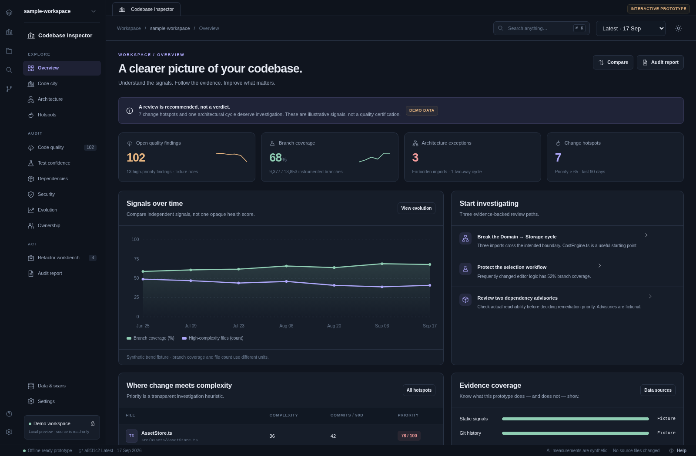

[Light-theme reference](../screenshots/overview-light.png)

**Information:** Open findings, branch coverage, architecture-rule violations, hotspot count, signal history, and evidence availability.

**Interactions:** Open prioritized investigation paths, inspect a hotspot, compare snapshots, and navigate to a report or provider sources.

**States and constraints:** Latest/baseline metrics; triage-dependent issue counts; unknown runtime and mutation evidence. No composite health score.

**Component boundaries:** MetricCard, SignalHistory, InvestigationCard, EvidenceCoverage, HotspotTable.

## 03 — Architecture

**Route:** `#architecture` · **Area:** Explore

**User outcome:** Compare observed dependencies with explicitly intended boundaries.

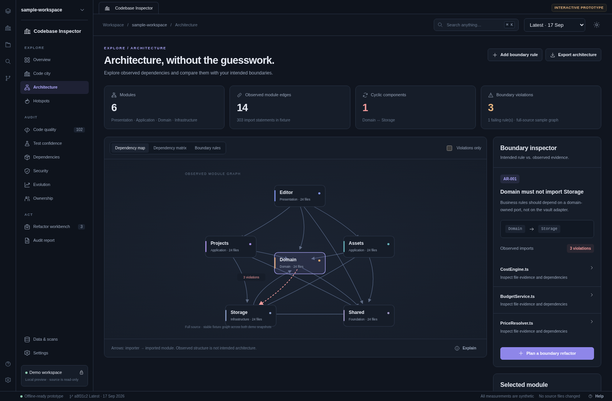

[Light-theme reference](../screenshots/architecture-light.png)

**Information:** Directed import graph, dependency structure matrix, rule inventory, module details, and Domain/Storage cycle evidence.

**Interactions:** Select nodes; inspect matrix cells; filter violations; switch map/matrix/rules; add and evaluate intended rules; inspect rule details; plan a boundary refactor.

**States and constraints:** Passing/review/violation rules; selected module; no edge; direction-specific matrix evidence. Graph fixture stays constant between the two sample snapshots.

**Component boundaries:** ModuleGraph, DependencyMatrix, BoundaryRuleTable, RuleEditor, ModuleInspector.

## 04 — Hotspots

**Route:** `#hotspots` · **Area:** Explore

**User outcome:** Prioritize investigation using transparent raw measurements.

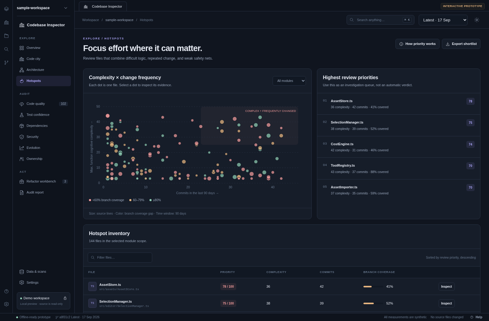

[Light-theme reference](../screenshots/hotspots-light.png)

**Information:** Scatterplot of maximum function cognitive complexity versus 90-day commit frequency; bubble area approximates source size; color indicates branch-coverage gap.

**Interactions:** Inspect a dot; filter by module or file; open a ranked file; inspect the priority formula; export the full shortlist as CSV.

**States and constraints:** No search results; selected module; varying review threshold. Heuristic priority is not a failure probability.

**Component boundaries:** Scatterplot, FileTable, PriorityExplanation, ModuleFilter.

## 05 — Code quality

**Route:** `#quality` · **Area:** Audit

**User outcome:** Triage static findings with evidence, location, and a recorded disposition.

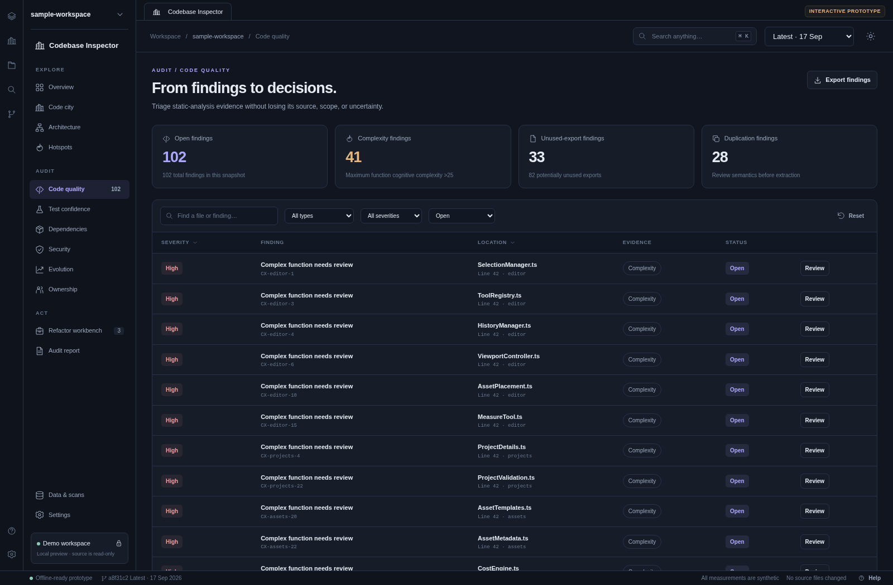

[Light-theme reference](../screenshots/quality-light.png)

**Information:** Complexity, unused-export and duplication findings, provider context, severity, file location, and status.

**Interactions:** Filter query/type/severity/status; sort by severity or file; show more; inspect a finding; acknowledge/reopen; dismiss with rationale; create a work item; export findings.

**States and constraints:** Open, acknowledged, dismissed; no matches; required dismissal reason; locally retained decisions. No repository suppressions are written.

**Component boundaries:** FindingsTable, FilterToolbar, FindingDialog, DispositionEditor.

## 06 — Test confidence

**Route:** `#tests` · **Area:** Audit

**User outcome:** Assess where tested execution is missing and keep assertion strength distinct from coverage.

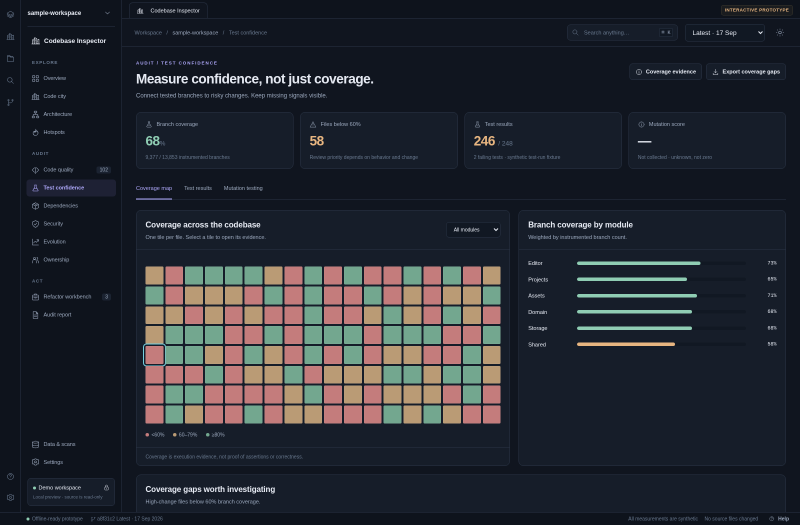

[Light-theme reference](../screenshots/tests-light.png)

**Information:** Per-file coverage tiles, weighted module coverage, coverage gaps, representative test-run results, and unavailable mutation evidence.

**Interactions:** Inspect a coverage tile; filter module; view test results; plan characterization tests; export coverage gaps; inspect the coverage provider.

**States and constraints:** Coverage map, test-results tab, two synthetic failing cases, missing mutation provider. Unknown is not zero or passing.

**Component boundaries:** CoverageMap, WeightedCoverageBars, GapTable, TestResultsTable, UnknownEvidenceState.

## 07 — Dependencies

**Route:** `#dependencies` · **Area:** Audit

**User outcome:** Inspect external package inventory separately from internal module architecture.

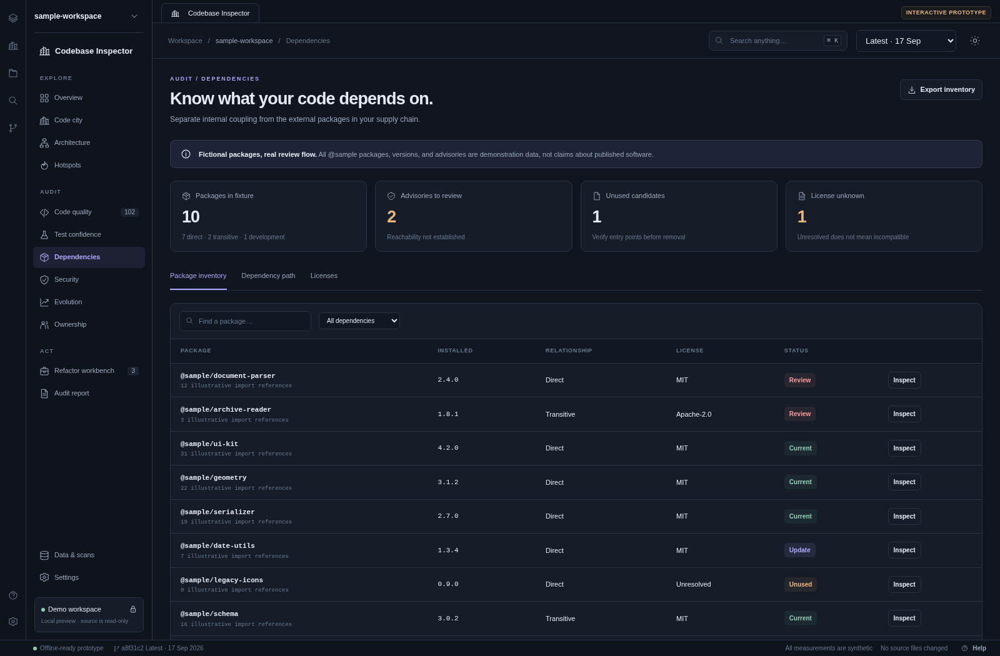

[Light-theme reference](../screenshots/dependencies-light.png)

**Information:** Fictional direct/transitive/development packages, usage references, recorded licenses, illustrative target versions, and dependency paths.

**Interactions:** Search and filter packages; inspect details; switch inventory/path/licenses; create a review item; export package metadata.

**States and constraints:** Current/update/review/unused states; unresolved license; unknown advisory reachability; no matches. No real package registry is consulted.

**Component boundaries:** PackageTable, RelationshipFilter, DependencyPath, PackageDialog, LicenseInventory.

## 08 — Security

**Route:** `#security` · **Area:** Audit

**User outcome:** Review possible issues without presenting an unverified exploitability verdict.

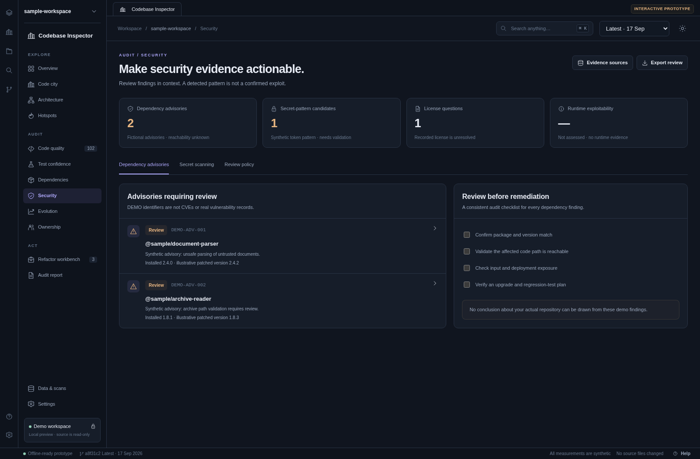

[Light-theme reference](../screenshots/security-light.png)

**Information:** Two DEMO advisories, one masked synthetic secret-pattern candidate, one unresolved license, and runtime exploitability shown as unknown.

**Interactions:** Inspect advisory records; record review checks; switch to secret scanning; mark the synthetic token as a fixture; inspect the related file; export a review.

**States and constraints:** Candidate vs. validated finding; unknown runtime evidence; masked secrets; explicit fictional-data labels.

**Component boundaries:** AdvisoryList, SecurityReviewChecklist, SecretCandidate, ReviewPolicy.

## 09 — Evolution

**Route:** `#evolution` · **Area:** Audit

**User outcome:** Understand trends and change relationships rather than judging one snapshot.

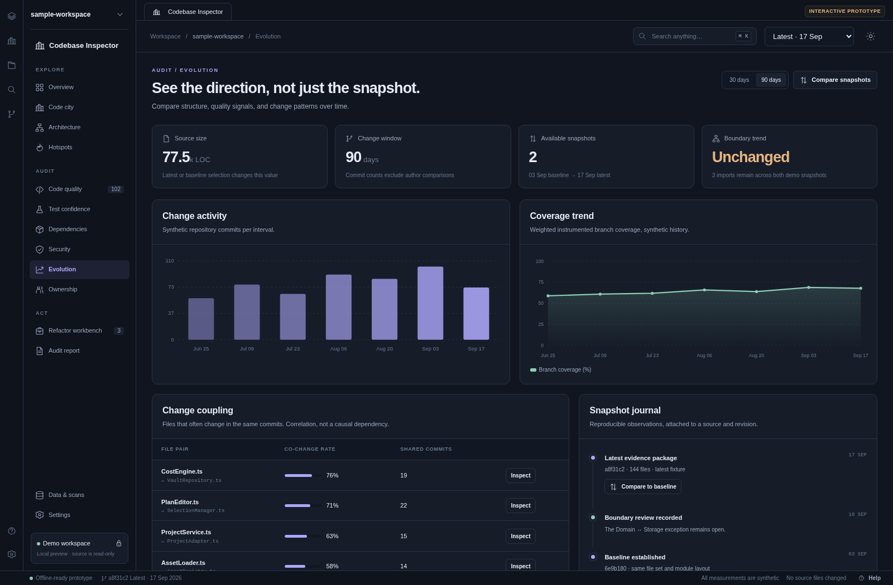

[Light-theme reference](../screenshots/evolution-light.png)

**Information:** Synthetic commit activity, coverage history, co-change examples, and a two-snapshot journal.

**Interactions:** Switch 30/90-day windows; compare baseline/latest; activate a snapshot; inspect co-changing files.

**States and constraints:** Snapshot deltas are generated data; co-change is not an import dependency or proof of causation.

**Component boundaries:** ActivityChart, SignalTrend, ChangeCouplingTable, SnapshotJournal, ComparisonDialog.

## 10 — Ownership

**Route:** `#ownership` · **Area:** Audit

**User outcome:** Plan continuity and knowledge sharing at module/team level.

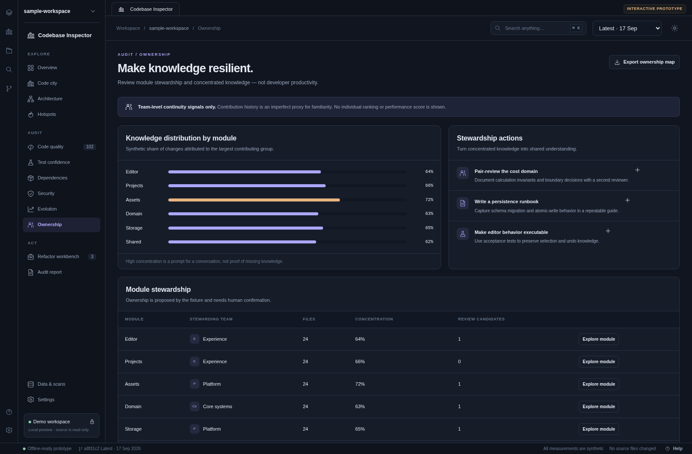

[Light-theme reference](../screenshots/ownership-light.png)

**Information:** Synthetic stewardship assignments and largest-group contribution concentration. No individual ranking or productivity score.

**Interactions:** Inspect a module in the city; create pairing, characterization-test, or documentation work items; export the stewardship map.

**States and constraints:** Contribution history is an imperfect familiarity proxy, not proof that knowledge is absent.

**Component boundaries:** StewardshipTable, ConcentrationBars, KnowledgeSharingActions.

## 11 — Refactor workbench

**Route:** `#workbench` · **Area:** Act

**User outcome:** Convert evidence into scoped, verifiable improvement work.

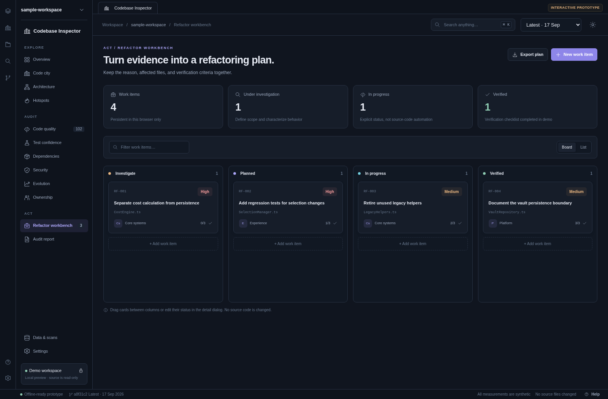

[Light-theme reference](../screenshots/workbench-light.png)

**Information:** Cards and rows containing evidence file, team, priority, notes, lifecycle state and a three-item verification checklist.

**Interactions:** Create/edit/delete; search; switch Board/List; drag between columns; update status; complete verification checks; export Markdown.

**States and constraints:** Investigate → Planned → In progress → Verified. Verified is blocked until every check is complete. Deletion requires confirmation.

**Component boundaries:** KanbanBoard, WorkItemCard, WorkItemTable, WorkItemEditor, ConfirmationDialog.

## 12 — Audit report

**Route:** `#report` · **Area:** Act

**User outcome:** Communicate scope, evidence, limitations and proposed work clearly.

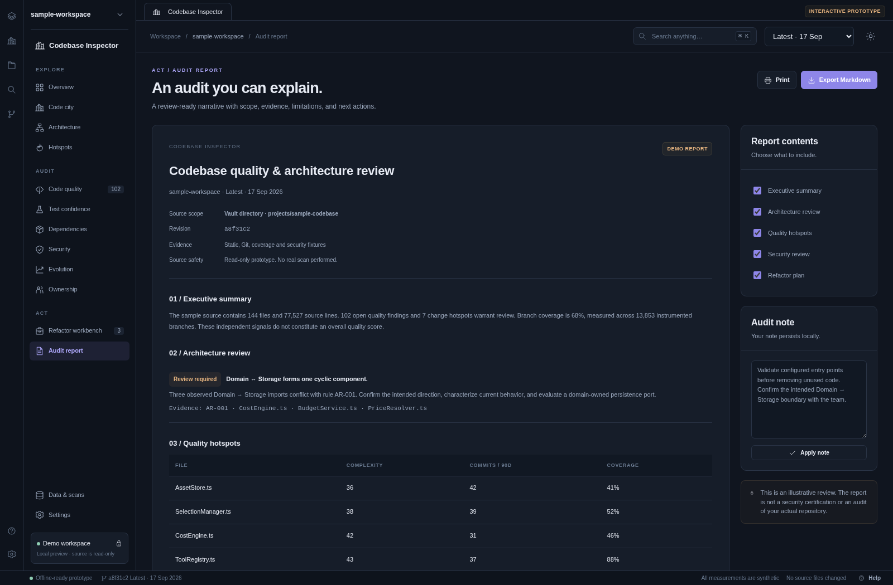

[Light-theme reference](../screenshots/report-light.png)

**Information:** A composed report with source metadata, summary, architecture, hotspots, security, plan, reviewer note, and limitations.

**Interactions:** Include/exclude sections; edit and apply reviewer note; print; export actual Markdown.

**States and constraints:** Sections toggle without losing notes; current snapshot and work items appear in the report. Explicitly not a real repository audit.

**Component boundaries:** ReportComposer, SectionSelector, ReviewerNote, MarkdownExporter, PrintStyles.

## 13 — Data & scans

**Route:** `#sources` · **Area:** Configure

**User outcome:** Make source scope and provider provenance explicit before interpretation.

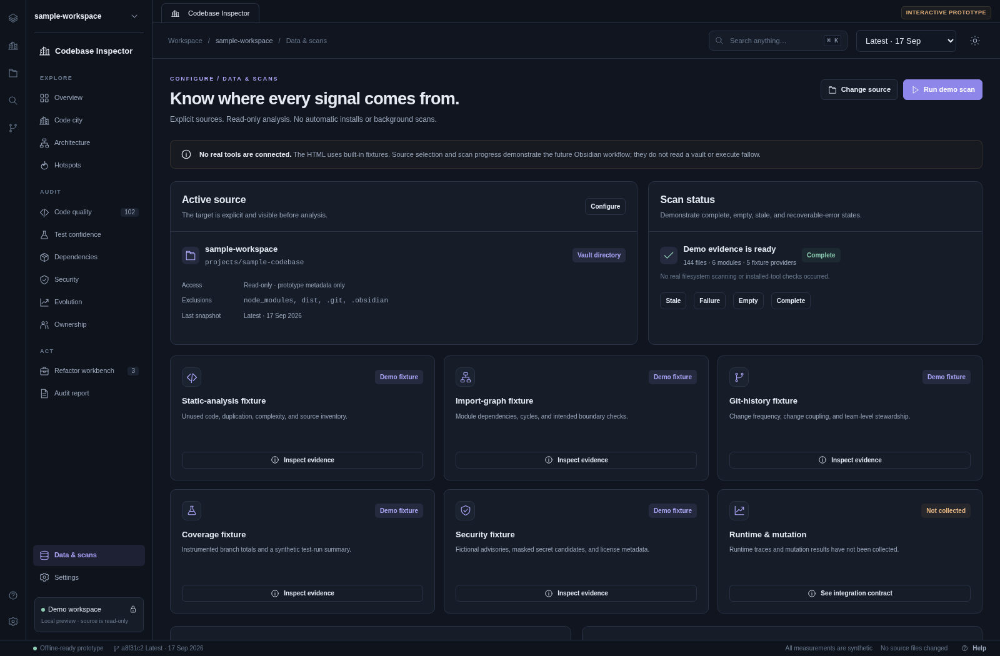

[Light-theme reference](../screenshots/sources-light.png)

**Information:** Active source descriptor, fixture providers, missing providers, scan-state previews, planned fallow adapter contract, and local state import/export.

**Interactions:** Run the three-step source wizard; choose vault/directory/external metadata; simulate a scan; exercise stale/failed/empty/complete states; inspect provider contracts; export evidence/state; import a validated state file.

**States and constraints:** Paths are metadata only. No real file scanning, executable discovery, fallow report import, process execution or auto-install occurs. Last fixture remains available with warning state.

**Component boundaries:** SourceWizard, ProviderCard, EvidenceEnvelope, ScanState, ImportStateDialog.

## 14 — Settings

**Route:** `#settings` · **Area:** Configure

**User outcome:** Adjust real preview preferences while keeping production policies explicit.

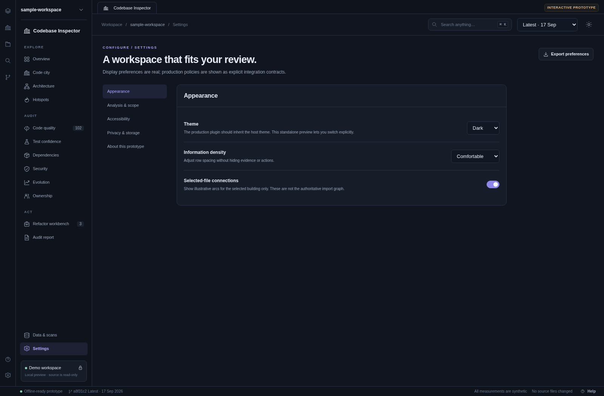

[Light-theme reference](../screenshots/settings-light.png)

**Information:** Appearance, analysis threshold, accessibility, privacy/storage, and prototype integration boundaries.

**Interactions:** Switch theme and density; toggle connections/reduced motion/contrast; change hotspot threshold; open inventory/help; export state; confirm reset.

**States and constraints:** Host-theme inheritance is a production contract; standalone theme selection is real. Browser storage may be unavailable; export/import remains available.

**Component boundaries:** SettingsNavigation, PreferenceRow, Toggle, ThresholdField, ResetDialog.

## 15 — File detail

**Route:** `#file` · **Area:** Cross-cutting

**User outcome:** Follow a selected file from metrics to source context, evidence and planned changes.

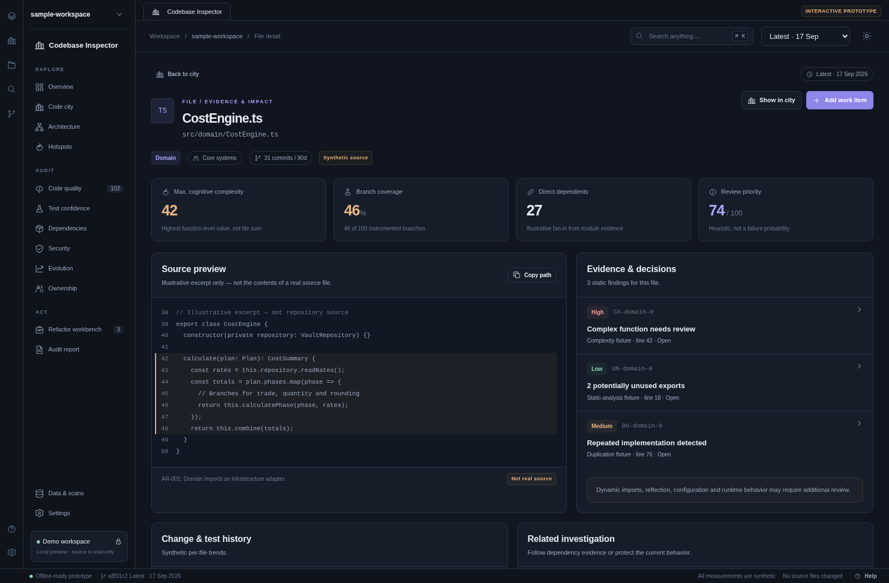

[Light-theme reference](../screenshots/file-light.png)

**Information:** File identity, team, source-relative path, raw metrics, synthetic source excerpt, static findings, illustrative coverage history, and related review actions.

**Interactions:** Open finding detail; copy file path; add work item; plan tests; inspect architecture; show the same selection in the city.

**States and constraints:** No findings does not imply no defects. Source preview is explicitly synthetic. Selection is shared across other screens.

**Component boundaries:** FileHeader, SourcePreview, FileMetricCards, EvidenceList, RelatedActions.

## Connected dialogs and subviews

| Surface | Entry | Completed interaction |
|---|---|---|
| File inspector drawer | File rows, scatterplot, coverage tiles | Inspect raw evidence and open detail/city/work item |
| Finding review | Quality or file evidence | Acknowledge, reopen, dismiss with reason, create work item |
| Snapshot comparison | Overview, city, evolution | Compare actual fixture differences and select active snapshot |
| Boundary-rule editor | Architecture | Save intended direction and evaluate against sample edges |
| Rule detail | Boundary-rule table | Show rationale, count, and illustrative paths |
| Package detail | Inventory or advisory | Inspect record and create dependency review item |
| Work-item editor | New item or card | Edit fields and guard Verified behind checklist completion |
| Source wizard | Sidebar source control or Data & scans | Choose source kind, edit metadata, confirm demo use |
| Scan progress | Run demo scan | Simulate provider stages; cancel; open city or sources |
| Provider detail | Evidence card or coverage action | Explain provenance and production integration boundary |
| Command palette | Ctrl/Command K or search | Search screens/files; use arrows and Enter; Escape to close |
| State import | Data & scans | Validate supported schema and reject malformed data |
| Reset confirmation | Privacy & storage | Export first, cancel, or reset only local prototype state |
| Help | Ribbon, status bar, settings | Review keyboard controls and connected workflow |

Subview screenshots are included for the dependency matrix, city map, test results, unknown mutation evidence, dependency path, scanner states, source wizard, file drawer, finding dialog, work-item editor, comparison, and command palette. Main screens are supplied in both themes. Narrow screenshots are review examples, not a claim of Obsidian mobile support.
